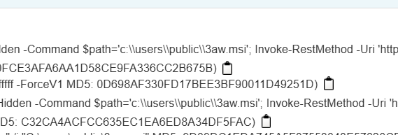

## Malware Analysis 1  

We are required to do a malware analysis, but there are no challenge files. Since this is an OSINT chall, it appears that we have to find source the attack online.  

Googling `"172.67.178.15" msi` will lead us to [this malware report](https://www.joesandbox.com/analysis/1623555/0/html).  

Inside the process tree summary, we can find the MSI file, giving us the flag.  

Flag: `0xfun{3aw.msi}`