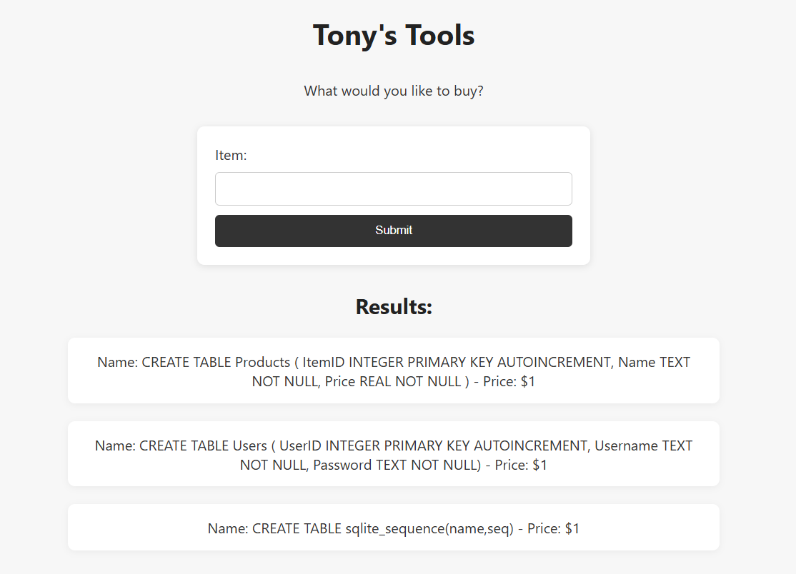
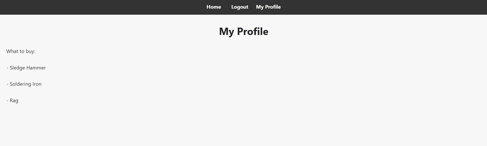
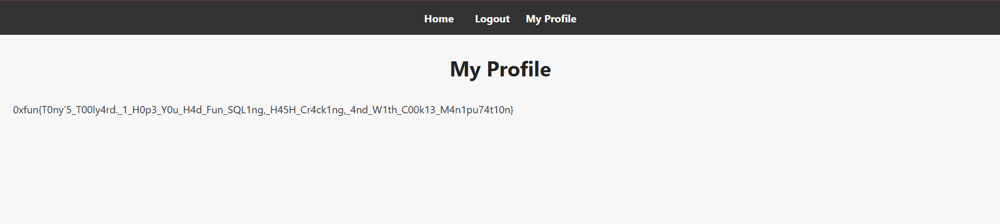

## Tony Toolkit  


We are given a webpage with an item search page and a login page.  


The item search page has an SQLi vuln, and we can leak the internal database structure with a simple payload, which will reveal a `users` table.  

```sql
hacked' union select sql, 1 from sqlite_master --
```



We can then dump the entire `users` table, which will reveal `2` users - `Admin` and `Jerry`.  

Only Jerry's password appears to be a valid hash, so we can try cracking that.  

```
hacked' union select username, password from users --
```


We can use `hashcat` to crack Jerry's password hash, giving us `1qaz2wsx`.  

```bash
echo 059a00192592d5444bc0caad7203f98b506332e2cf7abb35d684ea9bf7c18f08 > hash.txt

hashcat -m 1400 hash.txt rockyou.txt
hashcat -m 1400 --show hash.txt
```

We can now login as Jerry on the login page, however, visting the profile page won't give us anything useful.  



Inspecting the website's cookies, we can find a `userID` cookie set to `2`.  


Changing the cookie to `1` will authenticate us as admin, getting the server to render the flag on the profile page.  



Flag: `0xfun{T0ny&#39;5_T00ly4rd._1_H0p3_Y0u_H4d_Fun_SQL1ng,_H45H_Cr4ck1ng,_4nd_W1th_C00k13_M4n1pu74t10n}`