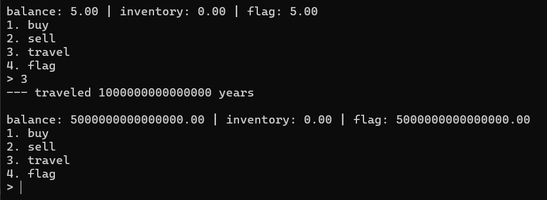
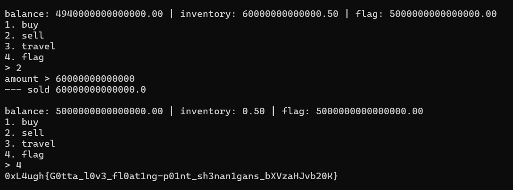

## Spare Me Some Change  

We are given a service to interact with, where we can buy or sell inventory in order to get the flag.  

Although we have just enough balance to purchase the flag, there is an extra `$0.05` fee, making it impossible to buy.  

The other feature of the service is that it allows us to time travel, upon which all values will be multiplied by `1e15`.  

I don't exactly know how it works, but we can abuse floating point rounding errors in the service to give ourselves an extra few cents.  

Buying almost all of our initial inventory and selling most of it back will accumulate floating point residue, which will be amplified by the time travel.  

With the extra few cents we generated, we can then buy the flag.  

Flag: `0xL4ugh{G0tta_l0v3_fl0at1ng-p01nt_sh3nan1gans_bXVzaHJvb20K}`