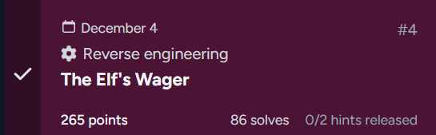

## The Elf's Wager



### Challenge Description

```
The break room buzzes with energy when you walk in. A crowd of elves has gathered around Jingle McSnark's desk, where a holographic scoreboard floats above a plate of half-eaten gingerbread.

"Ah, the human!" Jingle spins around, candy cane tucked behind one pointed ear. "Perfect timing. We were just discussing how long it would take you to fail today's challenge."

He gestures dramatically at his terminal, where green text scrolls across a black screen.

"Every week, I post a little puzzle for the SOC team. Keeps us sharp, you know? Last week, Snowdrift over there" he points at a sheepish-looking elf "took three days to crack my binary. THREE. DAYS."

Snowdrift mutters something about "unfair obfuscation" into his hot cocoa.

"But you," Jingle continues, leaning forward with a grin that's equal parts challenge and condescension, "you're supposed to be some kind of specialist, right? Santa's new secret weapon against the Krampus Syndicate?"

He slides a USB drive across the desk. It's shaped like a tiny Christmas tree.

"Prove it. My mainframe authentication module. Figure out what gets you in. No debuggers and I've made sure of that. Static analysis only, human."

The elves exchange glances. Someone starts a betting pool on a napkin.

"Oh, and one more thing," Jingle adds, spinning back to his monitors. "The Syndicate's been probing our mainframe access systems all week. If you can't figure out how authentication works at the North Pole... well, let's hope they can't either."

The room falls silent, waiting.
```

### Writeup

We can disassemble the challenge binary using Ghidra.  

The binary has a function at address `0x1362` that takes our input and XORs it with `0x42`, before comparing it against a hardcoded string of length `0x17` at `0x2110`. The hardcoded string in question is most likely the flag.  

```c
undefined8 FUN_00101362(long param_1)

{
  long lVar1;
  
  lVar1 = 0;
  do {
    if (((int)*(char *)(param_1 + lVar1) ^ 0x42U) != (uint)(byte)(&DAT_00102110)[lVar1]) {
      return 0;
    }
    lVar1 = lVar1 + 1;
  } while (lVar1 != 0x17);
  return 1;
}
```

We can extract `23` bytes from that address to retrieve our ciphertext, then reverse the XOR decryption to get the flag.  

```python
offset = 0x2110
length = 23

with open("day4", "rb") as f:
    f.seek(offset)

    enc = f.read(length)

flag = bytes([b ^ 0x42 for b in enc])

print(flag.decode())
```

Flag: `csd{1nt0_th3_m41nfr4m3}`