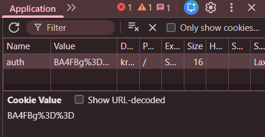
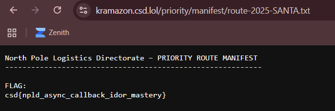

## The Elf's Wager


### Challenge Description

```
Intelligence analysts from the North Pole Logistics Directorate (NPLD) have uncovered a covert online storefront operated by the KRAMPUS Syndicate. Its name? Kramazon.

Looks familiar. Works familiar. Absolutely not legitimate.

Kramazon is a distribution front used by the Syndicate to intercept gifts, reroute sleigh cargo, and quietly undermine Santa’s global delivery network.

NPLD Cyber Response believes Kramazon’s checkout system contains a subtle implementation flaw: customers with ordinary elf-level accounts have somehow been able to receive Santa-priority shipping status, which should only be assigned through Santa’s authenticated sleigh-routing systems.

If KRAMPUS operators are abusing this flaw, they could divert or prioritize packages in ways that delay, disrupt, or even sabotage the entire Christmas Eve operation.

Investigate Kramazon’s ordering workflow. If you can exploit this flaw to obtain Santa Priority Delivery for your order, Kramazon will reveal its restricted Priority Route Manifest, which contains the flag.

Good luck, Operative.

https://kramazon.csd.lol/
```

### Writeup

We are given an Amazon clone webpage to exploit.  


Inside the website layout, we can find a `script.js` being loaded.  


Analysing `script.js`, we can see that the main functionality of the website lies in ordering the calendar.  

If we send an order with Santa-level privileges, our order will be finalised with priority (and we could potentially be given the flag).  


The most suspicious part of `script.js` is the `santaMagic()` function, which XORs a given `n` by `0x37`. This will be helpful later on.  

```js
function santaMagic(n) {
    return n ^ 0x37; // TODO: remove in production
}
```

We can use BurpSuite to intercept the requests and responses being received and sent by the server.  

After the webpage sends a request to finalise the order, the server sends a response identifying us as user `3921`. If we can change our ID to be authenticated as user `1`, our order will get prioritised.  


Back in the webpage, we can find an `auth` cookie.  



If we URL-decode and Base64-decode the cookie, then XOR each byte by `0x37` from the `santaMagic()` function earlier on, we actually get our user ID - `3921`.  

This explains how the server is identifying our user level.  


We can easily forge a cookie with user ID `1` by reversing the decryption steps.  

```python
import base64
from urllib.parse import quote

cookie = quote(base64.b64encode(bytes([b ^ 0x37 for b in b'1'])))
```

After changing the browser cookie to our own and placing the order again, the server response to `/finalize` shows that we have indeed been authenticated as Santa, and also reveals a file path.  


Accessing the file then reveals the flag.  



Flag: `csd{npld_async_callback_idor_mastery}`