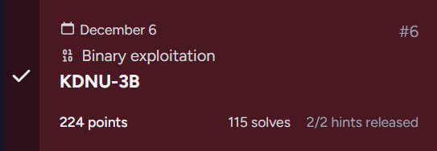
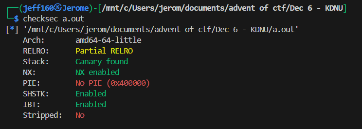
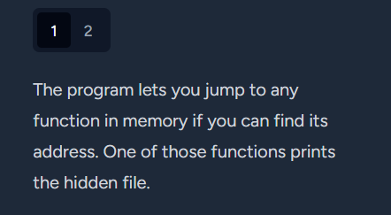
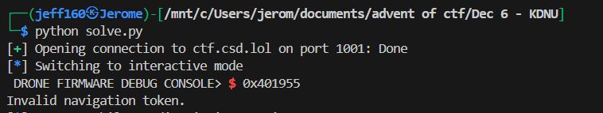

## KDNU-3B



### Challenge Description

```
NPLD analysts recovered a fragment of the KRAMPUS Syndicate’s KDNU-3B navigation firmware during a recent incident response sweep. The module appears to handle routing adjustments for mid-air course corrections, but most of its internal logic is inactive or stripped from the build. During static review, investigators identified a code path that is never reached during normal execution and does not align with any documented subsystem.

The firmware is designed to reject unexpected inputs immediately, a behavior that is consistent with hardened flight control software. To understand what the Syndicate was hiding, you will need to analyze how the controller processes incoming commands and determine how to reach the dormant functionality without triggering its shutdown behavior.

Your objective is to examine the recovered binary, map out the dispatcher flow, and extract whatever information the hidden subsystem contains.

Connect at nc ctf.csd.lol 1001
```

### Writeup

We are given a binary to analyse, as well as a service to interact with.  

Running `checksec` shows that the binary has no PIE, which means memory addresses are static. We will see why later on.  



Next, we can use Ghidra to disassemble the binary. Inspecting the `main()` function reveals that the program prompts us for an address, which it will jump to, which explains why PIE is not enabled.  

```c
bool main(void)
{
  int iVar1;
  long in_FS_OFFSET;
  code *local_20;
  code *local_18;
  long local_10;
  
  local_10 = *(long *)(in_FS_OFFSET + 0x28);
  setbuf((FILE *)stdout,(char *)0x0);
  printf("DRONE FIRMWARE DEBUG CONSOLE> ");
  iVar1 = __isoc99_scanf(&DAT_0049e0bf,&local_20);
  if (iVar1 == 1) {
    local_18 = local_20;
    (*local_20)();
  }
  else {
    puts("ERROR, shutting down.");
  }
  if (local_10 != *(long *)(in_FS_OFFSET + 0x28)) {
    __stack_chk_fail();
  }
  return iVar1 != 1;
}
```

One of the challenge hints reveals that there's a special function for printing a hidden file, and this is most likely the function we have to jump to.  



We can get all the function names and their addresses in the binary and filter out system symbols.  

```bash
nm a.out | grep ' T ' | grep -v '@' | grep -v '^_' > funcs.txt
```

We can immediately find a suspicious looking function, `nav_core()`.  


Back in Ghidra, we can find the decompilation of `nav_core()`, which shows that it is indeed a function that reads and outputs the contents of `manifest.bin`, which most likely contains the flag.  

```c
void nav_core(int param_1)
{
  int __fd;
  size_t __n;
  long in_FS_OFFSET;
  undefined1 local_118 [264];
  long local_10;
  
  local_10 = *(long *)(in_FS_OFFSET + 0x28);
  if (param_1 == 0xc0c0a) {
    __fd = open("manifest.bin",0);
    if (__fd < 0) {
      puts("Navigation manifest not found.");
    }
    else {
      __n = read(__fd,local_118,0xff);
      if ((long)__n < 1) {
        puts("Error reading navigation manifest.");
      }
      else {
        local_118[__n] = 0;
        write(1,local_118,__n);
      }
    }
  }
  else {
    puts("Invalid navigation token.");
  }
  if (local_10 != *(long *)(in_FS_OFFSET + 0x28)) {
    __stack_chk_fail();
  }
  return;
}
```

However, if we directly input the address of `nav_core()`, we get an error message.  

This is because `nav_core()` expects argument `param_1`, which must be set to `0xc0c0a` for the file to be outputted.  



Since we have no way of passing in arguments through the interface, we can instead opt to jump directly to the address where `manifest.bin` is being read, completely bypassing the check.  

In Ghidra, we can find the exact moment `manifest.bin` is being read in the assembly dump.  

The string `manifest.bin` is loaded into memory at `0x401995` and the `open()` call is made at `0x40199d`. We can jump to the address directly before the path is loaded - `0x401989` - to bypass the argument check.  


After inputting `0x401989` into the program, `manifest.bin` gets outputted and contains the flag, as expected.  


Flag: `csd{3Asy_F1rmWAr3_HACk1N9_Fr}`