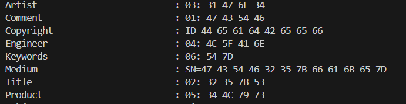

## SignalSnippetV4

Category: Forensics  
Difficulty: Easy

We are provided with a `.wav` file that plays morse code.  

Running `exiftool` on the file reveals hex values in the metadata.  

Decrypting each section and combining everything gives us the flag.  

Flag: `GCTF25{S1Gn4L_An4LysT}`