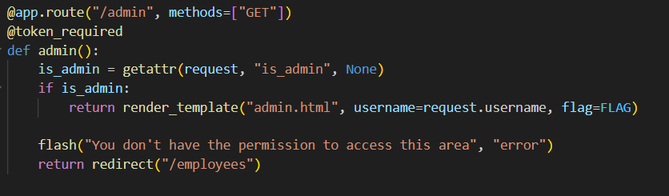
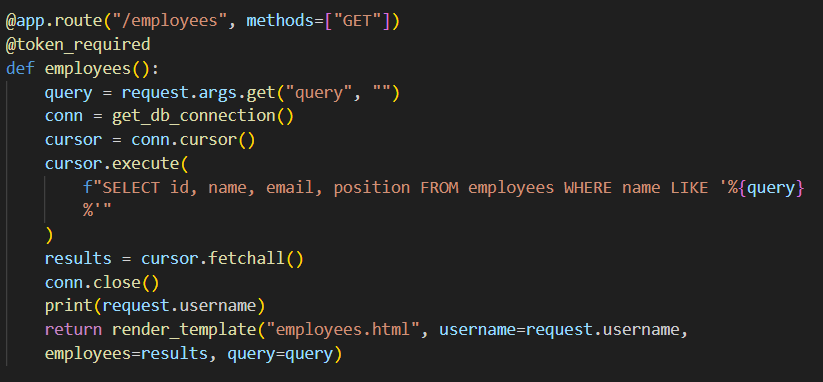
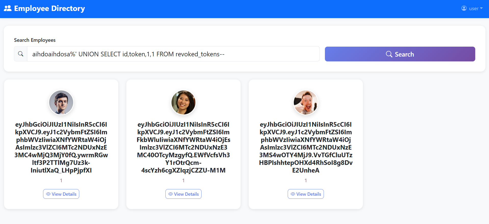
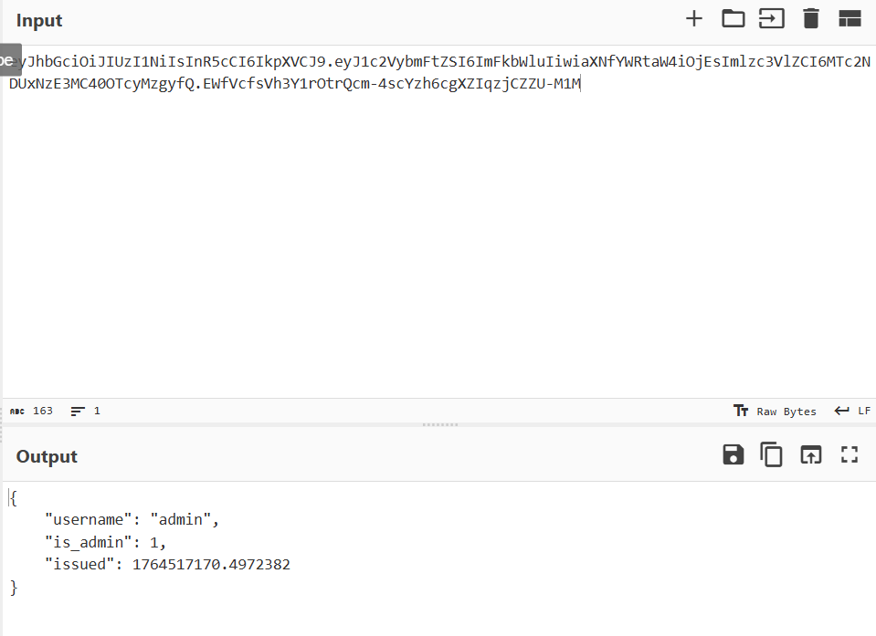
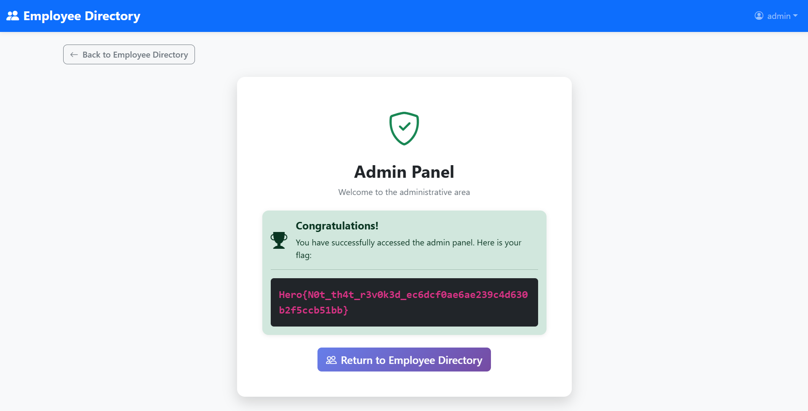

## Revoked

Category: Web  
Difficulty: Medium  


We are given a webpage which upon logging in, we are able to access an employees listing.  


The webpage has an `/admin` endpoint that displays the flag, which can only be accessed if we pass the authentication check.  



The `/employees` endpoint is also vulnerable to SQLi, as the query is built using direct string interpolation.  



We are actually able to leak the admin credentials using a simple SQLi payload, however, we can't actually crack the password hashes since they are hashed using bcrypt.  

The endpoint also uses `execute()` which only allows 1 statement at a time, so we can't do any database modifications, rendering the credentials useless.  


The webpage has another endpoint worth noting, which is the `/logout` endpoint. This endpoint saves user JWT tokens to a dedicated table in the database on logout.  


Since the challenge is named "Revoked", this hints that the solve has something to do with the revoked tokens.  

Going back to the authentication function, if we were able to bypass the check, we could potentially login using a revoked admin token and gain access to the admin panel.  


We can first leak all the revoked tokens through SQLi.  

```
aihdoaihdosa%' UNION SELECT id,token,1,1 FROM revoked_tokens--
```



Only one of the tokens has admin privileges, so we will use that to login.  



Bypassing the revoke check is pretty straightforward. Since JWT tokens are essentially Base64, we can pad the back of the token with `=` to bypass the check, while ensuring that the JWT decoding still passes through.  

You can easily verify this in Python.  

```python
import jwt

token = jwt.encode(
    { "username": 'admin' },
    'SECRET',
    algorithm="HS256",
)

data = jwt.decode(token + "=", 'SECRET', algorithms=["HS256"])
print(data)
```

After changing the cookie in the webpage to our padded JWT token, we are finally able to access the admin panel and retrieve the flag.  



Flag: `Hero{N0t_th4t_r3v0k3d_ec6dcf0ae6ae239c4d630b2f5ccb51bb}`