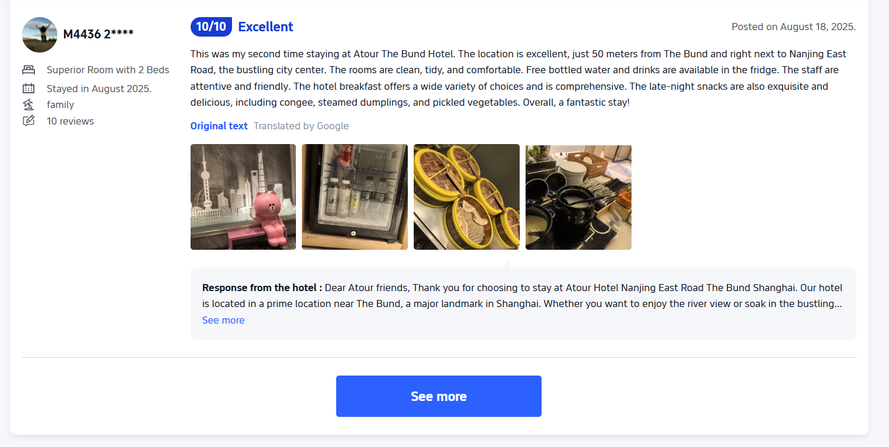
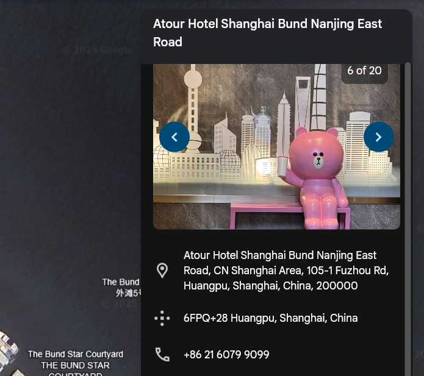

## Travelling Intern 1  


The challenge document directs us to finding an intern's social media account, and hints that he is a big fan of YBN.  

```
Assignment Brief
First off, on behalf of the ICA Data Analysis Department, we welcome you as a new junior analyst. We hope that you’ll be able to adapt to our environment in no time.
Moving onto the assignment. We have received a new contract targeting the CISO of Kronstadt Industries, William Kronx. Unfortunately, we have not been able to track down his location so far, as he keeps no social media presence and never shares his location information with anyone outside of his trusted circle. 
Recently, we noticed that the CISO’s secretary has hired a new intern to take her place and has managed to convince William to allow the intern to accompany them during a company trip abroad. Fortunately, the intern has a bad sense of OPSEC, and frequently posts on their Instagram account. 
We know that the intern is a big fan of the CTF team Yes But No (YBN), and has even made it part of his social media usernames. Help us track the intern down and get intel on William’s whereabouts. Maybe you can find out what hotel they are staying at?

Objective(s)
    - Find out where William Kronx is staying.
```

We can find the account by searching for keywords like `ybn` and `fan`.  


A Google Lens search of the pink bear in one of the posts revealed [this hotel review](https://th.trip.com/hotels/shanghai-hotel-detail-444194/atour-hotel-nanjing-east-road-shanghai-on-the-bund/review.html) of Atour Hotel.  

One of the comments posted the exact same bear statue.  



Searching for "Atour Hotel" on Google Earth also shows the bear in one of the images, confirming the location.  



Flag: `YBN{atour_hotel}`