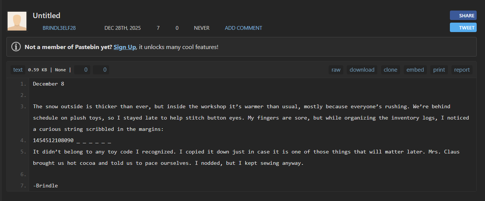
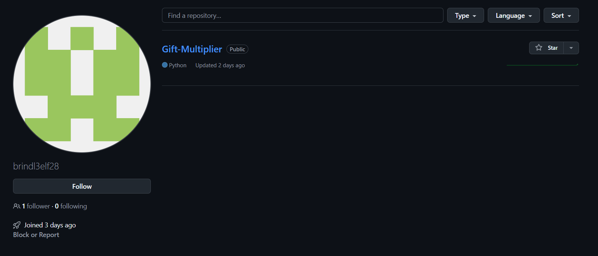
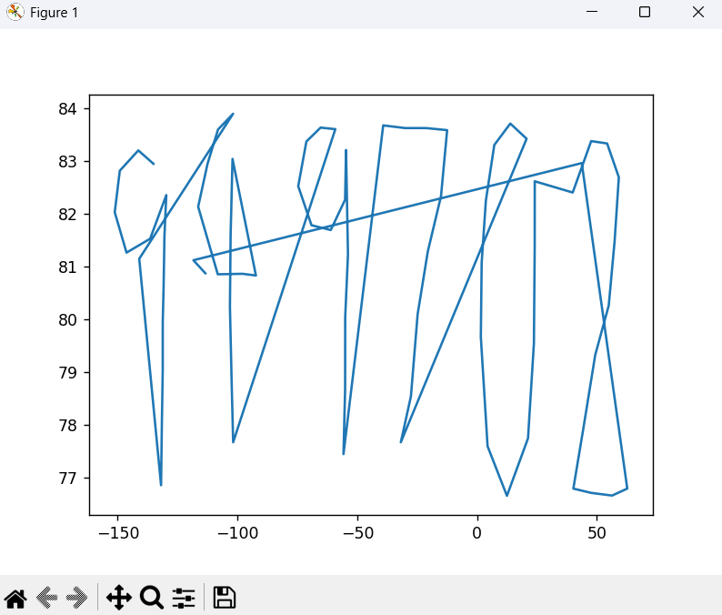
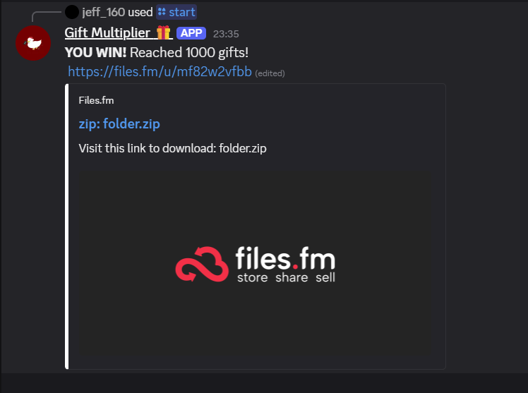

## Elf's Diary  


The challenge provides us with a seemingly plain `.txt` file. Opening it in VSCode, however, reveals zero-width characters.  

### Part 1: Pastebin Repo  


We can paste the entire into an [online decoder](https://330k.github.io/misc_tools/unicode_steganography.html), which will extract a Pastebin URL from the zero-width characters.  


However, if we try accessing the Pastebin repo, it shows that it has been removed by the author.  


Thankfully, [Wayback Machine](https://web.archive.org/) has a capture of the repo saved.  


In the repo, we discover the author's username is `brindl3elf28`, and the repo contents also contain a suspicious looking number with the last `6` digits redacted.  

Keep the number in mind, it will come in handy later on.  



### Part 2: Github Repo  

We can actually find a [Github account](https://github.com/brindl3elf28) registered under the username from the Pastebin. There is a singular repository called `Gift-Multiplier`.  



The Github repo contains the source code to a discord bot that runs a betting game.  

```python
import os
import random
import discord
from discord import app_commands
from dotenv import load_dotenv

...

# ---------- GAME STATE ----------
class Game:
    def __init__(self):
        self.gifts = 50
        self.previous_roll = None
        self.round = 1
        self.bet = None
...

# ---------- GAME VIEW ----------
class GameView(discord.ui.View):
    def __init__(self, user_id: int, message: discord.Message = None):
        super().__init__(timeout=600)
        self.user_id = user_id
        self.message = message

    async def interaction_check(self, interaction: discord.Interaction) -> bool:
        if interaction.user.id != self.user_id:
            await interaction.response.send_message(
                "This is not your game.",
                ephemeral=True
            )
            return False
        return True

    async def resolve(self, interaction: discord.Interaction, guess: str):
        game = games[self.user_id]

        if game.bet is None:
            await interaction.response.send_message(
                "Please set your bet first.",
                ephemeral=True
            )
            return

        roll = roll if roll in range(1, 7) else random.randint(1, 6)
        multiplier = 2 
        correct = False

        # ---------- ROUND 1 ----------
        if game.round == 1:
            result = "small" if roll <= 3 else "big"
            correct = (guess == result)

        # ---------- HIGHER / LOWER ----------
        else:
            prev = game.previous_roll

            if guess == "same":
                if prev not in (1, 6):
                    correct = False
                else:
                    multiplier = 5
                    correct = roll == prev
            
            elif guess == "higher":
                if prev == 6:
                    correct = False
                else:
                    correct = roll > prev

            elif guess == "lower":
                if prev == 1:
                    correct = False
                else:
                    correct = roll < prev

        # ---------- PAYOUT ----------
        if correct:
            win = game.bet * multiplier
            game.gifts += win
            outcome = f"You won **{win}** gifts (×{multiplier})."
        else:
            game.gifts -= game.bet
            outcome = f"You lost **{game.bet}** gifts."

        # ---------- END ----------
        if game.gifts <= 0:
            del games[self.user_id]
            await interaction.response.edit_message(
                content=f"**GAME OVER**\nDice: **{roll}**",
                view=None
            )
            return

        if game.gifts >= 1000:
            del games[self.user_id]
            await interaction.response.edit_message(
                content="**YOU WIN!** Reached 1000 gifts!",
                view=None
            )
            return

        # ---------- NEXT ROUND ----------
        view = GameView(self.user_id)
        view.add_item(SetBetButton())
        view.add_item(HigherButton())
        view.add_item(LowerButton())

        if roll in (1, 6):
            view.add_item(SameButton())

        msg = (
            f"Dice rolled: **{roll}**\n"
            f"{outcome}\n"
            f"Gifts: **{game.gifts}**\n"
            f"Next Bet: **Not set**\n\n"
            "Choose your next move:"
        )

        await interaction.response.edit_message(content=msg, view=view)
        view.message = await interaction.original_response()
```

`README.md` also contains the game rules. We have to make high-low bets on the current dice roll until we reach `1000` gifts.  

```
# Gift-Multiplier
December 20

Only five days to go. The reindeer training grounds are louder than ever, and the workshop smells like pine and fresh paint. Today we tested a new system Santa approved—a gift multiplier. 

RULES:
The goal of the game is to bet and win to 1000 gifts from the initial 50 and you lose when you run out of gifts.

/start to start the game
/quit to end the game

Each round uses a six-sided dice (values 1–6) to determine the multiplier outcome and if you correctly guess the condition, betted gifts are doubled.
In the first round, you have to bet if the dice would be small(1,2,3) or big(4,5,6).
For subsequent rounds you have to bet if the next dice value would be higher or lower than the current value.
For special cases like 1 and 6, you may choose to bet that the same value will appear in the next round. If successful, the betted gifts would be five times the original.
Remember, you must set the bet amount every round!

Good luck! 

-Brindle
```

However, we will notice that the source code doesn't contain the bot's client ID, so the next step would be for us to find it.  

```python
# ---------- ENV ----------
load_dotenv()
TOKEN = os.getenv("DISCORD_TOKEN")
```

### Part 3: Google Calendar  

Back in Github, we can view the commit metadata by appending `.patch` to the end of the URL.  

In `https://github.com/brindl3elf28/Gift-Multiplier/commit/f53c0fd82ac1f3c796c32b94a667981fa6896a3f.patch`, I found the account's email.  

```
From f53c0fd82ac1f3c796c32b94a667981fa6896a3f Mon Sep 17 00:00:00 2001
From: brindl3elf28 <brindle.elf@gmail.com>
Date: Mon, 29 Dec 2025 02:59:54 +0800
Subject: [PATCH] Create bot.py
```

Running [GHunt](https://github.com/mxrch/GHunt/) on the email reveals a public calendar under the email.  

```bash
# https://calendar.google.com/calendar/ical/brindle.elf@gmail.com/public/basic.ics
ghunt email brindle.elf@gmail.com
```

We can download the `.ics` file and import it into Google Calendar, which contains an event on 25 December 2020. The event card contains a spreadsheet which we can download.  


The spreadsheet contains a bunch of random coordinates pairs.  


We can actually plot these coordinates using Python, which reveals exactly `6` digits-the ones missing from the number in the Pastebin.  



Initially, I thought the digits were `949708`, but the discord invite link didn't work. I opened a ticket and the author confirmed that the last digit was `2`, as you were supposed to plot the points inside Google Maps instead.  

With all the digits, we can finally get the bot invite link and add it into our own server.  

```
https://discord.com/oauth2/authorize?client_id=1454512108090949702&scope=bot
```

### Part 4: Discord Bot  

After adding the bot into our own server, all we have to do is gamble until we reach `1000` gifts.  

In my case, I was fortunate enough that the dice rolls were mostly on the extreme ends of the range, so I was able to win relatively quickly.  

The bot will then give us a URL once we win.  



### Part 5: Forensics  

In the URL provided, we can find a singular zip file.  


Inside, we are provided with a JPG and a video.  


Running `steghide` on the image reveals a `.tar` file hidden inside, which we can extract with an empty passphrase.  


Inside `secret_payload.tar`, we find `flag.7z` and `hidden file.txt`. `flag.7z` is password protected, but `hidden file.txt` does contain some crucial information regarding the password. 

```
December 24

I can finally breathe. If you’re reading this, congratulations, you've managed to find the hidden files. With the workshop quiet at last, I boarded the speed rail to finish delivering the remaining gifts in China. The ride was fast, almost too fast, and when I arrived, I must admit I lingered longer than I should have. The scenery at the destination was breathtaking enough to distract even a seasoned elf like me.

Before I lost track of time completely, I left one final task behind. There’s a file waiting to be unlocked and its password follows the format:
trainnumber_traincabin (for example, G1234_01).

If you need a nudge, the speed rail journey started from Changsha South.

-Brindle
```

### Part 6: Final OSINT  

`video.mov` in `secret_payload.tar` shows the challenge author in a train in China.  

In `img.jpg`, we can lower the brightness to view the characters inscribed on the ground, which are revealed to be `主峰元峰 海拔534米`.  


ChatGPT is able to trace the characters to Shizhushan in Fuqing. This means that the train we are looking for was around that area.  


Since the train visited Fuqing, that narrows it down to `G` and `D` series trains, which have a maximum of `17` cabins.  

We can write a quick python script to generate all possible combinations for the `flag.7z` password.  

```python
prefixes = ["G", "D"]

min_number = 1
max_number = 9999

min_cabin = 1
max_cabin = 17

passwords = []

for prefix in prefixes:
    for train_num in range(min_number, max_number + 1):
        train_number = f"{prefix}{train_num:0>4}"
        for cabin in range(min_cabin, max_cabin + 1):
            passwords.append(f"{train_number}_{cabin:02d}")
```

We can use `7z2john` to extract the password hash for `flag.7z`, then run `hashcat` with our custom wordlist. This will retrieve the password `G1485_02`, which we can then use to extract `flag.7z`.  

```bash
7z2john flag.7z | cut -d':' -f2- > flag.hash
hashcat -m 18500 flag.hash wordlist.txt
hashcat -m 18500 flag.hash --show

7z x flag.7z -pG1485_02
```

`flag.txt` will then contain our flag.  


Flag: `YBN25{gIF7_5ucc3$SFUlLy_dEl!veR3d}`