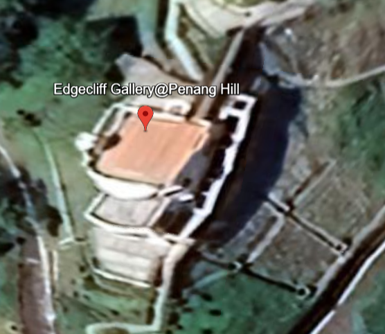

## beautiful clouds  

In the image, we can see a sign on the building that says `EDGECLIFF GALLERY PENANG HILL`.  

Google Earth has a location called `Edgecliff Gallery@Penang Hill, Tunnel Road East, Bukit Bendera, Penang, Malaysia`. Right-clicking on the location gives `5°25'26"N 100°16'13"E`, which converts to `5.424 100.270` for the flag format.  

Flag: `YBN25{5.424,100.270}`