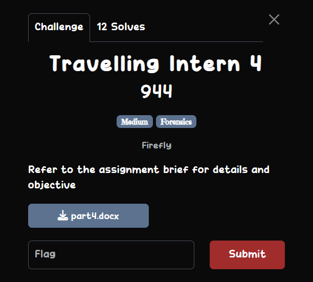
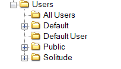
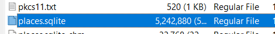
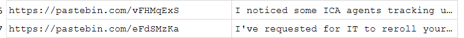
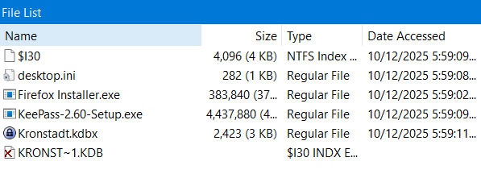
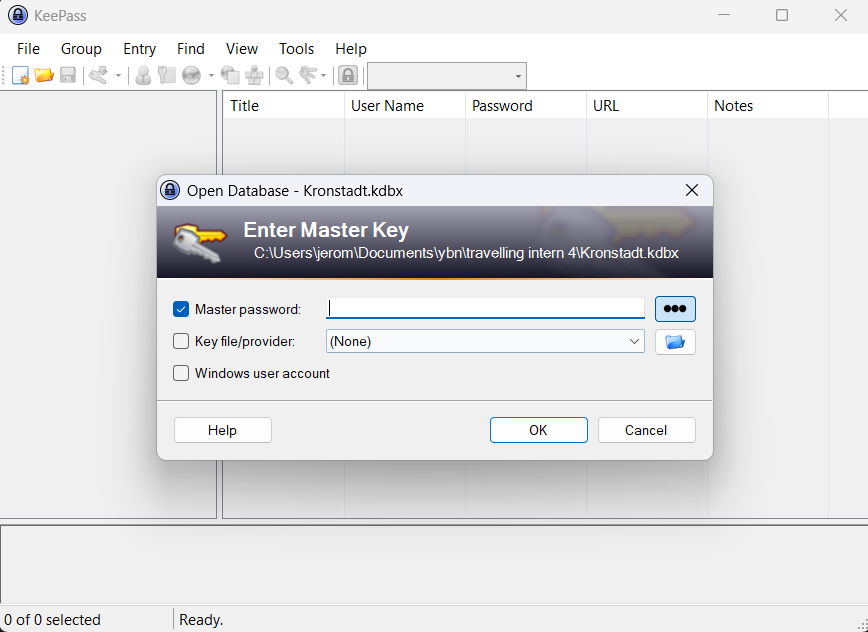
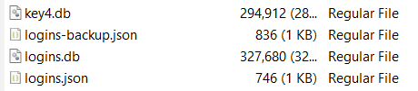
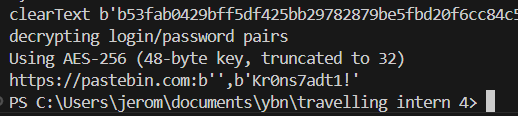
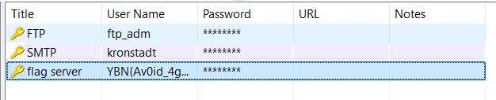

## Travelling Intern 4  



```
Assignment Brief

Thanks to you, we were able to track down the party just before they left Shanghai. Our agent was able to recover the intern’s laptop after he left it unlocked at a café and created a snapshot of the disk for forensics analysis later.
Your prior performance has caught the attention of higher-ups, and they have requested for you to take on this assignment to analyze the disk image. Have a look at the provided artifact and see if you can find anything interesting in the intern’s laptop that we can use.
You may download the disk artifact from the following link: https://drive.google.com/file/d/1kMXZ6q6wp0K2UV7oL1WLeojOsvjUY0xw/view?usp=sharing 

Objective(s)
    - Analyze the disk image of the intern’s laptop, and recover any interesting information
```

The drive link in the assignment brief gives us a disk image, which we can open in FTK Imager.  

Inside, we can find a folder under the user `Solitude`.  



In the `Appdata` folder, we find out that `Solitude` has `Firefox` installed with two accounts. The only one that is of concern to us is `default-release` since the `default` account doesn't have anything.  


In the `default-release` folder, we can find `places.sqlite`, which contains the full search history of the user.  



Using DB Browser, we can run `SELECT url, title from moz_places` to get all search history entries, which will reveal two Pastebin URLs.  



However, if we try accessing both repos, we discover that they are both password protected.  


Going back into `places.sqlite`, we can also find multiple references to downloading KeePass in the search history.  


In the `Downloads` folder in the disk image, we can actually find a KeePass database, which could potentially contain some secret info.  



However, we require a master key to read the database contents.  



Back in the `default-release` user's folder again, we can find two files that could potentially help us to recover the Pastebin passwords: `key4.db` and `logins.json`.  



`logins.json` does indeed contain the encrypted Pastebin passwords.  

```json
{"nextId":2,"logins":[{"id":1,"hostname":"https://pastebin.com","httpRealm":null,"formSubmitURL":"https://pastebin.com","usernameField":"","passwordField":"PostPasswordVerificationForm[password]","encryptedUsername":"MEMEEPgAAAAAAAAAAAAAAAAAAAEwHQYJYIZIAWUDBAEqBBDtqgYNRLgpDJIKGOWaxDbbBBB8YMdac6VwamlUIYbQZByT","encryptedPassword":"MEMEEPgAAAAAAAAAAAAAAAAAAAEwHQYJYIZIAWUDBAEqBBD9R8fODITezoD9lfDpZJP7BBDMwsAOokyyVMDrMd/C2qHJ","guid":"{b519a2d7-e549-4199-9208-3733ea3a66d1}","encType":1,"timeCreated":1765389126819,"timeLastUsed":1765389461229,"timePasswordChanged":1765389126819,"timesUsed":2,"syncCounter":1,"everSynced":false,"encryptedUnknownFields":null}],"potentiallyVulnerablePasswords":[],"dismissedBreachAlertsByLoginGUID":{},"version":3}
```

To crack the passwords, we can use [firepwd](https://github.com/lclevy/firepwd) and run it in the same directory with `key4.db` and `logins.json`, revealing the password to be `Kr0ns7adt1!`.  



After unlocking both Pastebin repos, we can find the master key for the `.kdbx` file from earlier.  


Inside `Kronstadt.kdbx`, we can find the flag under the `flag_server` entry.  



Flag: `YBN{Av0id_4gent47_At_A11_C0st5}`