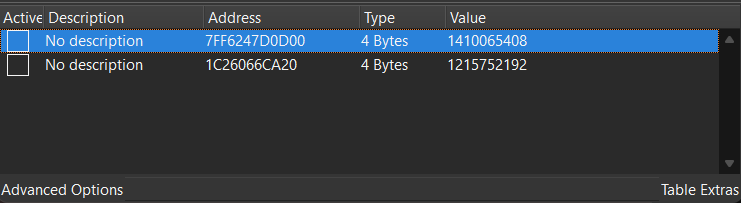

## Mushroom Farming Experts  


We are given a game where we have to farm 10 million mushrooms and coins for the flag to appear.  


We can use [Cheat Engine](https://www.cheatengine.org/) to modify the values. We just need to farm mushrooms and coins until we reach uncommon values like `10` or `14`.  

In my case, I managed to locate the counters in the addresses below.  

```
Mushrooms: mushroom_farming_experts.exe+3690D00
Coins: 1C26066CA20
```

After modifying the values, the game should display the flag.  

Also the chall description lied, 10 million isn't enough for some reason, you need to max out the values to get the flag to render.  




Flag: `YBN25{B1rD_G4M3_3_f0r_Chr1s7M45_YaHoo}`