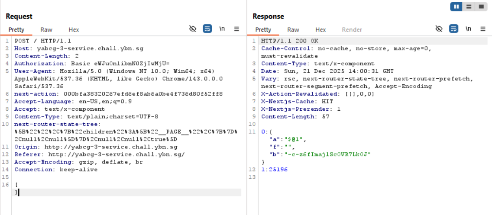
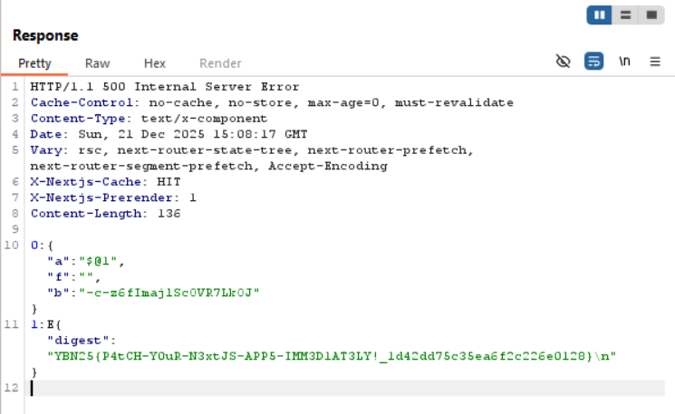

## YABCG 3

We are given a webpage built with Next.js for generating business cards.  

In Burp Suite we can intercept the request being sent to the server when we click "Generate Card".  

Based on the server response, this is [CVE-2025-55182](https://nvd.nist.gov/vuln/detail/CVE-2025-55182).  

I found [this POC payload](https://github.com/l4rm4nd/CVE-2025-55182) and adapted from it to gain RCE on the server.  

Running `ls` revealed the flag file in the current directory, which we can read to get the flag.  

Flag: `YBN25{P4tCH-Y0uR-N3xtJS-APP5-IMM3D1AT3LY!_1d42dd75c35ea6f2c226e0128}`