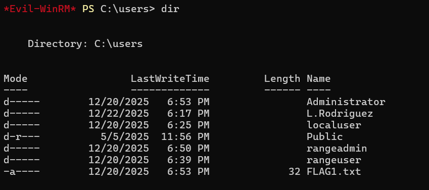

## [RV] Flag 1


We can use `Impacket` to perform an AS-REP attack and extract the password hashes of users who don't require pre-authentication.  

In this case, I was able to extract the username and password hash of `L.Rodriguez`.  


We can use hashcat to crack the hash using `rockyou.txt`, revealing the password to be `caitlind22`.  

```bash
hashcat -m 18200 hash.txt rockyou.txt
```

We can then use `evil-winrm` to connect to the Windows machine on `.10`.  

```bash
evil-winrm -i 10.3.10.10 -u 'JEZZCORP\L.Rodriguez' -p caitlind22
```

`cd`-ing into `/Users` will then reveal the flag file.  



Flag: `YBN25{9575a78bd3bf38af376a657100dd10c1}`