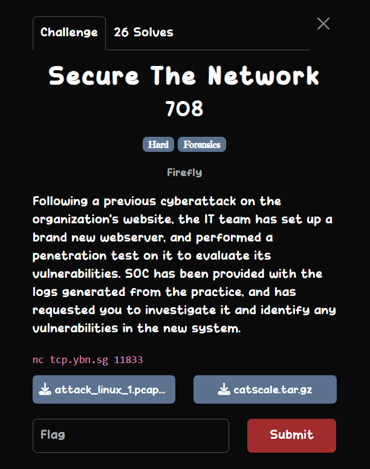
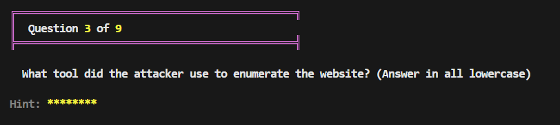
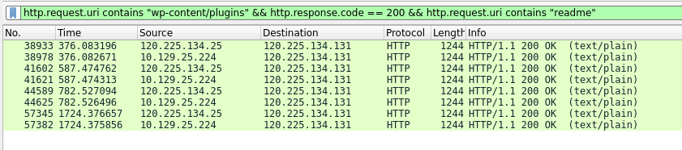
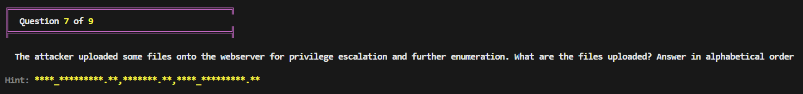
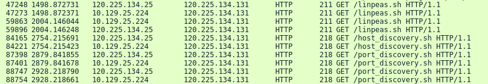
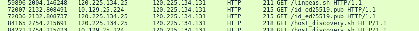
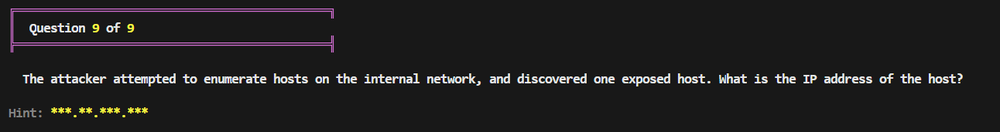
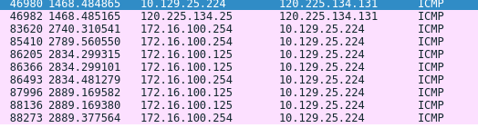

## Secure The Network  

This challenge requires us to answer `9` questions correctly to get the flag, and provides us with a packet capture and system logs for us to analyse.  

### Question 1  

Filtering for `http` packets in the capture shows numerous requests being made from `120.225.134.131` to the target machine, and it looks like their enumerating the directories, so this is our attacker address.  

### Question 2  

We can locate the packet where the attacker makes a request to the root directory of the web server (`GET /`). Following the TCP stream will show the full HTML source of the web server, which contains a reference to `Wordpress`.   

### Question 3  

To answer this question, we can filter with `http.request.method=="GET"` to get all packets of the attacker bruteforcing subdirectories.  

We can select one of the packets and the `User-Agent` header will show `gobuster` is being used to perform the enumeration.  

### Question 4  

In the packet capture, we can see that the attacker bruteforces `GET` requests for wordpress plugins. We can filter with `http.request.uri contains "wp-content/plugins" && http.response.code == 200 && http.request.uri contains "readme"` to get only the ones that were successfully fetched.  

Following the TCP stream of one of the packets will show the documentation for the `file-manager` plugin, with the version number being `6.0`. In the answer format, we get: `file_manager:v6.0`.  

### Question 5  

Since we already identified the vulnerable plugin and the version number, a quick google search will lead us to [CVE-2020-25213](https://nvd.nist.gov/vuln/detail/CVE-2020-25213), which details an RCE vulnerability that allows execution of arbitrary PHP, which is very evident in the packet capture.  

### Question 6  

i lowk guessed this one ngl  

answer: `python3 -c "import pty;pty.spawn('/bin/bash')"`  

### Question 7  

Since the file extension only has two characters, we can make an educated guess that they are most likely `.sh` files. A quick filter with `http.request.method=="GET" and frame contains "sh"` will show the files below.  

### Question 8  

From the packets above, if we remove the `.sh` filter, we can notice a `id_ed25519.pub` file being uploaded at around the same time. Since the filename matches the answer format exactly, this is our persistence file.  

### Question 9  

Since `icmp` is used for host discovery, we can filter with `icmp.type == 0`, which will show the IP address `172.16.100.125`.  

Submitting all the correct answers will then get the server to output the flag.  

Flag: `YBN{019aecc9843873b689b96225c1299939}`