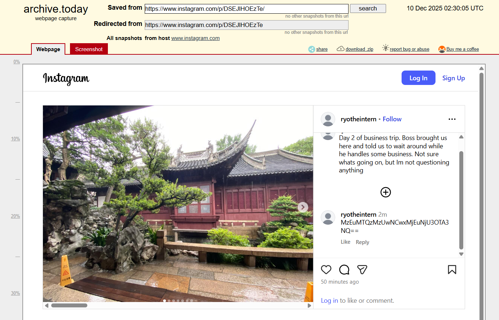

## Travelling Intern 2


The challenge document directs us to recovering a deleted comment from one of @ryotheintern's Instagram posts.  

```
Assignment Brief
Good job on finding William Kronx’s hotel, we have deployed agents to gather field intelligence on the target and his companions. Unfortunately, it seems like William has caught wind of ICA movement and has started to obfuscate his movements and meetups to prevent agents from keeping up with him. 
We noticed that William has made a comment on one of the intern’s social media posts but deleted it before we were able to read it. Recover the original comment that William has made, maybe it contains some hints on the next meetup with his… business associates.

Objective(s)
    - Recover the deleted comment, and figure out the new meetup point
```

This [reddit article](https://www.reddit.com/r/WaybackMachine/comments/grccg1/instagram_wayback_machine/) suggests using [archive.is](https://archive.is/) to recover deleted Instagram content.  

The website does indeed recover the comment, which contains a Base64 string.  



The string decodes to `31.1433504,121.6579075`, and we can just plug the coordinates into ChatGPT to get the flag location.  


flag: YBN{shanghai_disneyland_park}