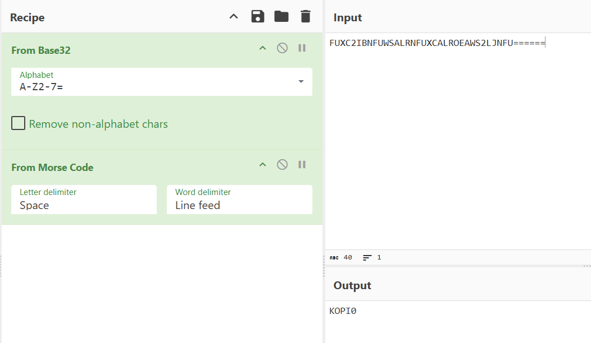

## Kopitiam  


This chall consists of 3 levels where we must derive the correct input to progress.  

After we have passed all levels, the program will do some computations to generate and output the flag.  

### Level 1  

In level 1, our input undergo some encryptions before being compared to a hardcoded string.  

```c
puts("Uncle: \"Lai, drink what?\"");
puts("Lee: \"I want order a *****\"");
read_line("[Level 1] Enter order: ",a,bufsz);
pbVar10 = (byte *)malloc(0x100);
...
iVar17 = strcmp(pcVar8,"FUXC2IBNFUWSALRNFUXCALROEAWS2LJNFU======");
free(pcVar8);
if (iVar17 != 0) goto LAB_0016663a;
```

We can plug the string into [CyberChef](https://gchq.github.io/CyberChef/) to auto-decrypt, revealing that our input is converted to morse code before being Base32-encoded.  

Note that the input has to be all lowercase: `kopi0`.  



### Level 2  

In level 2, our input is XOR-ed with a `2`-byte key `KEY.2`, then Base58-encoded before being compared against another hardcoded string `TARGET.1` of length `11`.  

```c
puts("\nUncle: \"Ok. $58. Enjoy ar...!\"\n");
    puts("Uncle: \"Lai, drink what?\"");
    puts("Ali: \"I want order a *******\"");
    read_line("[Level 2] Enter order: ",b,bufsz_00);
    sVar25 = strlen(b);
    pvVar15 = malloc(sVar25);
    if (pvVar15 == (void *)0x0) goto LAB_0016663a;
    if (sVar25 == 0) {
      pcVar8 = (char *)malloc(1);
      if (pcVar8 == (char *)0x0) goto LAB_0016699f;
      *pcVar8 = '\0';
    }
    else {
      uVar13 = 0;
      do {
        uVar14 = uVar13;
        *(char *)((long)pvVar15 + uVar14) = (&KEY.2)[(uint)uVar14 & 1] ^ b[uVar14];
        uVar13 = uVar14 + 1;
      } while (sVar25 != uVar13);
      uVar27 = 0;
      do {
        if (*(char *)((long)pvVar15 + uVar27) != '\0') break;
        uVar1 = uVar27 + 1;
        bVar28 = uVar14 != uVar27;
        uVar27 = uVar1;
      } while (bVar28);
      pbVar10 = (byte *)calloc(((uVar13 - uVar27) * 0x8a) / 100 + 1,1);
      if (pbVar10 == (byte *)0x0) {
LAB_0016699f:
        free(pvVar15);
        goto LAB_0016663a;
      }
      if (uVar27 < uVar13) {
        pbVar24 = (byte *)((long)pvVar15 + uVar27);
        lVar26 = 0;
        do {
          uVar23 = (uint)*pbVar24;
          if (lVar26 != 0) {
            pbVar18 = pbVar10;
            do {
              pbVar19 = pbVar18 + 1;
              iVar17 = (uint)*pbVar18 * 0x100 + uVar23;
              uVar23 = iVar17 / 0x3a;
              *pbVar18 = (char)iVar17 + (char)uVar23 * -0x3a;
              pbVar18 = pbVar19;
            } while (pbVar19 != pbVar10 + lVar26);
          }
          lVar9 = lVar26;
          if (uVar23 != 0) {
            lVar9 = lVar26 + 1;
            pbVar10[lVar26] = (char)uVar23 + (char)(uVar23 / 0x3a) * -0x3a;
            if (uVar23 / 0x3a != 0) {
              lVar9 = lVar26 + 2;
              pbVar10[lVar26 + 1] = (byte)((ulong)uVar23 / 0x3a);
            }
          }
          pbVar24 = pbVar24 + 1;
          lVar26 = lVar9;
        } while ((byte *)((long)pvVar15 + uVar13) != pbVar24);
        pcVar8 = (char *)malloc(uVar27 + 1 + lVar9);
        if (pcVar8 == (char *)0x0) {
LAB_00166997:
          free(pbVar10);
          goto LAB_0016699f;
        }
        if (uVar27 != 0) goto LAB_0016655a;
      }
      else {
        pcVar8 = (char *)malloc(uVar27 + 1);
        if (pcVar8 == (char *)0x0) goto LAB_00166997;
        lVar9 = 0;
LAB_0016655a:
        pcVar22 = pcVar8;
        for (uVar13 = uVar27 & 0xffffffff; uVar13 != 0; uVar13 = uVar13 - 1) {
          *pcVar22 = '1';
          pcVar22 = pcVar22 + (ulong)bVar29 * -2 + 1;
        }
      }
      if (lVar9 != 0) {
        pbVar24 = pbVar10 + lVar9 + -1;
        pcVar22 = pcVar8 + uVar27;
        do {
          *pcVar22 = "123456789ABCDEFGHJKLMNPQRSTUVWXYZabcdefghijkmnopqrstuvwxyz"[*pbVar24];
          bVar28 = pbVar24 != pbVar10;
          pbVar24 = pbVar24 + -1;
          pcVar22 = pcVar22 + 1;
        } while (bVar28);
        uVar27 = uVar27 + lVar9;
      }
      pcVar8[uVar27] = '\0';
      free(pbVar10);
    }
    free(pvVar15);
    iVar17 = strcmp(pcVar8,TARGET.1);
    free(pcVar8);
```

Since `KEY.2` and `TARGET.1` are global variables, we can try finding references to them in the assembly dump.  

```bash
objdump -d kopitiam | grep TARGET.0
objdump -d kopitiam | grep KEY.2
```

Running the above commands locates these lines, which shows that `TARGET.0` and `KEY.2` are at `0x36ab70` and `0x36ab7b` respectively.   

```
66765: 48 8d 35 f4 43 30 00  lea  0x3043f4(%rip),%rsi   # 36ab60 <TARGET.0>
66421: 48 8d 0d 53 47 30 00  lea  0x304753(%rip),%rcx   # 36ab7b <KEY.2>
```

With the target string and the key, we can decrypt the ciphertext to get our input: `tehP3ng`.  

```python
def extract(addr, length):
    with open("./kopitiam", 'rb') as f:
        f.seek(addr)

        return f.read(length).rstrip(b'\x00')

key = extract(0x36ab7b, 2)
target = extract(0x36ab70, 11)

decoded = base58.b58decode(target)
b = bytes(decoded[i] ^ key[i & 1] for i in range(len(decoded)))
```

### Level 3

In level 3, we must enter an input of length `10` which will then undergo some complex ROT3-encryption or smthing.  

```c
puts("\nUncle: \"Ok. $13 + $3 Enjoy ar...!\"\n");
puts("Uncle: \"Lai, drink what?\"");
puts("Sotong: \"I want order a **********\"");
read_line("[Level 3] Enter order: ",c,bufsz_01);
sVar25 = strlen(c);
if ((sVar25 != 10) || (pvVar15 = malloc(10), pvVar15 == (void *)0x0)) goto LAB_0016663a;
lVar9 = 0;
do {
    cVar5 = c[lVar9];
    if ((byte)(cVar5 + 0x9fU) < 0x1a) {
    cVar5 = (char)((cVar5 + -0x54) % 0x1a) + 'a';
    }
    else if ((byte)(cVar5 + 0xbfU) < 0x1a) {
    cVar5 = (char)((cVar5 + -0x34) % 0x1a) + 'A';
    }
    *(char *)((long)pvVar15 + lVar9) = cVar5 + '\x03';
    lVar9 = lVar9 + 1;
} while (lVar9 != 10);
iVar17 = memcmp(pvVar15,TARGET.0,10);
free(pvVar15);
```

idk im not really sure about this part gpt gave me a bruteforce decryption script tho  

```python
target = extract(0x36ab60, 10)

def forward_transform(ch):
    c = ord(ch)

    if (c + 0x9f) & 0xff < 0x1a:
        c = ((c - 0x54) % 26) + ord('a')
    elif (c + 0xbf) & 0xff < 0x1a:
        c = ((c - 0x34) % 26) + ord('A')

    return (c + 3) & 0xff

result = ""

for t in target:
    for ch in string.ascii_letters:
        if forward_transform(ch) == t:
            result += ch
            break
```

After entering the correct inputs, the binary will output the flag.  

Flag: `YBN25{TR3AT_Y0U_LIM_K0PI}`  