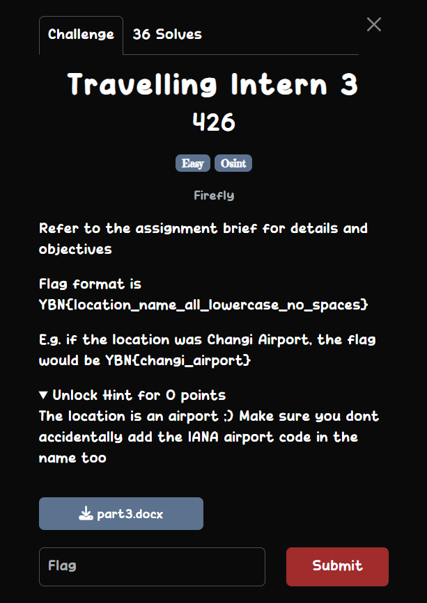

## Travelling Intern 3  



```
Good job, intern. We were able to deploy agents to the new meetup point, and they got a hint on where the next location will be posted. One of the agents mentioned that they overheard William saying to “check other socials” for the next location meetup, and that they will be getting the intern to post the new location.
Find the platform that the intern will be posting the next meetup location, and where the meetup will be organized. We suggest using automated tools for this assignment. 

Objective(s)
    - Find the social platform that the intern will post the next meetup
```

scuffed ass chall bro  

chall hint states that its an airport and part 1 & 2 were both in shanghai  

chall gives you 10 attempts and shanghai only has like 2 major airports so just guess both lol  


Flag: `YBN{shanghai_pudong_international_airport}`