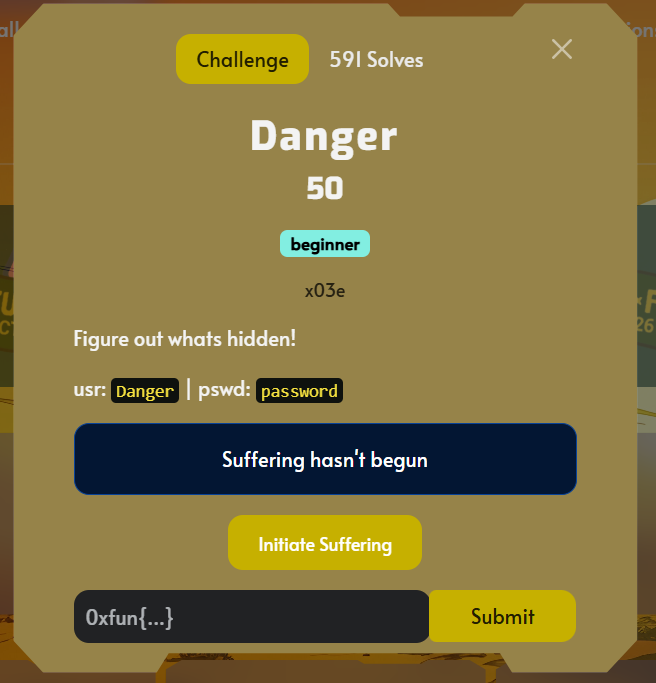
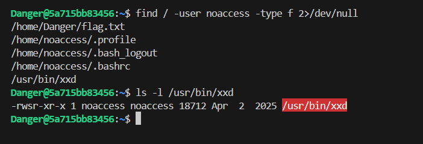

## Danger  

In the challenge server, we are provided with a singular file `flag.txt`, but we don't have the perms to read it.  

Looking at the file privileges, we can see that only user `noaccess` has read access to `flag.txt`, but we are currently logged in as `Danger`.  

We can use `find` to list all the binaries that are owned by `noaccess`, and the one that is of most interest to use would be `/usr/bin/xxd`.  

`/usr/bin/xxd` runs as `noaccess`, and has the group permission `r-x`, which means any user can run it.  

We can thus us `/usr/bin/xdd` to read the flag file.  

Flag: `0xfun{Easy_Access_Granted!}`