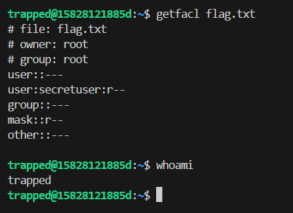
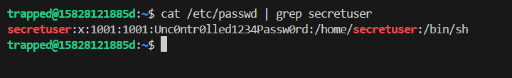

## Trapped  

In the challenge server, we are provided with `flag.txt`, but we don't have permission to read it.  

Running `getfacl` on the flag file will show that it is root owned, and will also reveal that `secretuser` has root privileges.  

We can find the password for `secretuser` in `/etc/passwd`.  

We can then `su` with the `secretuser` password to get a shell with root privileges, where we can read the flag file.  

Flag: `0xfun{4ccess_unc0ntroll3d}`