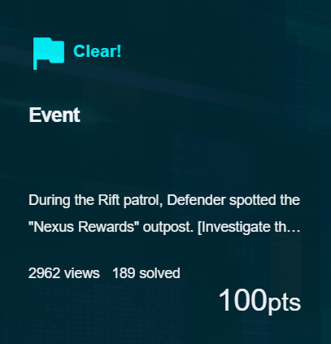
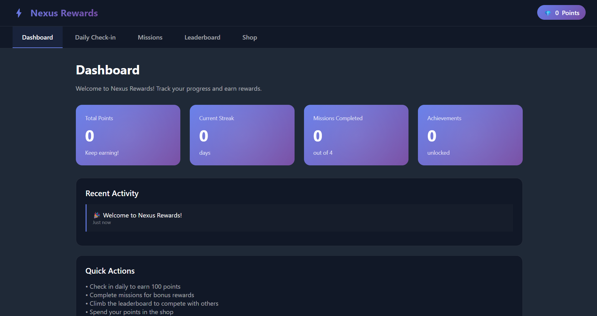

## Event  



We are given a webpage where we can claim points.  



Inside the HTML source, we can find `checkFlag()` which requests `/api/flag`.  

```js
async function checkFlag() {
    try {
        const response = await fetchAPI('/api/flag');
        const data = await response.json();

        if (data.success) {
            const flagDiv = document.getElementById('flagDisplay');
            flagDiv.textContent = `🎊 ${data.flag}`;
            flagDiv.style.display = 'block';
        }
    } catch (error) {
        console.error('Error checking flag:', error);
    }
}
```

Attempting to directly request `/api/flag` gives us this message.  

```json
{"success":false,"message":"You need 1000 points to unlock this reward. Current: 100"}
```

The only way for us to earn points is through `/api/daily-checkin`, but it only gives `100` points.  

This hints at a race condition vuln.  

```js
async function dailyCheckin() {
    const btn = document.getElementById('checkinBtn');
    const msgDiv = document.getElementById('checkinMessage');

    btn.disabled = true;

    try {
        const response = await fetchAPI('/api/daily-checkin', { method: 'POST' });
        const data = await response.json();

        if (data.success) {
            showMessage(msgDiv, data.message, 'success');
            await updateStats();
        } else {
            showMessage(msgDiv, data.message, 'error');
        }
    } catch (error) {
        showMessage(msgDiv, 'Network error occurred', 'error');
    } finally {
        setTimeout(() => {
            btn.disabled = false;
        }, 1000);
    }
}
```

solve was lowk kinda scuffed cuz the solve script only worked like 40% of the time  

so just race with a shitton of threads and pray you get lucky  

```json
{"success":true,"flag":"CDDC2026{r4c3_c0nd1t10n_1s_r34l_thr34t_d89f2a1b}","message":"Congratulations! You've unlocked the secret reward!"}
```

Flag: `CDDC2026{r4c3_c0nd1t10n_1s_r34l_thr34t_d89f2a1b}`