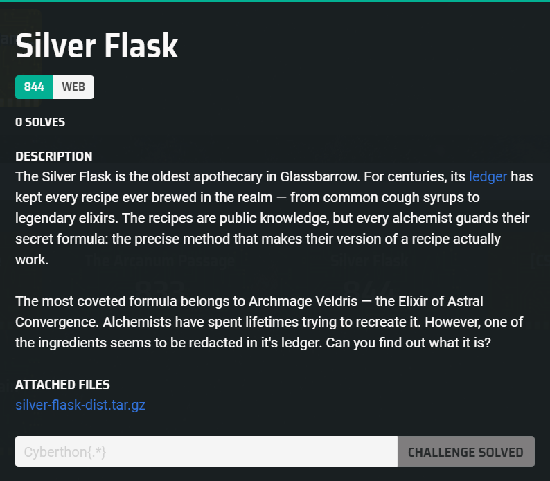
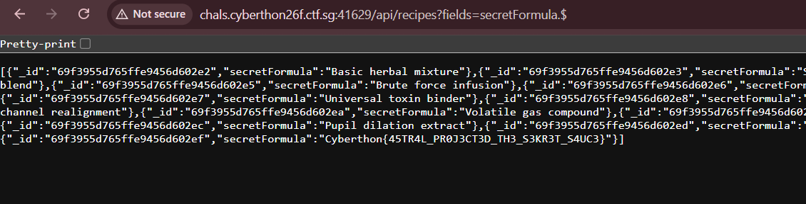

## Silver Flask  



We are given a webpage written in Node.js, with a Mongoose database.  

The webpage has an `/api/recipes` endpoint where we can query for recipes of spells in the database.  

```js
// index.js
app.use('/api/recipes', recipesRouter);

...

// routes/recipes.js
router.get('/', async (req, res) => {
    try {
        const query = Recipe.find();
        if (req.query.fields) {
            query.select(req.query.fields);
        }
        res.json(await query);
    } catch (err) {
        res.status(500).json({ error: 'internal error' });
    }
});
```

Looking at `Recipe.js`, we can see that each spell entry has a `secretFormula` field that has `select` set to `false`, meaning that field will be excluded from projections by default.  

```js
import mongoose from 'mongoose';

const recipeSchema = new mongoose.Schema({
    owner:         { type: String, required: true },
    name:          { type: String, required: true },
    description:   { type: String },
    ingredients:   { type: String, required: true },
    secretFormula: { type: String, select: false },
});

export default mongoose.model('Recipe', recipeSchema);
```

In `seed.js`, we can see that a special entry is created with the `secretFormula` field set to the flag.  

```js
export async function seed(flag) {
    const count = await Recipe.countDocuments();
    if (count > 0) {
        console.log('Database already seeded, skipping');
        return;
    }

    console.log('Seeding database...');

    await Recipe.insertMany(decoys);

    const target = await Recipe.create({
        owner: 'Archmage Veldris',
        name: 'Elixir of Astral Convergence',
        description: 'The most sought-after formula in the known realm, and the subject of more failed imitations than any other recipe in the Silver Flask\'s long history. Said to open the drinker\'s mind to the space between stars, granting visions of distant planes and knowledge that transcends mortal comprehension.\n\nThe experience lasts only minutes but leaves the drinker permanently changed — wiser, most agree, though others whisper of those who saw too much and never fully returned to themselves. The Archmage himself is said to have brewed it only seven times in his long life.\n\nOnly Veldris has ever successfully produced it, and he guards the formula with enchantments that would make a dragon think twice. Those who have attempted to reverse-engineer the elixir from its ingredients alone have produced nothing but expensive headaches and, in one memorable case, a small fire that burned for three days without consuming anything.',
        ingredients: 'Ancient herbs, Starlight essence, [SECRET FORMULA REQUIRED]',
        secretFormula: flag,
    });
    console.log(`Target recipe ID: ${target._id}`);

    console.log('Seeding complete');
}
```

We are only allowed to specify fields through the `field` URL parameter, so we can't use NoSQL filters.  

Mongoose is also running with `sanitizeProject` set to `true`, so we can't just bypass it with `+secretFormula`.  

```js
// MongoDB
const mongoURI = process.env.MONGO_URI || 'mongodb://localhost:27017/silverflask';
mongoose.set('sanitizeProjection', true);
```

Instead, we can bypass this using `secretFormula.$`. Even though `sanitizeProjection` is enabled, the raw projection results are still sent to Mongoose.  

`.$` is a positional projection operator on arrays and Mongoose won't normalise `secretFormula.$`, which will cause it to return the `secretFormula` field values.  



Flag: `Cyberthon{45TR4L_PR0J3CT3D_TH3_S3KR3T_S4UC3}`