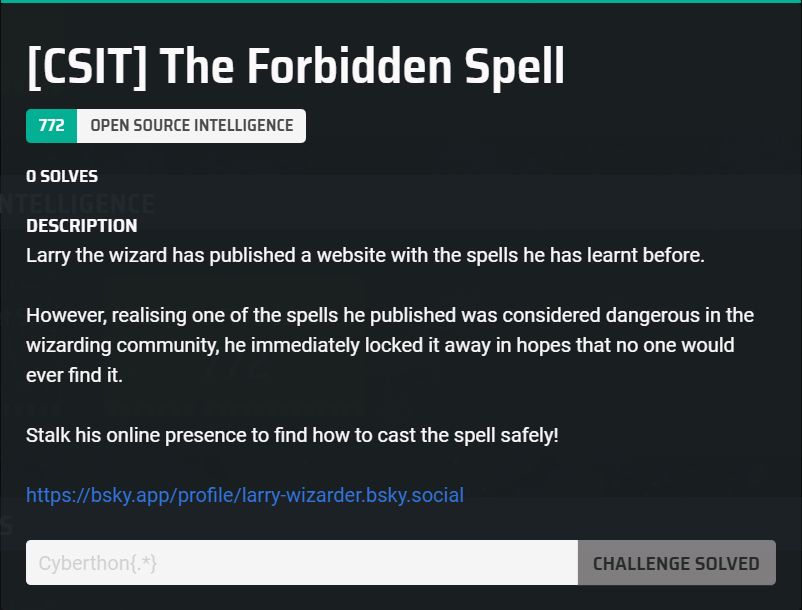
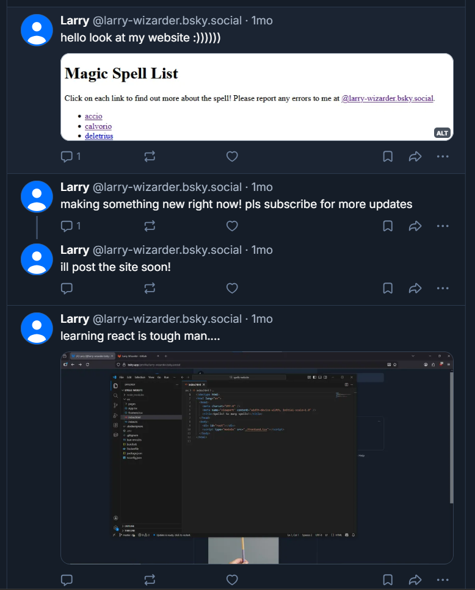
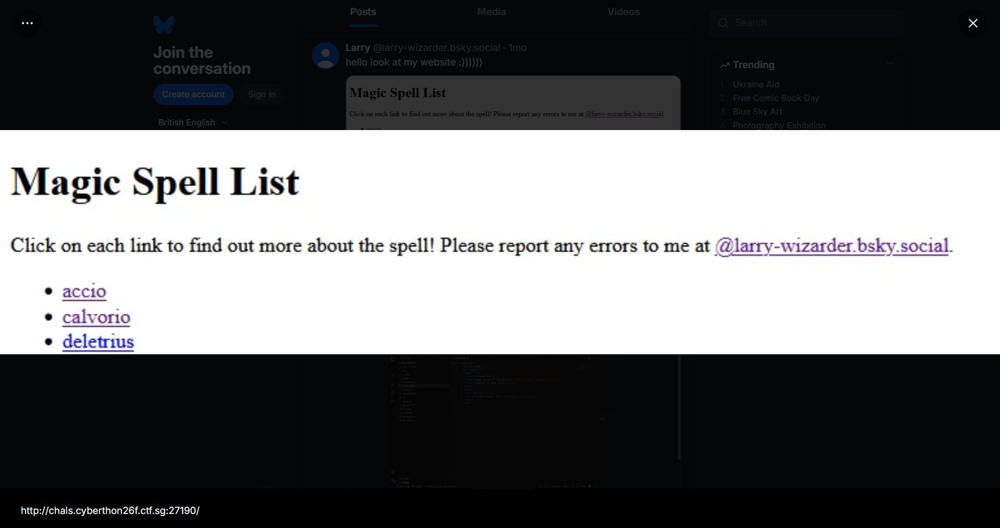
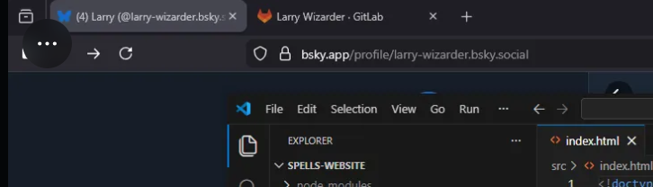
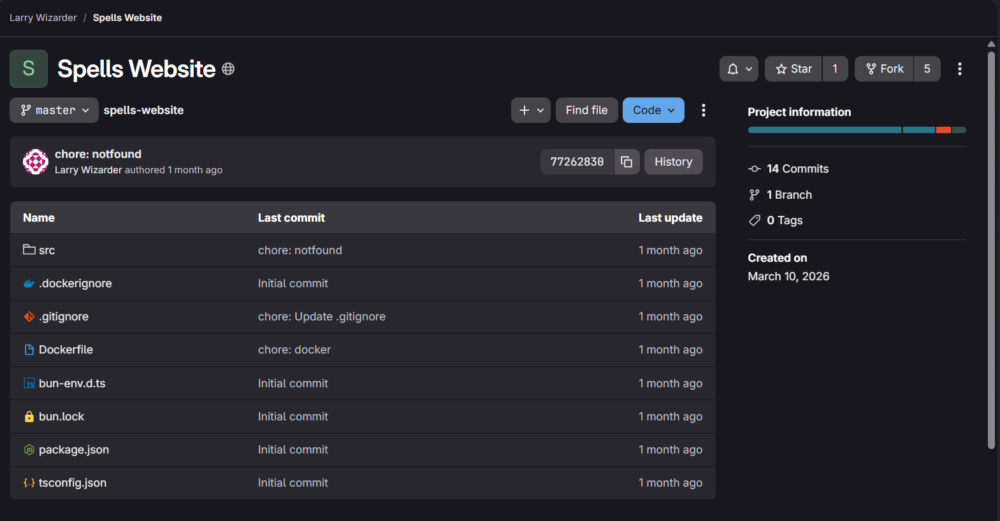
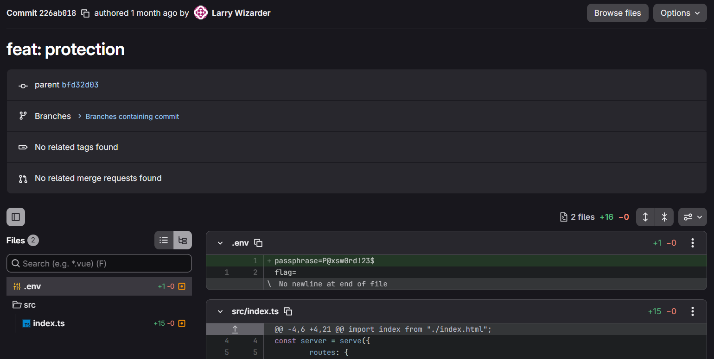
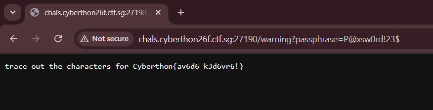

## The Forbidden Spell  



We are given a Bluesky account to OSINT.  

In the posts, we can find two mentions of a website that Larry is supposedly developing.  



If we open the post with the website screenshot, we can find alt text containing the website link `http://chals.cyberthon26f.ctf.sg:27190/`.  



In the other post, we can see his GitLab username in one of the tabs.  



If we search for `Larry Wizarder` on GitLab, we can find one repo under that username, which turns out to be the source code for the website.  



`/src/index.ts` shows that there is a `/warning` endpoint, where the flag will be rendered if we supply the correct passphrase.  

Both the passphrase and flag are environment variables defined in `.env`.  

```ts
import { serve } from "bun";
import index from "./index.html";

const server = serve({
	routes: {
		"/*": index,

		"/warning": {
			async GET(req) {
				const searchParams = new URL(req.url).searchParams;

				if (searchParams.get("passphrase") !== process.env.passphrase) {
					return new Response("<redacted>", { status: 401 });
				}

				return new Response(
					`trace out the characters for ${process.env.flag}`,
					{ status: 200 },
				);
			},
		},
	},

	development: process.env.NODE_ENV !== "production" && {
		hmr: true,
	},
	port: 80,
});

console.log(`🚀 Server running at ${server.url}`);
```

Looking through the commit history, we can find one commit where the passphrase `P@xsw0rd!23$` is added to the `.env`.  



Visiting `/warning` with the passphrase will get the flag to display.  



Flag: `Cyberthon{av6d6_k3d6vr6!}`