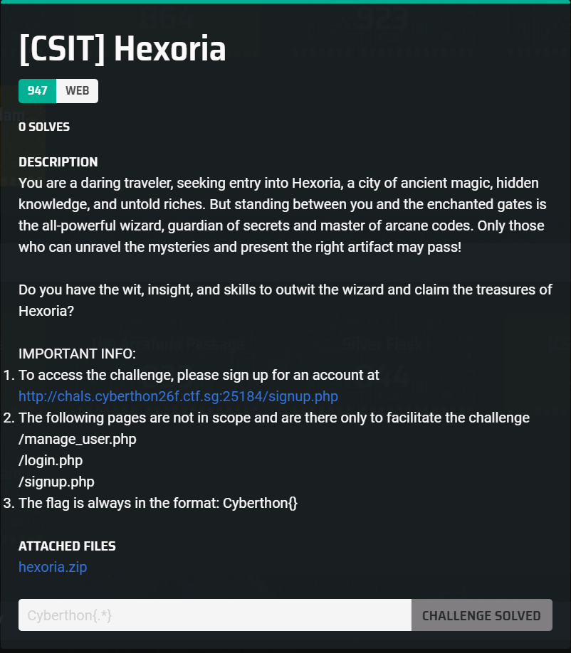
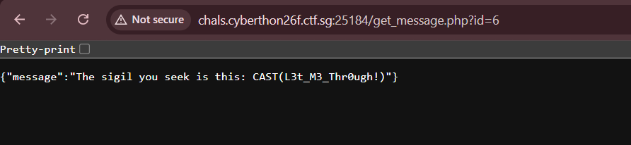
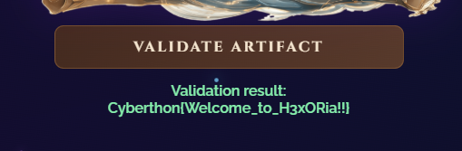

## [CSIT] Hexoria  



The server has a `/validate.php` endpoint, where we have to supply a file that meets two criteria to get the flag.  

`validate()` checks if the file contains a special sigil text, and also checks if the filename ends with `.spell`.  

```php
class ArtifactValidator
{
    ...

	private function findPos(string $file, string $split): int {
	    $lower = mb_strtolower($file, 'UTF-8');
	    $idx = strpos($lower, strtolower($split));

	    if ($idx === false) {
	        return -1;
	    }
	    return $idx + strlen($split);
	}
    
    ...

    private function validate(string $file): void {
    	global $sigil;
        $safeFilename = sanitizeFilename($file);
        $file = $this->userDir . '/' . $safeFilename;
        
        if (!file_exists($file)) {
            $this->respond(false,'Artifact does not exsit in Repository.');
        	return;
        }

        $data = file_get_contents($file);
        
        if (!str_contains($data, $sigil) || !$this->spell_checkv2($safeFilename)) {
        	$this->respond(false,'Something is missing in this artifact.');
       		return;
   		}

        $this->respond(true, file_get_contents(WELCOME_FILE));

        return;
    }

	private function spell_checkv2(string $filename): bool {
	    global $URI;
	    if (is_null($filename) || $filename === '') {
	        return false;
	    }

	    $pos = $this->findPos($filename, ".spell");
	    if ($pos === -1) {
	        return false;
	    }

	    $ext = substr($filename, $pos);
	    $ext = mb_strtolower($ext, 'UTF-8');

	    $URI = substr($filename, 0, $pos);

	    return $ext == null;
	}
    ...
```

The chall dist includes the source for `get_message.php`, albeit with some code implementation missing, so we can assume that the endpoint is pretty important.  

`/get_message.php` allows us to supply an `id`, and will return the corresponding message.  

```php
$lines = file($file_path, FILE_IGNORE_NEW_LINES | FILE_SKIP_EMPTY_LINES);

if (empty($lines)) {
    echo json_encode(['message' => 'No magical waves received.']);
    exit;
}

$id = filter_input(INPUT_GET, 'id', FILTER_VALIDATE_INT);

if($id === null){
	echo json_encode(['message' => '........']);
	exit;
}

$message = $lines[$id];
echo json_encode(['message' => $message]);
```

If we supply `6` as the `id`, we get the special sigil our file requires.  



Now, we just need to figure out how to upload our payload file.  

`/upload.php` allows file uploads, but an important caveat is that it only allows PNG uploads, which means we can't simply upload a file with the `.spell` extension.  

```php
class ArtifactUploader
{   
    ...

    private function validateFile(): bool
    {
        if (!isset($this->file) || $this->file['error'] !== UPLOAD_ERR_OK) {
            $this->fail('Image corruption during summon.');
            return false;
        }

        if ($this->file['size'] > 2 * 1024 * 1024) {
            $this->fail('The artifact is too heavy for the magic.');
            return false;
        }

        $finfo = new finfo(FILEINFO_MIME_TYPE);
        $mime = $finfo->file($this->file['tmp_name']);
        if ($mime !== 'image/png') {
            $this->fail('Only authentic PNG artifacts are accepted.');
            return false;
        }

        $ext = strtolower(pathinfo($this->file['name'], PATHINFO_EXTENSION));
        if ($ext !== 'png') {
            $this->fail('The artifact essence must end in .png');
            return false;
        }

        return true;
    }

    ...
```

Going back to `validate()` in `/validate.php`, we can spot a vulnerability that allows us to bypass this restriction.  

The file extension check is inherently flawed, as `spellcheckv2()` calls `mb_strtolower()` on the filename before extracting the position of `.spell`, counting the indexes by bytes.  

However, `validate()` later extracts the substring at that position directly using `substr()`, which counts indexes by character.  

If we pad the start of the filename with `4` multi-byte characters, we can cause a sufficiently large misalign such that the extension index returned by `spellcheckv2()` comes after the index of `.png`, thus bypassing the extension check.  

```
\u0130\u0130\u0130\u0130a.spell.png
```

We just have to create a valid PNG and insert the sigil in the imgae metadata, then rename it to our payload filename.  

Submitting our payload file for validation will then get the flag to display.  



Flag: `Cyberthon{Welcome_to_H3xORia!!}`