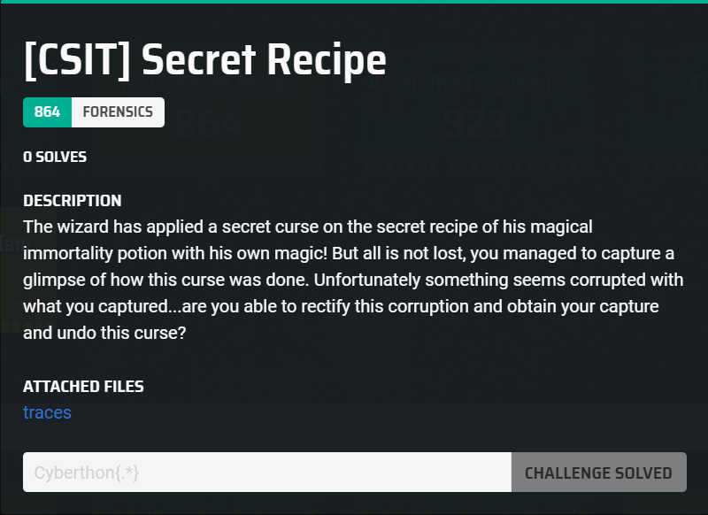
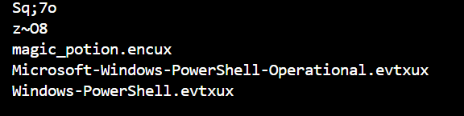
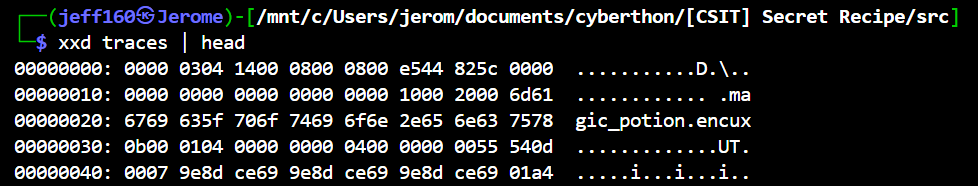
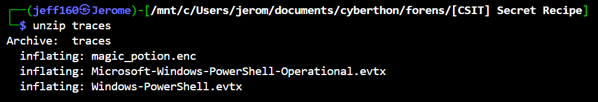

## [CSIT] Secret Recipe  



We are provided with a `traces` file that contains binary gibberish.  

Running `strings` on the file reveals some filename strings, which hints that it is a zip archive.  



However, if we inspect the header bytes, we will notice that it lacks a valid file signature, which explains why Linux can't detect the file type.  



If we patch the first `2` bytes of file to `PK`, we can successfully unzip the file.  

```bash
printf '\x50\x4b' | dd of=traces bs=1 count=2 conv=notrunc
```

This gives us three files, `magic_potion.enc` and two event log files.  



`Windows-Powershell.evtx` suggest that we should inspect the Powershell event logs, and we can extract them using this script.  

```python
from Evtx.Evtx import Evtx

out = ''

with Evtx("Microsoft-Windows-PowerShell-Operational.evtx") as log:
    for record in log.records():
        if '4104' in record.xml():
            out += record.xml() + '\n'

with open("log.txt", 'w') as f:
    f.write(out)
```

Inspecting the logs, we can see that Powershell scripts where used to perform an encryption to produce `magic_potion.enc`.  

Specifically, an RC4 encryption was run on the original file contents using the computer's hostname as the key.  

```ps1
# Apply_Curse.ps1
$b = [System.Text.Encoding]::UTF8.GetBytes($env:COMPUTERNAME)

# Curse_Magic.psm1
function Seal {
    param (
        [Parameter(Mandatory=$true)]
        [byte[]]$a,

        [Parameter(Mandatory=$true)]
        [byte[]]$b
    )

    $S = 0..255
    $j = 0
    $b = [System.Text.Encoding]::UTF8.GetBytes($env:COMPUTERNAME)
    for ($i = 0; $i -lt 256; $i++) {
        $j = ($j + $S[$i] + $b[$i % $b.Length]) % 256

        $temp = $S[$i]
        $S[$i] = $S[$j]
        $S[$j] = $temp
    }

    $i = 0
    $j = 0
    $result = New-Object byte[] $a.Length

    for ($n = 0; $n -lt $a.Length; $n++) {
        $i = ($i + 1) % 256
        $j = ($j + $S[$i]) % 256

        $temp = $S[$i]
        $S[$i] = $S[$j]
        $S[$j] = $temp

        $K = $S[($S[$i] + $S[$j]) % 256]
        $result[$n] = $a[$n] -bxor $K
    }

    return $result
}
```

Conveniently, each event log already includes the computer's hostname.  

```xml
<Execution ProcessID="3932" ThreadID="7860"></Execution>
<Channel>Microsoft-Windows-PowerShell/Operational</Channel>
<Computer>DESKTOP-H3KMT1M</Computer>
<Security UserID="S-1-5-21-4005867129-758303680-3052277857-1001"></Security>
```

We can decrypt the RC4 ciphertext in `magic_potion.enc`, which gives us a long Base64 string.  

```python
def rc4(data, key):
    key = key.encode('utf-8')
    S = list(range(256))
    j = 0
    for i in range(256):
        j = (j + S[i] + key[i % len(key)]) % 256
        S[i], S[j] = S[j], S[i]
    i = j = 0
    result = []
    for byte in data:
        i = (i + 1) % 256
        j = (j + S[i]) % 256
        S[i], S[j] = S[j], S[i]
        K = S[(S[i] + S[j]) % 256]
        result.append(byte ^ K)
    return bytes(result)
```

```
RGVlcCB3aXRoaW4gdGhlIG1vb25saXQgZ3JvdmVzIG9mIHRoZSBXaGlzcGVyaW5nIFdvb2RzLCB0aGUgTHVtaW5hcmEgRWxpeGlyIGF3YWl0cywgYSBwb3Rpb24gb2YgZHJlYW1zIGFuZCBoaWRkZW4gbWFnaWMuIFRvIGNyYWZ0IGl0LCBnYXRoZXIgdGhyZWUgZHJvcHMgb2YgTW9vbmxpdCBEZXcsIGZpdmUgU3RhcmR1c3QgUGV0YWxzIGZyb20gdGhlIG1pZG5pZ2h0LWJsb29taW5nIFNpbHZlciBGbG93ZXIsIGEgc2xpdmVyIG9mIFdoaXNwZXJpbmcgV2lsbG93IEJhcmssIHR3byBkcm9wcyBvZiB2b2xhdGlsZSBFbWJlcnZpbmUgRXNzZW5jZSwgYSBwaW5jaCBvZiBDcnlzdGFsbGl6ZWQgRHJlYW1yb290LCBhbmQgYSBzbWFsbCBOaWdodGluZ2FsZSBGZWF0aGVyIOKAlCB0aG91Z2ggb25lIGVsdXNpdmUgaW5ncmVkaWVudCwgZW5jb2RlZCBhcyBRM2xpWlhKMGFHOXVlMUF3ZHpOeU0yaGxNMnhmVEROaFZtVTFYMnd3WjNNaElYMD0sIG11c3QgZmlyc3QgYmUgZGVjaXBoZXJlZCBieSB0aG9zZSBjbGV2ZXIgZW5vdWdoIHRvIHVucmF2ZWwgaXRzIGhpZGRlbiBmb3JtLiBQbGFjZSB0aGVtIGluIGEgY2F1bGRyb24gb3ZlciBnZW50bGUgZW1iZXJzLCBjaGFudGluZyDigJhCeSBtb29uIGFuZCBzdGFyLCBieSBkcmVhbSBhbmQgc3BhcmssIGF3YWtlbiB0aGUgbWFnaWMgaW4gdGhpcyBkYXJrLOKAmSBzd2lybGluZyB0aGUgZGV3IHRocmVlIHRpbWVzLCBhZGRpbmcgcGV0YWxzIGFzIHRoZXkgZGlzc29sdmUsIHRoZW4gdGhlIGJhcmsgYW5kIGVzc2VuY2Ugd2l0aCBzZXZlbiBjb3VudGVyLWNsb2Nrd2lzZSBzdGlycy4gU3ByaW5rbGUgaW4gdGhlIERyZWFtcm9vdCwgZmxvYXQgdGhlIGZlYXRoZXIgYXRvcCwgYW5kIGxldCB0aGUgcG90aW9uIHJlc3QgdW5kZXIgdGhlIHR3aW4gbW9vbnMgdW50aWwgaXQgZ2xvd3Mgc29mdGx5IGxpa2UgbGlxdWlkIHN0YXJsaWdodC4gT25lIHNpcCBhd2FrZW5zIHZpc2lvbnMgb2YgZm9yZ290dGVuIHdvcmxkcywgYnV0IG9ubHkgaGVhcnRzIG9mIHRydWUgaW50ZW50IGNhbiBoYXJuZXNzIGl0cyBwb3dlciwgYW5kIHRoZSBlbGl4aXIgd2FuZXMgYWZ0ZXIgdGhyZWUgbmlnaHRzLg==
```

The string decrypts to this message, which contains a Base64 string that decodes to the flag.  

```
Deep within the moonlit groves of the Whispering Woods, the Luminara Elixir awaits, a potion of dreams and hidden magic. To craft it, gather three drops of Moonlit Dew, five Stardust Petals from the midnight-blooming Silver Flower, a sliver of Whispering Willow Bark, two drops of volatile Embervine Essence, a pinch of Crystallized Dreamroot, and a small Nightingale Feather — though one elusive ingredient, encoded as Q3liZXJ0aG9ue1AwdzNyM2hlM2xfTDNhVmU1X2wwZ3MhIX0=, must first be deciphered by those clever enough to unravel its hidden form. Place them in a cauldron over gentle embers, chanting ‘By moon and star, by dream and spark, awaken the magic in this dark,’ swirling the dew three times, adding petals as they dissolve, then the bark and essence with seven counter-clockwise stirs. Sprinkle in the Dreamroot, float the feather atop, and let the potion rest under the twin moons until it glows softly like liquid starlight. One sip awakens visions of forgotten worlds, but only hearts of true intent can harness its power, and the elixir wanes after three nights.
```

Flag: `Cyberthon{P0w3r3he3l_L3aVe5_l0gs!!}`