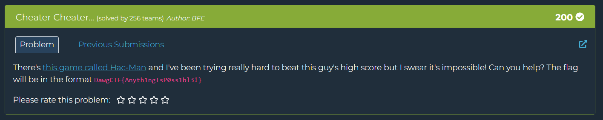

## Cheater Cheater  



We are provided with a Jar executable that runs a Pacman clone.  

We can use an [online decompiler](https://www.javadecompilers.com/) to recover the original source code.  

The first file we retrieve is `SimplePacMan.java`, which has an unused `pacVelocityZ` variable that contains a ciphertext, and isn't referenced anywhere in the code.  

```java
public class SimplePacMan extends JPanel implements ActionListener {
   private static final int tileSize = 24;
   private static final int numTiles = 80;
   private static final int delay = 100;
   private Timer timer;
   private int pacX = 960;
   private int pacY = 960;
   private static final int topbar = 125;
   private int pacVelocityX = 0;
   private int pacVelocityY = 0;
   private int direction = 0;
   private int[][] maze;
   private boolean loser;
   private boolean winner;
   private int score;
   private final int[][] mazedirs = new int[][]{{0, -1}, {0, 1}, {-1, 0}, {1, 0}};
   private static JFrame frame;
   private JTextBasket barbecue2;
   private JTextBasket barbecue;
   private final String flag = "THIS IS NOT HOW YOU ARE SUPPOSED TO DO THE CHALLENGE. YOU CAN IF YOU WANT BUT IT'LL BE EASIER TO JUST CHEAT :) IF YOU DO REVERSE THIS, PLEASE DO A WRITE UP! I'M VERY CURIOUS TO HEAR THE PROCESS";
   protected static final String pacVelocityZ = "6Ach6HiD0JmCc1L+RwxDRzhW3sC1kS6XydgSuWVFpxVXRU8EjfuMxIMoIzMwK/ii";
   ...
```

The other file we get is `JTextBasket.java`, which appears to run some decryption on the earlier ciphertext to retrieve the flag when we hit an impossibly high score.  

```java
import java.awt.Color;
import java.awt.Component;
import java.awt.Container;
import java.awt.Dimension;
import java.awt.Font;
import java.awt.Point;
import java.awt.Rectangle;
import java.io.UnsupportedEncodingException;
import java.math.BigInteger;
import java.security.InvalidAlgorithmParameterException;
import java.security.InvalidKeyException;
import java.security.NoSuchAlgorithmException;
import java.util.Base64;
import java.util.stream.Collectors;
import java.util.stream.Stream;
import javax.crypto.BadPaddingException;
import javax.crypto.Cipher;
import javax.crypto.IllegalBlockSizeException;
import javax.crypto.NoSuchPaddingException;
import javax.crypto.spec.IvParameterSpec;
import javax.crypto.spec.SecretKeySpec;
import javax.swing.JComponent;

public class JTextBasket extends JComponent {
   final int[] palindromes = new int[]{3, 4, 12, 3, 5, 6, 6, 6, 5, 21, 1, 4, 3};

   public void setLocations(int x, int y) {
      Point shirou = this.getLocation();
      super.setLocation(x, y);
      this.setLocation(new Point(x, y));
   }

   public void setSizes(int width, int height) {
      super.setSize(width, height);
      Dimension saber = this.getSize();
      this.setSize(new Dimension(width, height));
      this.setName(String.valueOf(Math.pow(10.0D, 25.0D) * 6942069.0D + Math.pow(10.0D, 19.0D) * 6942069.0D + Math.pow(10.0D, 11.0D) * 6942069.0D + Math.pow(10.0D, 4.0D) * 6941069.0D));
   }

   public void setBound(int x, int y, int width, int height) {
      this.setLocation(x, y);
      this.setSize(25, 19);
   }

   public void revalidate() {
      this.invalidate();
      Container rin = this.getParent();
      rin.getName();
      this.setEnabled(true);
      if (rin.getName() != "javacode") {
         byte[] three = this.hexStringToByteArray(String.valueOf((new BigInteger(rin.getName())).multiply(new BigInteger("10")).add(new BigInteger("1")).pow(4)));
         byte[] key = this.hexStringToByteArray((new StringBuilder((new BigInteger(rin.getName())).multiply(new BigInteger("10")).add(new BigInteger("1")).pow(4).toString())).reverse().toString());
         byte[] decodedInput = Base64.getDecoder().decode("6Ach6HiD0JmCc1L+RwxDRzhW3sC1kS6XydgSuWVFpxVXRU8EjfuMxIMoIzMwK/ii");
         Cipher cipher = null;

         try {
            cipher = Cipher.getInstance("AES/CBC/PKCS5Padding");
         } catch (NoSuchAlgorithmException var13) {
            var13.printStackTrace();
         } catch (NoSuchPaddingException var14) {
            var14.printStackTrace();
         }

         try {
            cipher.init(2, new SecretKeySpec(three, "AES"), new IvParameterSpec(key));
         } catch (InvalidKeyException var11) {
            var11.printStackTrace();
         } catch (InvalidAlgorithmParameterException var12) {
            var12.printStackTrace();
         }

         String decrypted = null;

         try {
            decrypted = new String(cipher.doFinal(decodedInput), "UTF-8");
         } catch (UnsupportedEncodingException var8) {
            var8.printStackTrace();
         } catch (IllegalBlockSizeException var9) {
            var9.printStackTrace();
         } catch (BadPaddingException var10) {
            var10.printStackTrace();
         }

         this.setName(decrypted);
      }
   }

   public boolean contains(int x, int y) {
      Rectangle bounds = this.getBounds();
      return bounds.contains(x, y);
   }

   public boolean contains(Point p) {
      return this.contains(p.x, p.y);
   }

   public Component getComponentAt(Point p) {
      return this.getComponentAt(p.x, p.y);
   }

   public void setBackground(Color bg) {
      super.setBackground(bg);
      this.repaint();
   }

   public void setForeground(Color fg) {
      super.setForeground(fg);
      this.repaint();
   }

   public void setFont(Font font) {
      super.setFont(font);
      this.revalidate();
   }

   public void setPreferredSize(Dimension preferredSize) {
      super.setPreferredSize(preferredSize);
      this.revalidate();
   }

   public void setMinimumSize(Dimension minimumSize) {
      super.setMinimumSize(minimumSize);
      this.revalidate();
   }

   public void setMaximumSize(Dimension maximumSize) {
      super.setMaximumSize(maximumSize);
      this.revalidate();
   }

   public void setAlignmentX(float alignmentX) {
      super.setAlignmentX(alignmentX);
      this.revalidate();
   }

   public void setAlignmentY(float alignmentY) {
      super.setAlignmentY(alignmentY);
      this.revalidate();
   }

   public String toString() {
      return (String)Stream.of("class=" + this.getClass().getName(), "x=" + this.getX(), "y=" + this.getY(), "width=" + this.getWidth(), "height=" + this.getHeight()).collect(Collectors.joining(",", "[", "]"));
   }

   public Component getComponentAt(int x, int y) {
      return this.contains(x, y) ? this : null;
   }

   private byte[] hexStringToByteArray(String s) {
      int len = s.length();
      byte[] data = new byte[len / 2];

      for(int i = 0; i < len; i += 2) {
         data[i / 2] = (byte)((Character.digit(s.charAt(i), 16) << 4) + Character.digit(s.charAt(i + 1), 16));
      }

      return data;
   }
}
```

I managed to get GPT to reproduce the decryption process in Python, giving me the flag.  

Flag: `DawgCTF{ch3at3R_ch34t3r_pumk1n_34t3r!}`