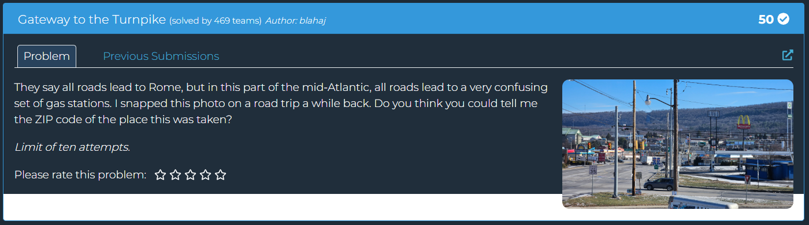
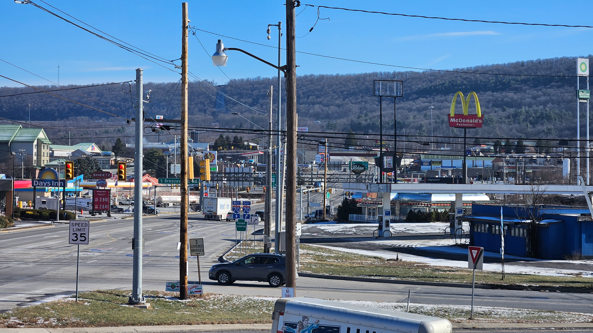
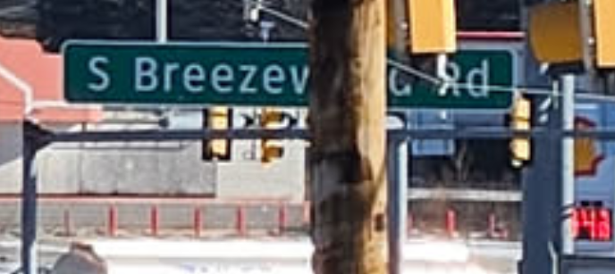

## Gateway to the Turnpike  

We are tasked with identifying the ZIP code of the location shown in the picture.  

Zooming in, we can see a cut off sign in the background that identifies the location.  

The full sign is meant to say `S Breezewood Rd`.  

Googling for the ZIP code of S Breezewood Rd gives us `15533`.  

Flag: `DawgCTF{15533}`