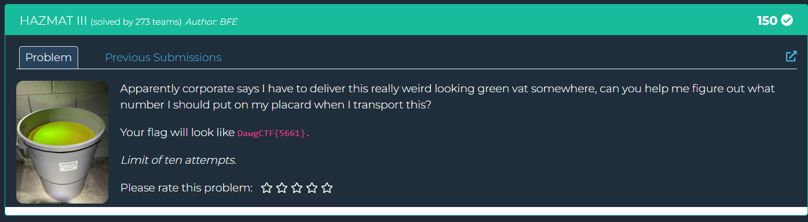

## Hazmat III  



Gemini transcript  

```
To solve this CTF challenge, you need to identify the specific hazardous material pictured and find its corresponding UN Number (the four-digit code used for transport placards).

Step 1: Identify the Substance
The label on the bucket clearly reads UCARTHERM. A quick search for this product reveals that it is a brand of heat transfer fluid, specifically an inhibited ethylene glycol.

Step 2: Determine the UN Number
According to the Material Safety Data Sheet (MSDS)—as the bucket suggests—ethylene glycol is regulated for transport by the Department of Transportation (DOT) only when it meets the threshold of a "reportable quantity" (usually in large containers). However, the standard UN number assigned to environmentally hazardous substances like ethylene glycol in bulk is:

UN3082

Step 3: Match the Flag
The prompt asks for the number you should put on your placard. Looking at the provided flag format and the digits required:

(Note: While your prompt included a placeholder flag DawgCTF{5661}, the actual solution based on the chemical "UCARTHERM" is 3082.)
```

Flag: DawgCTF{3082} 