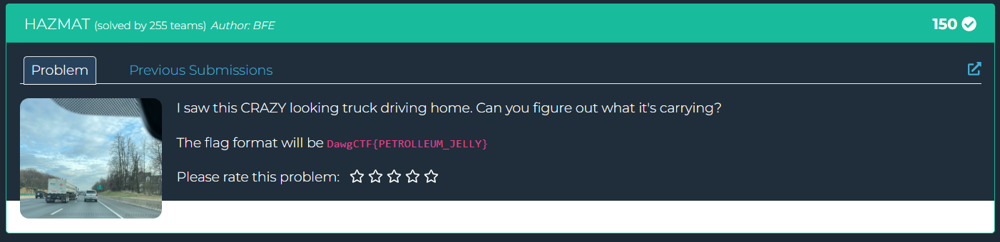
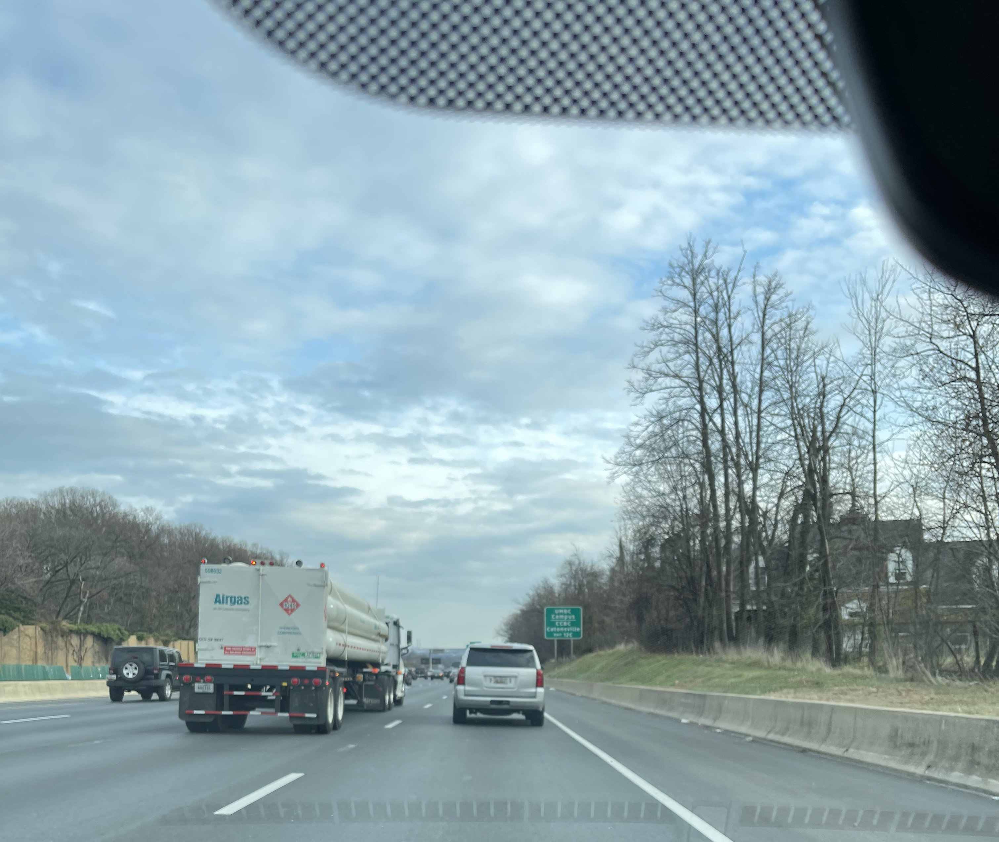
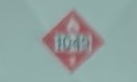

## Hazmat  

We are provided with an image of a truck on a road, and are tasked with identifying the substance it is carrying.  

Zooming in on the image, we can see a label that says `1049`.  

UN 1049 is the UN number representing compressed hydrogen, giving us the flag.  

Flag: `DawgCTF{COMPRESSED_HYDROGEN}`