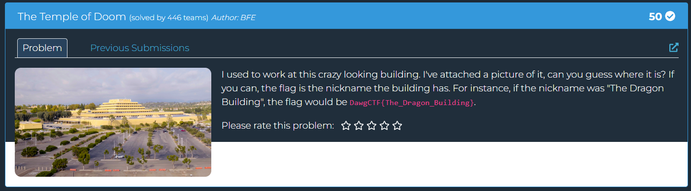

## The Temple of Doom  

We are tasked with finding the nickname of the location in the image.  

A quick Google Lens search identifies the structure as the Chet Holifield Federal Building, and we can easily find its nickname on Wikipedia.  

Flag: `DawgCTF{The_Ziggurat_Building}`