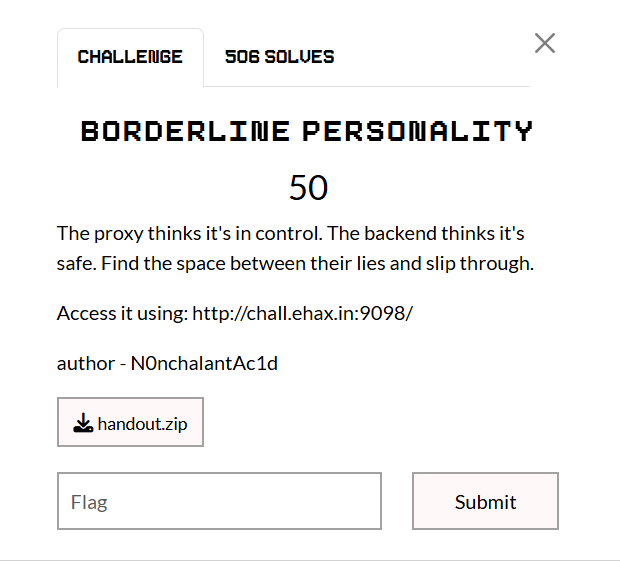

## Borderline Personality  



We are given a relatively simple webapp with an `/admin/flag` endpoint.  

```python
from flask import Flask, request, jsonify, render_template

app = Flask(__name__)

# The UI Template


@app.route('/')
def index():
    return render_template('index.html')


@app.route('/api/submit', methods=['POST'])
def submit():
    data = request.get_data()
    return jsonify({"status": "success", "message": "Data received."}), 200


@app.route('/admin/flag', methods=['GET', 'POST'])
def flag():
    return "EHAX{TEST_FLAG}\n", 200


@app.errorhandler(404)
def not_found(e):
    return "Not Found\n", 404
```

The server implements a Haproxy filter that blocks `admin` endpoints that are preceeded with slashes.  

```haproxy
global
    log stdout format raw local0
    maxconn 2000

defaults
    log     global
    mode    http
    option  httplog
    timeout connect 5000ms
    timeout client  50000ms
    timeout server  50000ms

frontend http-in
    bind *:8080
    
    acl restricted_path path -m reg ^/+admin
    http-request deny if restricted_path
    
    default_backend application_backend

backend application_backend
    server backend1 backend:5000
```

To bypass this, we can visit `%2fadmin/flag`. This works because of a mismatch in the way Haproxy and Flask parse URLs.  

Haproxy doesn't decode the path before applying the regex, which allows our payload to bypass the filter, while Flask correctly decodes and normalises the URL, giving us access to the flag endpoint.  

Flag: `EH4X{BYP4SSING_R3QU3S7S_7HR0UGH_SMUGGLING__IS_H4RD}`