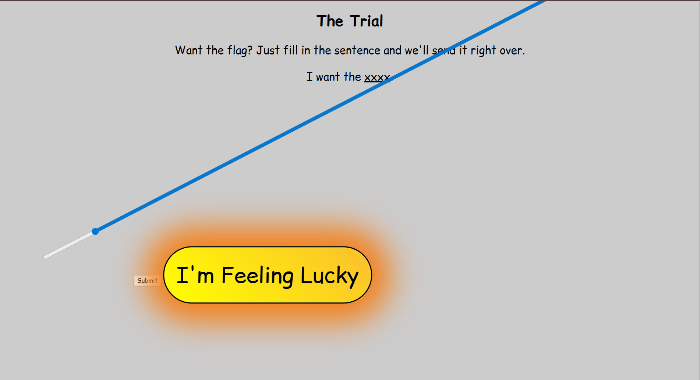

## the trial  


The challenge website contains a spinning slider and a golden button that redirects us to the rickroll video.  

The spinning slider value will be used to generate a 4-character word for the sentence `I want the ____`.  



Looking at the HTML source, we can see that the webpage makes a `POST` request to `/getflag` with the word.  


We can just skip the slider entirely and send a request with `word` as `flag` to `/getflag` to get the flag.  

```python
import requests

url = "https://the-trial.chall.lac.tf/"

res = requests.post(f'{url}/getflag', data={
    'word': 'flag'
}, headers={"Content-Type": "application/x-www-form-urlencoded"})
```

Flag: `lactf{gregor_samsa_awoke_from_wait_thats_the_wrong_book}`