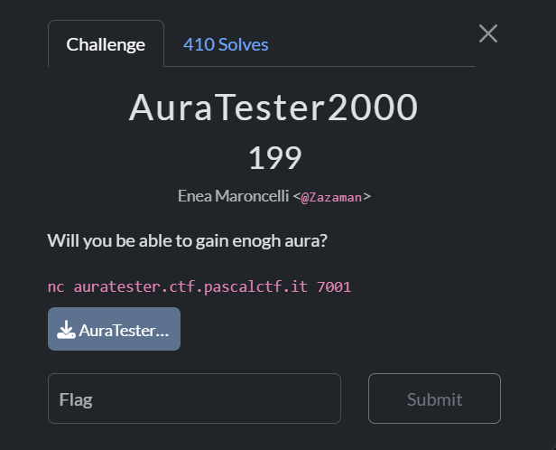

## AuraTester2000  



The challenge source provided contains Python-looking syntax, except that the keywords are all brainrot terms.  

```python
glaze random ahh sonopazzo
glaze os ahh palle

words = ["tungtung","trallalero","filippo boschi","zaza","lakaka","gubbio","cucinato"]

phrase = " ".join(sonopazzo.sample(words,k=sonopazzo.randint(3, 5)))

steps = sonopazzo.randint(2, 5)
flag = palle.getenv("FLAG", "pascalCTF{REDACTED}")
bop encoder(phrase, steps):
    encoded_phrase = ""
    mewing i in huzz(0,len(phrase)):

        chat is this real phrase[i] twin " ":
            encoded_phrase rizz= phrase[i]

        yo chat i% steps twin 0:
            encoded_phrase rizz= str(ord(phrase[i]))

        only in ohio:
            encoded_phrase rizz= phrase[i]


    its giving encoded_phrase
bop questions(name):
    gained_aura = 0
    questions = [
        "Do you believe in the power of aura? (yes/no)",
        "Do you a JerkMate account? (yes/no)",
        "Are you willing to embrace your inner alpha? (yes/no)",
        "Do you really like SHYNE from Travis Scott? (yes/no)",
    ]
    aura_values = [(150,-50), (-1000,50),(450,-80),(-100,50)]
    mewing i in huzz(len(questions)):
        print(f"{name}, {questions[i]}")
        answer = input("> ").strip().lower()
        chat is this real answer twin "yes":
            gained_aura rizz= aura_values[i][0]
        yo chat answer twin "no":
            gained_aura rizz=  aura_values[i][1]
    its giving gained_aura

bop aura_test(name):
```

This is actually the [PyGyat](https://pygyat.vercel.app/) dialect.  

Since Pygyat is only a preprocessor that replaces the syntax with brainrot terms, we can create a mapping that will convert the challenge source to normal Python syntax.  

```python
syntax = {
    "chat is this real": "if",            
    "yo chat": "elif",                    
    "only in ohio": "else",               
    "mewing": "for",                      
    "let him cook": "while",              
    
    "hawk": "try",                        
    "tuah": "except",                     
    "spit on that thang": "finally",      

    "bop": "def",                         
    "skibidi": "class",                   
    "GOAT": "global",                     
    "motion": "nonlocal",                 
    "pluh": "pass",                       
    "pause": "yield",                     
    "pause no diddy": "yield from",       
    "unc": "self",                        

    "glaze": "import",                    
    "lock in": "from",                    

    "yap": "print",                       
    "mog": "open",                        
    "demure": "close",                    
    
    "Aura": "True",                       
    "Cooked": "False",                    
    "NPC": "None",                        
    
    "rizz": "+",                          
    "fanum tax": "-",                     
    "sigma": ">",                         
    "beta": "<",                          
    "sigma twin": ">=",                   
    "beta twin": "<=",                    
    "twin": "==",                         
    
    "just put the fries in the bag bro": "break",   
    "edge": "continue",                              

    "sus": "assert",                     
    "crashout": "raise",                 
    
    "pookie": "with",                    
    "ahh": "as",                         

    "delulu": "del",                     
    "huzz": "range",  

    'its giving': 'return'                   
}

with open("chall.py", "r", encoding='utf-8') as f:
    code = f.read().strip()

for a, b in syntax.items():
    code = code.replace(a, b)

with open("deobf.py", "w", encoding='utf-8') as f:
    f.write(code)
```

Looking at the deobfuscated code, we can see that we have to farm aura by answering some questions, and when we have enough aura, we can take the final aura test to get thet flag.  

```python
def aura_test(name):
    print(f"{name}, you have reached the final TrueTest!")
    print("If you want to win your prize you need to decode this secret phrase:",encoder(phrase, steps))

    guess = input("Type the decoded phrase to prove your worth:\n> ")
    if guess == phrase:
        print(f"Congratulations {name}! You have proven your worth and gained the ultimate aura!\nHere's your price:\n{flag}")
        exit()
    else:
        print(f"Dont waste my time {name}, you failed the TrueTest. Try again but this time use all your aura!") 
    
...

while(True):
    print("\n\n1. Answer questions to gain or lose aura.\n\n2. Check your current aura.\n\n3. Take the final TrueTest to prove your worth.\n\n4. Exit the TrueTester2000.")
    choice = input("What do you want to do little Beta?\n> ")
    if (choice == "1"):
        print("You choose to answer questions. Let's see how much aura you can gain!")
        gained_aura = questions(name)
        if(aura > 0):
            print(f"Congratulations {name}! You gained {gained_aura} aura points.")
        else:
            print(f"Sorry {name}, you lost {gained_aura} aura points. Learn how to be a real Sigma!")
        aura += gained_aura

    elif(choice == "2"):
        print(f"Your current aura is {aura}.")
    elif(choice == "3"):
        if(aura < 500):
            print("You need more aura to even try the final TrueTest.")
        else:
            aura_test(name)
    elif(choice == "4"):
        print("Exiting the TrueTester2000. Goodbye!")
        exit()
    else:
        print("Invalid option. Please try again.")
```

The questions are pretty easy to answer since `aura_values` shows which options adds aura.  

```python
def questions(name):
    gained_aura = 0
    questions = [
        "Do you believe in the power of aura? (yes/no)",
        "Do you a JerkMate account? (yes/no)",
        "Are you willing to embrace your inner alpha? (yes/no)",
        "Do you really like SHYNE from Travis Scott? (yes/no)",
    ]
    aura_values = [(150,-50), (-1000,50),(450,-80),(-100,50)]
    for i in range(len(questions)):
        print(f"{name}, {questions[i]}")
        answer = input("> ").strip().lower()
        if answer == "yes":
            gained_aura += aura_values[i][0]
        elif answer == "no":
            gained_aura +=  aura_values[i][1]
    return gained_aura
```

The final aura test requires us to decrypt a ciphertext that is encrypted using a custom cipher.  

```python
words = ["tungtung","trallalero","filippo boschi","zaza","lakaka","gubbio","cucinato"]

phrase = " ".join(random.sample(words,k=random.randint(3, 5)))

steps = random.randint(2, 5)

...

def encoder(phrase, steps):
    encoded_phrase = ""
    for i in range(0,len(phrase)):

        if phrase[i] == " ":
            encoded_phrase += phrase[i]

        elif i% steps == 0:
            encoded_phrase += str(ord(phrase[i]))

        else:
            encoded_phrase += phrase[i]
```

lowk just gpt the decryption  

since the cipher uses `random.randint()` for the steps just bruteforce the steps until you get a valid plaintext  

```python
def decrypt(cipher, steps):
    result = ""
    i = j = 0 

    while j < len(cipher):
        if cipher[j] == " ":
            result += " "
            j += 1
            i += 1
            continue

        if i % steps == 0:
            num = ""
            while j < len(cipher) and cipher[j].isdigit():
                num += cipher[j]
                j += 1

            if num == "":
                return None

            result += chr(int(num))
            i += 1
        else:
            result += cipher[j]
            j += 1
            i += 1

    return result

def solve(cipher):
    for i in range(2, 6):
        secret = decrypt(cipher, i)
        print(secret)

        if secret:
            return secret
        
        i += 1
```

Answering all the questions correctly and passing the final aura test will then give us the flag.  

Flag: `pascalCTF{Y0u_4r3_th3_r34l_4ur4_f1n4l_b0s5}`