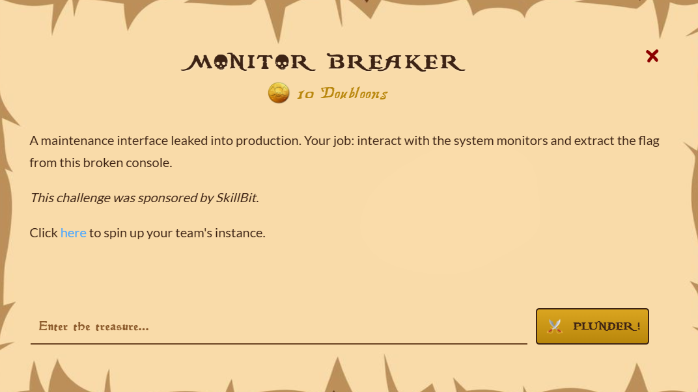
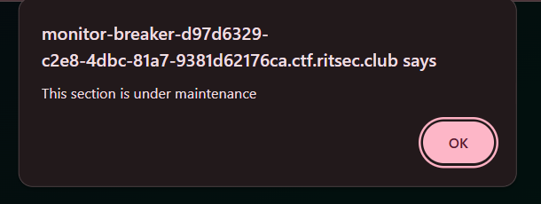
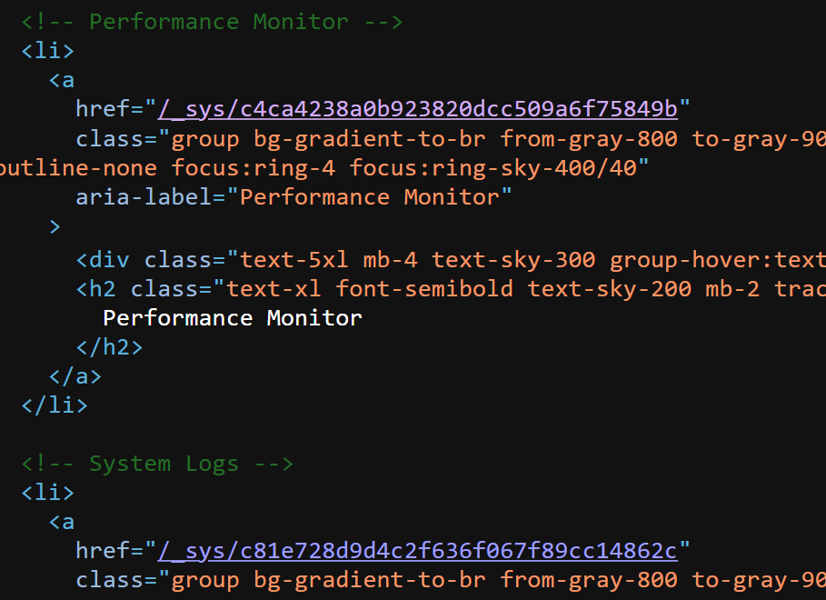
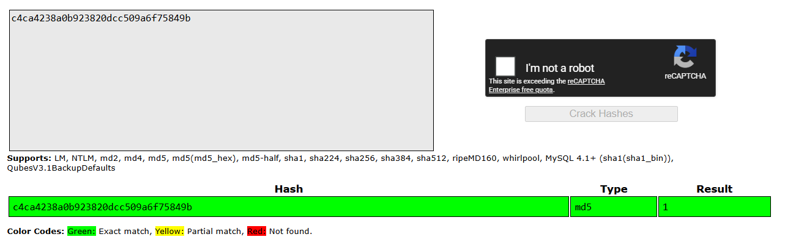

## Monitor Breaker  

We are given a simple webpage with three different endpoints.  

The Performance Monitor and System Logs both lead to generic system diagnostics endpoints, but interestingly, the Network Health gives an alert message instead.  

Going into the HTML source, we can see that the endpoints for the working endpoints are hashes.  

Cracking the hashes with [Crackstation](https://crackstation.net/) reveals that they are just MD5 hashes of the endpoint numbers.  

Since the endpoints have a predictable format, we can deduce that the Network Health endpoint is probably just the MD5 hash of `0`.  

Visiting `/_sys/cfcd208495d565ef66e7dff9f98764da` leads us to a ping tool with a generic command injection vulnerability, which we can exploit to inspect the directory structure and read the flag.  

Flag: `RS{1_br0k3_17_e6ebced80740d006889f26ceeeee666b}`