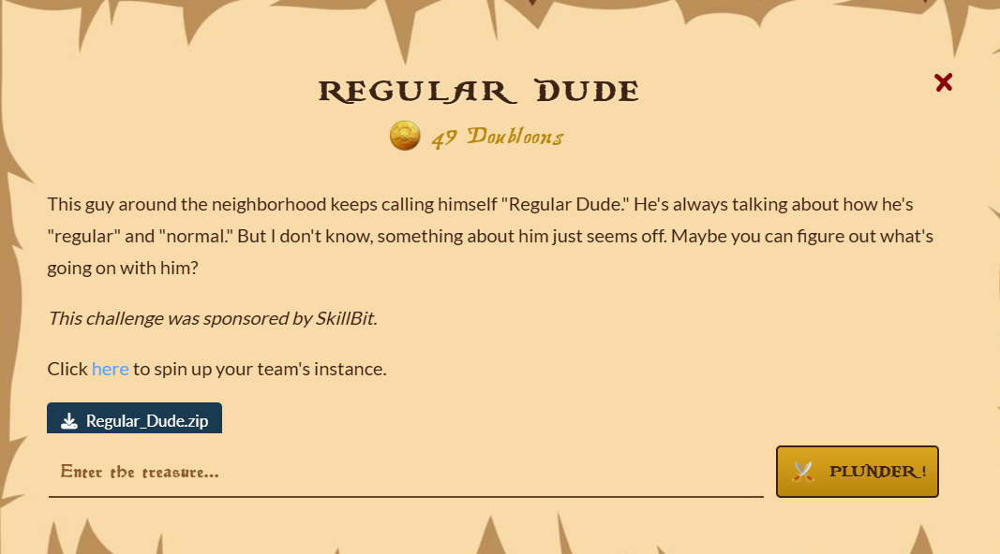

## Regular Dude  



bro im lowk lazy too explain this  

ok basically `/upload-model` has a keras rce vuln, and Dockerfile shows that theres a `FLAG` environment variable, so you just have to upload a malicious keras model that executes `os.system`  

`/upload-model` requires admin auth, but you dont have to register an admin account since the admin auth middleware falls back on the `Username` request header to check for admin  

```python
from flask import Flask, request, jsonify, session, redirect, render_template, url_for
import random
from tensorflow import keras, constant
import numpy as np
import hashlib
import re
import sqlite3


db = sqlite3.connect('users.db', check_same_thread=False)
cursor = db.cursor()

# Create users table if it doesn't exist
cursor.execute('''CREATE TABLE IF NOT EXISTS users (
                    id INTEGER PRIMARY KEY AUTOINCREMENT,
                    username TEXT UNIQUE NOT NULL,
                    password TEXT NOT NULL
                )''')
db.commit()

app = Flask(__name__)
app.secret_key = random.randbytes(16)

def admin_required(f):
    """
    Admin middleware. Using re, check if session username is equal to "admin", ignore case.
    """
    def wrapper(*args, **kwargs):
        username = session.get('username') or request.headers.get('Username', '')
        if re.match(r'^admin$', username, re.IGNORECASE):
            return f(*args, **kwargs)
        else:
            return jsonify({'error': 'Unauthorized'}), 401
    wrapper.__name__ = f.__name__
    return wrapper

@app.route('/register', methods=['GET', 'POST'])
def register():
    if request.method == 'GET':
        return render_template('register.html')

    if request.is_json:
        data = request.get_json()
        username = data.get('username')
        password = data.get('password')
    else:
        username = request.form.get('username')
        password = request.form.get('password')

    if not username or not password:
        return jsonify({'error': 'Username and password are required'}), 400
    elif username.lower() == 'admin':
        return jsonify({'error': 'Username "admin" is reserved'}), 400

    cursor.execute("INSERT INTO users (username, password) VALUES (?, ?)", (username, password))
    db.commit()

    if request.is_json:
        return jsonify({'message': 'User registered successfully'}), 201
    else:
        return redirect(url_for('login'))

@app.route('/login', methods=['GET', 'POST'])
def login():
    if request.method == 'GET':
        return render_template('login.html')

    if request.is_json:
        data = request.get_json()
        username = data.get('username')
        password = data.get('password')
    else:
        username = request.form.get('username')
        password = request.form.get('password')

    cursor.execute("SELECT * FROM users WHERE username=?", (username,))
    user = cursor.fetchone()

    if user and user[2] == password:
        session['username'] = username
        if request.is_json:
            return jsonify({'message': 'Login successful'}), 200
        else:
            return redirect(url_for('index'))
    else:
        if request.is_json:
            return jsonify({'error': 'Invalid credentials'}), 401
        else:
            return render_template('login.html', error='Invalid credentials')
    
@app.route('/logout', methods=['POST', 'GET'])
def logout():
    session.clear()
    return redirect('/')


@app.route('/', methods=['GET'])
def index():
    return render_template('index.html', username=session.get('username'))


@app.route('/upload-model', methods=['GET'])
@admin_required
def upload_page():
    return render_template('upload.html')

@app.route('/model', methods=['POST'])
@admin_required
def model():
    # Admin will upload a model file, we will load it and execute it.
    if 'model' not in request.files:
        return jsonify({'error': 'No model file uploaded'}), 400
    model_file = request.files['model']
    model_path = f"/tmp/{hashlib.md5(model_file.filename.encode()).hexdigest()}.h5"
    model_file.save(model_path)

    try:
        model = keras.models.load_model(model_path, safe_mode=False)
        input_data = constant([[0.0]])  # Default input

        predictions = model.predict(input_data)

        def sanitize(obj):
            # Recursively convert tensors, numpy types and bytes to JSON-serializable Python types
            if hasattr(obj, 'numpy') and callable(getattr(obj, 'numpy')):
                return sanitize(obj.numpy())
            if hasattr(obj, 'tolist') and not isinstance(obj, (bytes, bytearray)):
                try:
                    return sanitize(obj.tolist())
                except Exception:
                    pass
            if isinstance(obj, (bytes, bytearray)):
                try:
                    return obj.decode('utf-8')
                except Exception:
                    return obj.decode('utf-8', errors='replace')
            if isinstance(obj, np.generic):
                return obj.item()
            if isinstance(obj, (list, tuple)):
                return [sanitize(x) for x in obj]
            if isinstance(obj, dict):
                return {k: sanitize(v) for k, v in obj.items()}
            return obj

        return jsonify({'predictions': sanitize(predictions)}), 200
    except Exception as e:
        return jsonify({'error': str(e)}), 500
    
if __name__ == '__main__':
    app.run(host='0.0.0.0', port=5000, debug=False)
```

Flag: `RS{R3gul4r_Dud3_w1th_4n_1rregular_m0d37}`