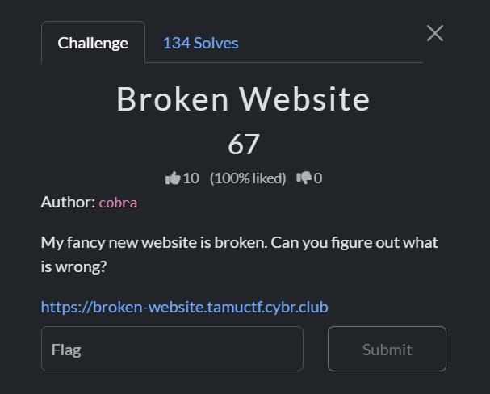
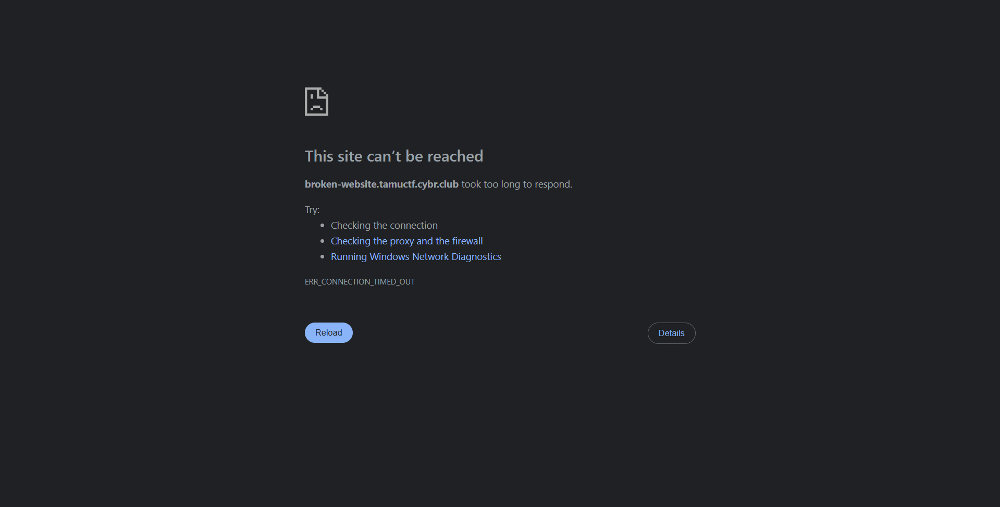

## Broken Website  



Attempting to access the challenge website normally via a browser causes the request to time out.  



If we try connecting via `HTTP3` using `curl`, we get a certificate verification error, but this also confirms that the website does indeed support HTTP3.  

```bash
┌──(jeff160㉿Jerome)-[/mnt/c/Users/jerom/documents/tamuctf/broken website]
└─$ curl --http3 -v https://broken-website.tamuctf.cybr.club
* Host broken-website.tamuctf.cybr.club:443 was resolved.
* IPv6: (none)
* IPv4: 54.91.191.64
*   Trying 54.91.191.64:443...
* SSL Trust Anchors:
*   CAfile: /etc/ssl/certs/ca-certificates.crt
*   CApath: /etc/ssl/certs
*   Trying 54.91.191.64:443...
* SSL connection using TLSv1.3 / TLS_AES_128_GCM_SHA256 / X25519MLKEM768 / id-ecPublicKey
* Server certificate:
*   subject:
*   start date: Mar 21 22:18:58 2026 GMT
*   expire date: Mar 22 10:18:58 2026 GMT
*   issuer: CN=Caddy Local Authority - ECC Intermediate
*   Certificate level 0: Public key type EC/prime256v1 (256/128 Bits/secBits), signed using ecdsa-with-SHA256
*   Certificate level 1: Public key type EC/prime256v1 (256/128 Bits/secBits), signed using ecdsa-with-SHA256
*   subjectAltName: "broken-website.tamuctf.cybr.club" matches cert's "broken-website.tamuctf.cybr.club"
* SSL certificate OpenSSL verify result: unable to get local issuer certificate (20)
* QUIC connect to 54.91.191.64 port 443 failed: SSL peer certificate or SSH remote key was not OK
* Failed to connect to broken-website.tamuctf.cybr.club port 443 after 270 ms: SSL peer certificate or SSH remote key was not OK
```

We can bypass this with the `-k` flag to skip SSL/TLS certificate verification, which will get the website to render, giving us the flag.  

```bash
┌──(jeff160㉿Jerome)-[/mnt/c/Users/jerom/documents/tamuctf/broken website]
└─$ curl --http3 -k -v https://broken-website.tamuctf.cybr.club
* Host broken-website.tamuctf.cybr.club:443 was resolved.
* IPv6: (none)
* IPv4: 54.91.191.64
*   Trying 54.91.191.64:443...
* SSL Trust: peer verification disabled
*   Trying 54.91.191.64:443...
* SSL connection using TLSv1.3 / TLS_AES_128_GCM_SHA256 / X25519MLKEM768 / id-ecPublicKey
* Server certificate:
*   subject: 
*   start date: Mar 21 22:18:58 2026 GMT
*   expire date: Mar 22 10:18:58 2026 GMT
*   issuer: CN=Caddy Local Authority - ECC Intermediate
*   Certificate level 0: Public key type EC/prime256v1 (256/128 Bits/secBits), signed using ecdsa-with-SHA256
*   Certificate level 1: Public key type EC/prime256v1 (256/128 Bits/secBits), signed using ecdsa-with-SHA256
*  SSL certificate verification failed, continuing anyway!
* Established connection to broken-website.tamuctf.cybr.club (54.91.191.64 port 443) from 172.20.38.83 port 44652
* using HTTP/3
* [HTTP/3] [0] OPENED stream for https://broken-website.tamuctf.cybr.club/
* [HTTP/3] [0] [:method: GET]
* [HTTP/3] [0] [:scheme: https]
* [HTTP/3] [0] [:authority: broken-website.tamuctf.cybr.club]
* [HTTP/3] [0] [:path: /]
* [HTTP/3] [0] [user-agent: curl/8.18.0]
* [HTTP/3] [0] [accept: */*]
> GET / HTTP/3
> Host: broken-website.tamuctf.cybr.club
> User-Agent: curl/8.18.0
> Accept: */*
>
* Request completely sent off
< HTTP/3 200 
< accept-ranges: bytes
< content-length: 662
< date: Sun, 22 Mar 2026 02:33:53 GMT
< server: Caddy
< vary: Accept-Encoding
< etag: "dh79xf3jompsie"
< content-type: text/html; charset=utf-8
< last-modified: Fri, 20 Mar 2026 03:02:52 GMT
<
<!DOCTYPE html>
<html lang="en">
<head>
    <meta charset="UTF-8">
    <meta name="viewport" content="width=device-width, initial-scale=1.0">
    <title>Fancy Website</title>
    <link rel="stylesheet" type="text/css" href="style.css">
    <link rel="preconnect" href="https://fonts.googleapis.com">
<link rel="preconnect" href="https://fonts.gstatic.com" crossorigin>
<link href="https://fonts.googleapis.com/css2?family=Ubuntu:ital,wght@0,300;0,400;0,500;0,700;1,300;1,400;1,500;1,700&display=swap" rel="stylesheet">
</head>
<body>
    <h1>Welcome to my website!</h1>
    <h2>Here's the flag:</h2>
    <h2>gigem{7h3_fu7u23_15_qu1c_64d1f5}</h2>
</body>
</html>
* Connection #0 to host broken-website.tamuctf.cybr.club:443 left intact
```

Flag: `gigem{7h3_fu7u23_15_qu1c_64d1f5}`