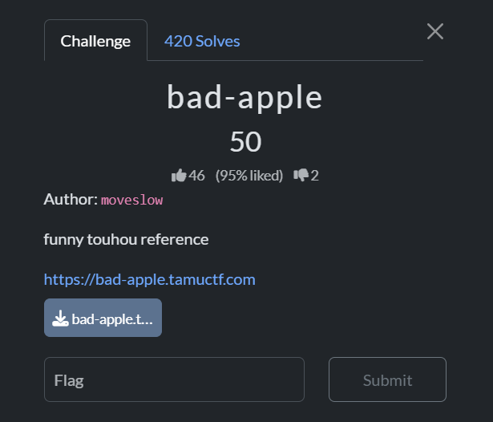
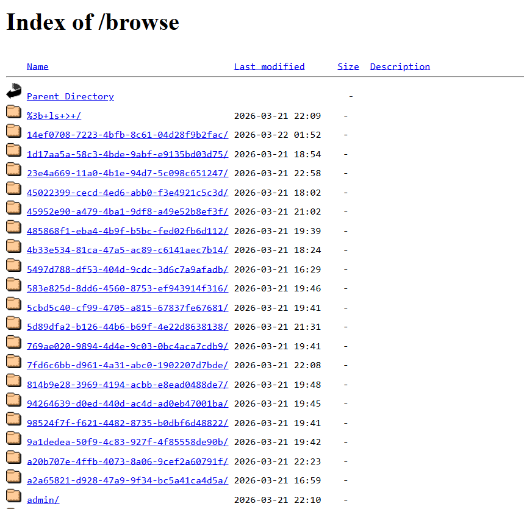

## bad-apple  



We are given a simple webapp that allows uploading and storing of GIFs.  

Inside `httpd-append.conf`, we can notice that the `/browse` endpoint is publicly exposed.  

```apache
<VirtualHost *:80>
    WSGIScriptAlias / /srv/app/wsgi_app.py

    <Directory /srv/app>
        Require all granted
    </Directory>

    Alias /browse /srv/http/uploads
    <Directory /srv/http/uploads>
        Options +Indexes
        DirectoryIndex disabled
        IndexOptions FancyIndexing FoldersFirst NameWidth=* DescriptionWidth=* ShowForbidden
        AllowOverride None
        Require all granted

        <FilesMatch "\.gif$">
            AuthType Basic
            AuthName "Admin Area"
            AuthUserFile /srv/http/.htpasswd
            Require valid-user
        </FilesMatch>
    </Directory>
</VirtualHost>
```

Accessing `/browse` reveals an `/admin` endpoint. This was probably unintended, as the `/admin` directory contained a folder containing all the flag GIF frames.  



I was able to solve it before the issue got patched, and wrote a script to download all the flag GIF frames.  

Flag: `gigem{3z_t0h0u_fl4g_r1t3}`